# Índice

# Resumen Ejecutivo

En el presente informe se detallan las vulnerabilidades explotadas en la auditoría realizada a la empresa La Descuidada S.A, tras haber llevado a cabo análisis exhaustivos a los dos servidores acordados con la compañía. 

Usando como base la extensa lista de vulnerabilidades encontradas en los análisis previos realizados, y tras llevar a cabo múltiples pruebas con la lista mencionada, logramos explotar algunas de las vulnerabilidades especificadas en los análisis. 

Se ha logrado explotar una de las dos vulnerabilidades de nivel alto en el servidor Windows Server 2008 R2 Standard, la cual está relacionada con el protocolo SMB, encontrando que este servidor ha resultado ser el más seguro de los dos, debido a su menor número de vulnerabilidades, tanto analizadas como explotadas.

En el segundo servidor, denominado Windows Server Metasploitable 3, logramos explotar múltiples vulnerabilidades de varios niveles, siendo algunas de estas de nivel crítico, siendo las demás de nivel alto y medio.  

# Tabla de Riesgos

# Test de penetración

# Breve Resumen

Se ha realizado un test de caja negra por cada sistema auditado y se han encontrado varias vulnerabilidades catalogadas teniendo en cuenta las dos tablas siguientes. Las vulnerabilidades críticas, altas y medias podrían suponer un peligro para los sistemas auditados.

**Windows Server 2008 R2 Standard**
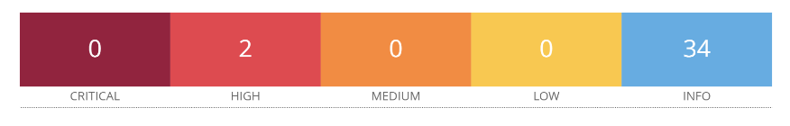

**Windows Server Metasploitable 3**

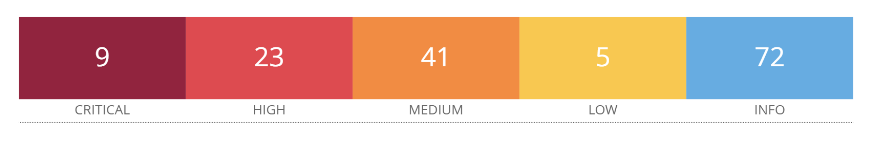

Además se ha encontrado una vulnerabilidad con el CVE: CVE-2018-15473 de SSH que no se encuentra entre los análisis realizados.

## Vulnerabilidades Windows Server 2008 R2 Standard

| Descripción de la vulnerabilidad |El servidor SMBv1 en Microsoft Windows Vista SP2; Windows Server 2008 SP2 y R2 SP1; Windows 7 SP1; Windows 8.1; Windows Server 2012 Gold y R2; Windows RT 8.1 y Windows 10 Gold, 1511 y 1607 y Windows Server 2016 permite a atacantes remotos ejecutar código arbitrario a través de paquetes manipulados, vulnerabilidad también conocida como "Windows SMB Remote Code Execution Vulnerability"|
|----------------------------------|--------------------------------------------------------------|
| CVE/CWE                          |              [CVE-2017-0143](https://nvd.nist.gov/vuln/detail/cve-2017-0143)                                                |
| CVSS v3                          |                    [8.1](https://nvd.nist.gov/vuln-metrics/cvss/v3-calculator?name=CVE-2017-0143&vector=AV:N/AC:H/PR:N/UI:N/S:U/C:H/I:H/A:H&version=3.0&source=NIST)                                          |
| Severidad                        |                    Alta                                          |
| Impacto                          | Si un atacante consigue acceder a la máquina usando esta vulnerabilidad, puede obtener acceso de manera remota a la máquina y por lo tanto podría leer, modificar, crear o borrar información importante, escalar privilegios, hacer landing a otras máquinas de la red y obtener persistencia.   |
| Sistemas afectados               |                     Windows server 2008 R2 Standard                                   |
| Prueba de concepto (POC)        |        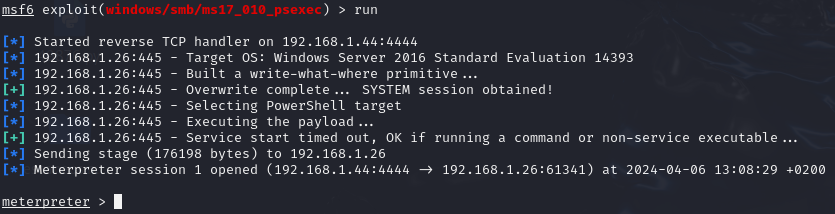                                                      |
| Remediación                      |   Actualizar el Sistema Operativo a una versión más reciente ya que se ha parcheado esta vulnerabilidad.                                                     |
| Link de referencia               |       [https://attack.mitre.org/techniques/T1210/](https://attack.mitre.org/techniques/T1210/)                                                       |

 
 

## Vulnerabilidades Windows Server Metasploitable 3

| Descripción de la vulnerabilidad |El servidor SMBv1 en Microsoft Windows Vista SP2; Windows Server 2008 SP2 y R2 SP1; Windows 7 SP1; Windows 8.1; Windows Server 2012 Gold y R2; Windows RT 8.1 y Windows 10 Gold, 1511 y 1607 y Windows Server 2016 permite a atacantes remotos ejecutar código arbitrario a través de paquetes manipulados, vulnerabilidad también conocida como "Windows SMB Remote Code Execution Vulnerability"|
|----------------------------------|--------------------------------------------------------------|
| CVE/CWE                          |              [CVE-2017-0143](https://nvd.nist.gov/vuln/detail/cve-2017-0143)                                                |
| CVSS v3                          |                    [8.1](https://nvd.nist.gov/vuln-metrics/cvss/v3-calculator?name=CVE-2017-0143&vector=AV:N/AC:H/PR:N/UI:N/S:U/C:H/I:H/A:H&version=3.0&source=NIST)                                          |
| Severidad                        |                    Alta                                          |
| Impacto                          | Si un atacante consigue acceder a la máquina usando esta vulnerabilidad, puede obtener acceso de manera remota a la máquina y por lo tanto podría leer, modificar, crear o borrar información importante, escalar privilegios, hacer landing a otras máquinas de la red y obtener persistencia.   |
| Sistemas afectados               |                     Windows Server Metasploitable 3                                        |
| Prueba de concepto (POC)        |        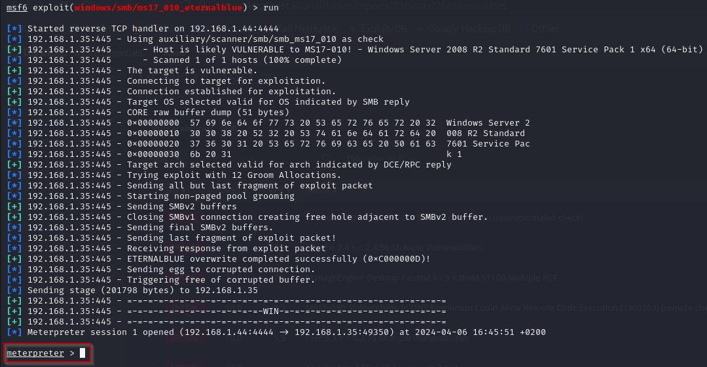                                                      |
| Remediación                      |   Actualizar el Sistema Operativo a una versión más reciente ya que se ha parcheado esta vulnerabilidad.                                                     |
| Link de referencia               |       [https://attack.mitre.org/techniques/T1210/](https://attack.mitre.org/techniques/T1210/) |

 
 

| Descripción de la vulnerabilidad |                                                El servicio de protocolo de escritorio remoto (RDP) en Microsoft Windows Server 2008 R2 Service Pack 1 y R2 y Windows 7 Gold y SP1 permite a atacantes remotos causar una denegación de servicio (la aplicación se bloquea) a través de una serie de paquetes modificados, también conocido como "Terminal Server Denial of Service Vulnerability."              |
|----------------------------------|--------------------------------------------------------------|
| CVE/CWE                          |                                                    [CVE-2012-0152](https://nvd.nist.gov/vuln/detail/CVE-2012-0152)         |
| CVSS v3                          |                                            [7.5](https://nvd.nist.gov/vuln-metrics/cvss/v3-calculator?vector=AV:N/AC:L/PR:N/UI:N/S:U/C:N/I:N/A:H&version=3.0)                  |
| Severidad                        |                                      Alta                        |
| Impacto                          |                                  Un atacante puede realizar un ataque de denegación de servicio y bloquear la máquina                           |
| Sistemas afectados               |                                           Windows Server Metasploitable 3                |
| Prueba de concepto (POC)        |                                                      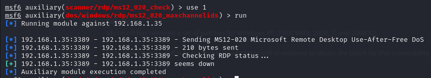        |
| Remediación                      |                                  Instalar las actualizaciones de seguridad más recientes o desactivar el acceso remoto a la máquina a través de RDP.                            |
| Link de referencia               |                                              [https://attack.mitre.org/techniques/T1498/](https://attack.mitre.org/techniques/T1498/)                |

 
 

| Descripción de la vulnerabilidad |                                              Un atacante remoto no autenticado podría aprovechar esta vulnerabilidad para leer archivos de aplicaciones web desde un servidor vulnerable. En los casos en que el servidor vulnerable permite la carga de archivos, un atacante podría cargar código JavaServer Pages (JSP) malicioso dentro de una variedad de tipos de archivos y activar esta vulnerabilidad para obtener la ejecución remota de código.        |
|----------------------------------|--------------------------------------------------------------|
| CVE/CWE                          |                                   [CVE-2020-1745](https://nvd.nist.gov/vuln/detail/CVE-2020-1745)     |
| CVSS v3                          |                                       [9.8](https://nvd.nist.gov/vuln-metrics/cvss/v3-calculator?name=CVE-2020-1745&vector=AV:N/AC:L/PR:N/UI:N/S:U/C:H/I:H/A:H&version=3.1&source=NIST)                       |
| Severidad                        |                                  Alta                            |
| Impacto                          |                               Un atacante puede leer cualquier archivo de la aplicación web pudiendo acceder a información importante.                         |
| Sistemas afectados               |                                         Windows Server Metasploitable 3                    |
| Prueba de concepto (POC)        |                                                       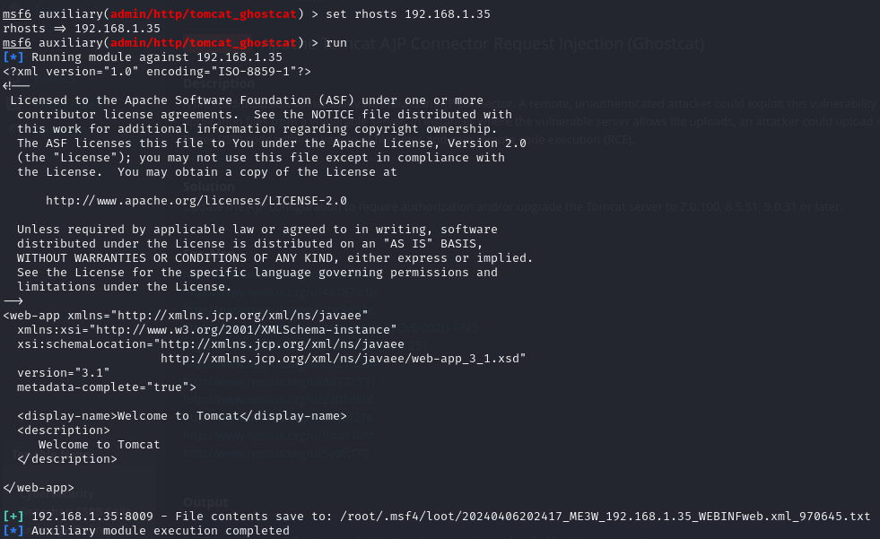       |
| Remediación                      |                               Deshabilitar AJP y usar en su lugar HTTP o HTTPS                               |
| Link de referencia               |                                          [https://attack.mitre.org/techniques/T1659/](https://attack.mitre.org/techniques/T1659/)                    |

 
 

| Descripción de la vulnerabilidad |                                                 La lista de usuarios LanMan del host remoto se puede obtener mediante SNMP.|
|----------------------------------|--------------------------------------------------------------|
| CVE/CWE                          |                                      [CVE-1999-0499](https://nvd.nist.gov/vuln/detail/CVE-1999-0499)                        |
| CVSS v3                          |                                      [5.3](https://nvd.nist.gov/vuln-metrics/cvss/v3-calculator)                        |
| Severidad                        |                                   Medio                           |
| Impacto                          |                                      Un atacante podría tener acceso a una lista de usuarios dentro del protocolo SNMP.                        |
| Sistemas afectados               |                                           Windows Server Metasploitable 3                   |
| Prueba de concepto (POC)        |                                                     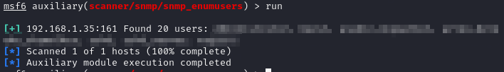         |
| Remediación                      |                                  Desactivar el protocolo si no se utiliza                            |
| Link de referencia               |                                           [https://attack.mitre.org/techniques/T1087/](https://attack.mitre.org/techniques/T1087/)                   |

 
 

| Descripción de la vulnerabilidad |                                                 La lista de servicios LanMan que se ejecutan en el host remoto se puede obtener mediante SNMP. |
|----------------------------------|--------------------------------------------------------------|
| CVE/CWE                          |                                   [CVE-1999-0499](https://nvd.nist.gov/vuln/detail/CVE-1999-0499)                             |
| CVSS v3                          |                                     [5.3](https://nvd.nist.gov/vuln-metrics/cvss/v3-calculator?vector=AV:N/AC:L/PR:N/UI:N/S:U/C:L/I:L/A:L&version=3.0)                         |
| Severidad                        |                                       Medio                       |
| Impacto                          |                                  Un atacante podría ver los servicios de red que se están usando en el sistema a través de SNMP para posible explotación de los mismos.                            |
| Sistemas afectados               |                                        Windows Server Metasploitable 3                      |
| Prueba de concepto (POC)        |                                                    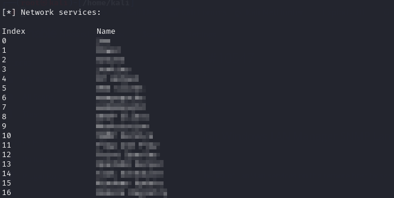          |
| Remediación                      |                                   Desactivar el protocolo si no se utiliza  |
| Link de referencia               |                                        [https://attack.mitre.org/techniques/T1046/](https://attack.mitre.org/techniques/T1046/)                      |

 
 

| Descripción de la vulnerabilidad |                                                  OpenSSH hasta la versión 7.7 es propenso a una vulnerabilidad de enumeración de usuarios debido a que no retrasa el rescate de un usuario de autenticación no válido hasta que el paquete que contiene la petición haya sido analizado completamente. Esto está relacionado con auth2-gss.c, auth2-hostbased.c, y auth2-pubkey.c.            |
|----------------------------------|--------------------------------------------------------------|
| CVE/CWE                          |                                     [CVE-2018-15473](https://nvd.nist.gov/vuln/detail/cve-2018-15473)                         |
| CVSS v3                          |                                     [5.3](https://nvd.nist.gov/vuln-metrics/cvss/v3-calculator?name=CVE-2018-15473&vector=AV:N/AC:L/PR:N/UI:N/S:U/C:L/I:N/A:N&version=3.1&source=NIST)                         |
| Severidad                        |                                      Medio                        |
| Impacto                          |                                Un atacante podría ver los usuarios que tiene el sistema para luego ejecutarle fuerza bruta.                              |
| Sistemas afectados               |                                           Windows Server Metasploitable 3                   |
| Prueba de concepto (POC)        |                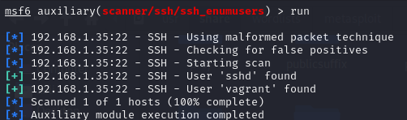                                              |
| Remediación                      |                          Actualizar OpenSSH a una versión más moderna.                                    |
| Link de referencia               |       [https://attack.mitre.org/techniques/T1087/](https://attack.mitre.org/techniques/T1087/)|

 
 

| Descripción de la vulnerabilidad |  La vulnerabilidad se encuentra en la clase FileUploadServlet. Cuando se carga un archivo 7z, el parámetro ConnectionId, controlado por el usuario, no se valida adecuadamente. Esto permite a un atacante remoto inyectar un byte nulo al final del valor para crear un archivo malicioso con un tipo de archivo arbitrario. Posteriormente, este archivo malicioso puede ser colocado en un directorio que permita la ejecución de scripts del lado del servidor, lo que resulta en la ejecución remota de código bajo el contexto del usuario SYSTEM.   |
|----------------------------------|--------------------------------------------------------------|
| CVE/CWE                          |                CVE-2015-8249                                 |
| CVSS v3                          |                9.8                                           |
| Severidad                        |                Crítica                                       |
| Impacto                          |   Un atacante puede cargar y ejecutar archivos de su elección a través del parámetro ConnectionId.    |
| Sistemas afectados               |           Windows Server Metasploitable 3                    |
| Prueba de concepto (POC)         |   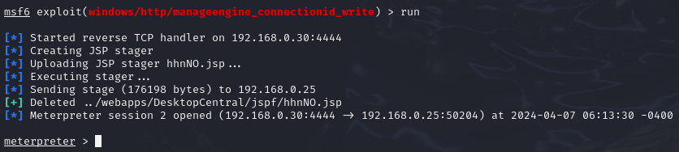   |
| Remediación                      |      Actualizar a una build igual o posterior a la 91100     |
| Link de referencia               |      https://nvd.nist.gov/vuln/detail/CVE-2015-8249          |

 
 

| Descripción de la vulnerabilidad |  La configuración por defecto en ElasticSearch en versiones anteriores a la 1.2 permite el scrpting dinámico, lo que permite a los atacantes remotos ejecutar expresiones MVEL (MVEL es un lenguaje basado en la sintaxis de Java) y código en Java a través del parámetro fuente para _search.  |
|----------------------------------|--------------------------------------------------------------|
| CVE/CWE                          |                CVE-2014-3120                                 |
| CVSS v3                          |                [6.8](https://www.cvedetails.com/cve/CVE-2014-3120/)  |
| Severidad                        |                Media                                       |
| Impacto                          |  Un atacante puede ejecutar código arbitrario de forma remota, permitiéndoles acceder al sistema.  |
| Sistemas afectados               |       Windows Server Metasploitable 3                        |
| Prueba de concepto (POC)         |   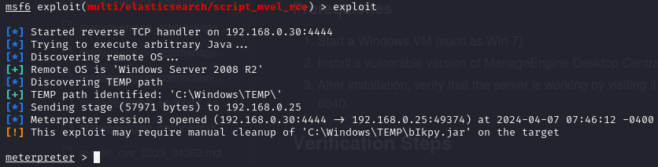                    |
| Remediación                      |      Actualizar a una versión igual o posterior a la 1.2     |
| Link de referencia               |      https://nvd.nist.gov/vuln/detail/CVE-2014-3120          |

| Descripción de la vulnerabilidad | CWE-200: Exposure of Sensitive Information to an Unauthorized Actor. Oracle Glassfish                                                                                                                                                                                                                                                                                                                                           |
| -------------------------------- | ------------------------------------------------------------------------------------------------------------------------------------------------------------------------------------------------------------------------------------------------------------------------------------------------------------------------------------------------------------------------------------------------------------------------------- |
| CVE/CWE                          | CWE-200                                                                                                                                                                                                                                                                                                                                                                                                                         |
| CVSS v3                          | 7.2                                                                                                                                                                                                                                                                                                                                                                                                                             |
| Severidad                        | Alto                                                                                                                                                                                                                                                                                                                                                                                                                            |
| Impacto                          | La exposición de información sensible puede tener un impacto significativo, dependiendo del tipo de información revelada. Esto puede variar desde la revelación de información personal privada, como mensajes personales, datos financieros, registros de salud, ubicación geográfica o detalles de contacto, hasta información sobre el estado y el entorno del sistema, como el sistema operativo y los paquetes instalados. |
| Sistemas afectados               | Metasploitable 3                                                                                                                                                                                                                                                                                                                                                                                                                |
| Prueba de concepto (POC)         | Acceder al puerto 8080 a través de un navegador                                                                                                                                                                                                                                                                                                                                   |
| Remediación                      | Para mitigar este tipo de vulnerabilidades, se recomienda sanitizar la información (como los datos del usuario), así como implementar la compartimentación y establecer áreas seguras trazando límites de confianza para los datos. En el caso específico de Oracle Glassfish, asegúrate de que la configuración del servidor esté correctamente establecida para no exponer información sensible a través del puerto 8080.     |
| Link de referencia               | [CWE-200: Exposure of Sensitive Information to an Unauthorized Actor - MITRE](https://cwe.mitre.org/data/definitions/200.html)                                                                                                                                                                                                                                                                                                  |

| Descripción de la vulnerabilidad |                                                                                                                                                                     |
| -------------------------------- | ------------------------------------------------------------------------------------------------------------------------------------------------------------------- |
| CVE/CWE                          | CWE-200: Exposure of Sensitive Information to an Unauthorized Actor.   Apache Tomcat                                                                          |
| CVSS v3                          | 7.2                                                                                                                                                                 |
| Severidad                        | Alto                                                                                                                                                                |
| Impacto                          | Esta página por defecto muestra información de que efectivamente este servidor posee un apache Tomcat además de mostrar su versión y desvelar el puerto donde está. |
| Sistemas afectados               | Metasploitable 3                                                                                                                                                    |
| Prueba de concepto (POC)         | Acceder al puerto 8282 a través de un navegador.                                                                   |
| Remediación                      | Añadir configuración para no mostrar pantalla,                                                                                                                      |
| Link de referencia               | https://cwe.mitre.org/data/definitions/200.html                                                                                                                     |

| Descripción de la vulnerabilidad |                                                                                                                                                                                                                                                                                  |
| -------------------------------- | -------------------------------------------------------------------------------------------------------------------------------------------------------------------------------------------------------------------------------------------------------------------------------- |
| CVE/CWE                          | CWE-521 (Weak Password Requirements)  Manage Engine                                                                                                                                                                                                                        |
| CVSS v3                          | 9.8                                                                                                                                                                                                                                                                              |
| Severidad                        | Crítica                                                                                                                                                                                                                                                                          |
| Impacto                          | La contraseña y usuario para entrar a este servicio es *admin:admin*, lo cual es un problema de seguridad crítico. Cualquier atacante que lo intente podría adquirir privilegios de administrador con tan solo hacer o bien una prueba manual básica o un ataque de fuerza bruta |
| Sistemas afectados               | Metasploitable 3                                                                                                                                                                                                                                                                 |
| Prueba de concepto (POC)         | Acceder al puerto 8020 o 8022 y realizar una prueba con varios conjuntos de credenciales básicas. Realizar un ataque de fuerza bruta con diccionarios básicos.                                                                     |
| Link de referencia               | https://www.cvedetails.com/cwe-details/521/Weak-Password-Requirements.html                                                                                                                                                                                                       |

| Descripción de la vulnerabilidad |                                                                                                                                                                     |
| -------------------------------- | ------------------------------------------------------------------------------------------------------------------------------------------------------------------- |
| CVE/CWE                          | CWE-200: Exposure of Sensitive Information to an Unauthorized Actor.   Apache WampServer                                                                      |
| CVSS v3                          | 7.2                                                                                                                                                                 |
| Severidad                        | Alto                                                                                                                                                                |
| Impacto                          | Esta página por defecto muestra información de que efectivamente este servidor posee un apache Tomcat además de mostrar su versión y desvelar el puerto donde está. |
| Sistemas afectados               | Metasploitable 3                                                                                                                                                    |
| Prueba de concepto (POC)         | Acceder al puerto 8585 a través de un navegador.                                                                      |
| Remediación                      | Añadir configuración para no mostrar pantalla,                                                                                                                      |
| Link de referencia               | https://cwe.mitre.org/data/definitions/200.html                                                                                                                     |

 
 

| Descripción de la vulnerabilidad |                                                                                                                                                                                                                                                                                  |
| -------------------------------- | -------------------------------------------------------------------------------------------------------------------------------------------------------------------------------------------------------------------------------------------------------------------------------- |
| CVE/CWE                          | CWE-521 (Weak Password Requirements)  Manage Engine                                                                                                                                                                                                                        |
| CVSS v3                          | 9.8                                                                                                                                                                                                                                                                              |
| Severidad                        | Crítica                                                                                                                                                                                                                                                                          |
| Impacto                          | La contraseña y usuario para entrar a este servicio es *admin:admin*, lo cual es un problema de seguridad crítico. Cualquier atacante que lo intente podría adquirir privilegios de administrador con tan solo hacer o bien una prueba manual básica o un ataque de fuerza bruta |
| Sistemas afectados               | Metasploitable 3                                                                                                                                                                                                                                                                 |
| Prueba de concepto (POC)         | Acceder al puerto 8020 o 8022 y realizar una prueba con varios conjuntos de credenciales básicas. Realizar un ataque de fuerza bruta con diccionarios básicos.                                                                     |
| Link de referencia               | https://www.cvedetails.com/cwe-details/521/Weak-Password-Requirements.html                                                                                                                                                                                                       |

 
 

| Descripción de la vulnerabilidad |                                                                                                                                                                                                                                                                                                 |
| -------------------------------- | ----------------------------------------------------------------------------------------------------------------------------------------------------------------------------------------------------------------------------------------------------------------------------------------------- |
| CVE/CWE                          | CWE-521 (Weak Password Requirements)  MySQL                                                                                                                                                                                                                                               |
| CVSS v3                          | 9.8                                                                                                                                                                                                                                                                                             |
| Severidad                        | Crítica                                                                                                                                                                                                                                                                                         |
| Impacto                          | La contraseña y usuario para entrar a este servicio es *root:*, lo cual es un problema de seguridad crítico. Cualquier atacante que lo intente podría adquirir privilegios de administrador en la base de datos con tan solo hacer o bien una prueba manual básica o un ataque de fuerza bruta. |
| Sistemas afectados               | Metasploitable 3                                                                                                                                                                                                                                                                                |
| Prueba de concepto (POC)         | Realizamos un escaneo de reconocimiento utilizando `nmap` y descubrimos un servicio MySQL.   Una vez tengamos el puerto. Con el exploit `mysql_login` y el diccionario de contraseñas `unix_passwords.txt` obtenemos la contraseña:         |
| Link de referencia               | https://www.cvedetails.com/cwe-details/521/Weak-Password-Requirements.html                                                                                                                                                                                                                      |

# Metodologías

## Herramientas

# Conclusión
