# Índice

- [Resumen Ejecutivo](#resumen-ejecutivo)
- [Tabla de Riesgos](#tabla-de-riesgos)
- [Evaluación](#evaluacion)
    - [Breve Resumen](#breve-resumen)
    - [Tabla de Hallazgos](#tabla-de-hallazgos)
      - [Metasploitable 3](#vulnerabilidades-ubuntu-metasploitable-3)
      - [Kioptrix](#vulnerabilidades-kioptrix)
      - [w1r3s](#máquina-w1r3s)
- [Metodologías](#metodologías)
  - [Herramientas utilizadas](#herramientas-utilizadas)
  - [Procedimiento](#procedimiento)
    - [Fase 1: Reconocimiento](#fase-1-reconocimiento)
    - [Fase 2: Explotación](#fase-2-explotación)
- [Conclusión](#conclusión)

# Resumen Ejecutivo

# Tabla de Riesgos

La siguiente tabla explica de forma clara y concisa la puntuación de los riesgos de los sistemas en una escala del 1 al 10.

| Riesgo | CVSSv3 | Descripción |
|--------|--------|-------------|
| CRÍTICA | 10 | Se describe una vulnerabilidad que ha sido calificada como crítica y requiere resolución tan rápida como sea posible. |
| ALTA | 7 - 9.9 | Se describe una vulnerabilidad que ha sido calificada como alta y requiere resolución a corto plazo. |
| MEDIA | 4 - 6.9 | Se describe una vulnerabilidad que ha sido calificada como media y debe resolverse como parte del mantenimiento de seguridad de un sistema. |
| BAJA | 1 – 3.9 | Se describe una vulnerabilidad que ha sido calificada como baja y debe ser abordada como parte de las tareas de mantenimiento rutinario. |
| INFO | 0 – 0.9 | Se realizó un descubrimiento de carácter informal y debe ser abordado con el fin de cumplir con una buena práctica de seguridad. |

# Evaluación

## Breve Resumen

Se ha realizado un test de caja negra por cada sistema auditado y se han encontrado varias vulnerabilidades catalogadas teniendo en cuenta las tres tablas siguientes. Las vulnerabilidades críticas, altas y medias podrían suponer un peligro para los sistemas auditados. 

Estas tablas suponen una información superficial que servirá como idea general del estado de las máquinas con las que estamos trabajando.

**Linux Server Metasploitable 3**
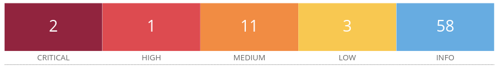

**Máquina Kioptrix** <br>
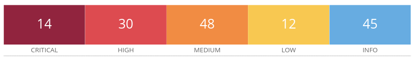

**Máquina W1r3s**
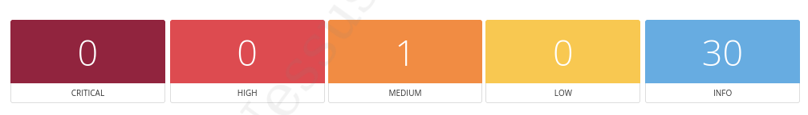

## Tabla de hallazgos

### Vulnerabilidades Ubuntu Metasploitable 3

| Descripción de la vulnerabilidad | El módulo mod_copy en ProFTPD 1.3.5 permite a atacantes remotos leer y escribir en archivos de su elección mediante los comandos site cpfr y site cpto.|
|----------------------------------|--------------------------------------------------------------|
| CVE/CWE                          |        [CVE-2015-3306](https://nvd.nist.gov/vuln/detail/CVE-2015-3306)                                                    |
| CVSS v3                          |            [9.8](https://nvd.nist.gov/vuln-metrics/cvss/v3-calculator)                                                  |
| Severidad                        |                       Alta                                       |
| Impacto                          | Un atacante puede leer información sensible, modificar archivos, crearlos e intentar ganar privilegios de administrador en el sistema.                                                         |
| Sistemas afectados               |       Ubuntu Metasploitable 3                                                       |
| Prueba de concepto (POC)         |       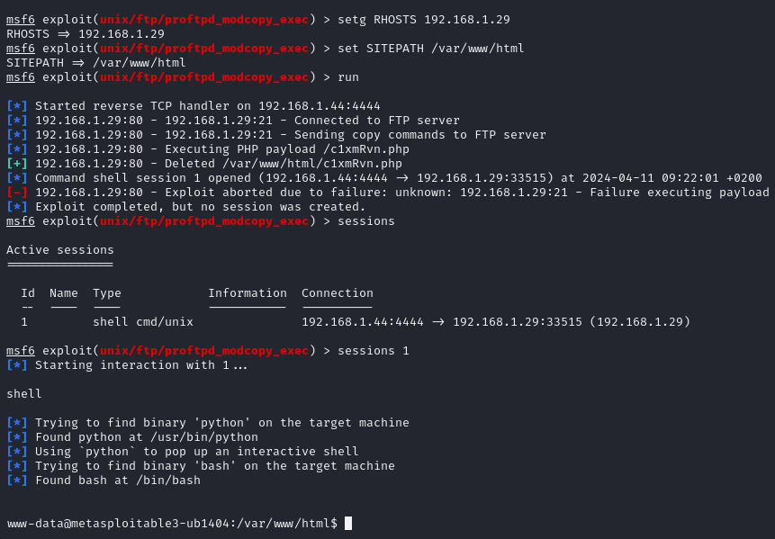                                                       |
| Remediación                      | Actualizar a una versión posterior a ProFTPD 1.3.5.                                                         |
| Link de referencia               |     [https://owasp.org/www-project-top-ten/2017/A3_2017-Sensitive_Data_Exposure](https://owasp.org/www-project-top-ten/2017/A3_2017-Sensitive_Data_Exposure)                                                         |
<br>

| Descripción de la vulnerabilidad | La versión de Drupal que se ejecuta en el servidor web remoto se ve afectada por una vulnerabilidad de ejecución de código remoto en el módulo Coder, específicamente en el archivo coder_upgrade.run.php, debido a una validación incorrecta de la entrada proporcionada por el usuario a la función unserialize(). Un atacante remoto no autenticado puede explotar esto, a través de una solicitud especialmente diseñada, para ejecutar código PHP arbitrario. |
|----------------------------------|--------------------------------------------------------------|
| CVE/CWE                          |     [CVE-2018-7600](https://nvd.nist.gov/vuln/detail/CVE-2018-7600)                                                                                    |
| CVSS v3                          |         [9.8](https://nvd.nist.gov/vuln-metrics/cvss/v3-calculator)                                                                                    |
| Severidad                        |                  Alta                                        |
| Impacto                          | Un atacante podría ejecutar código malicioso en la máquina, acceder a información que se encuentre en el servidor web y modificarla.                                                     |
| Sistemas afectados               |             Ubuntu Metasploitable 3                                                 |
| Prueba de concepto (POC)         |            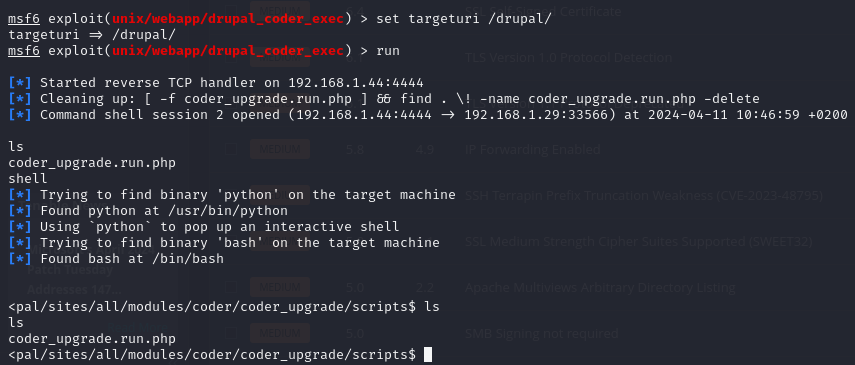                                                  |
| Remediación                      | Actualizar la versión de drupal a una versión posterior a la 7.x-2.6 o eliminar el módulo de drupal.                                                         |
| Link de referencia               |         [https://attack.mitre.org/techniques/T1059/004/](https://attack.mitre.org/techniques/T1059/004/)                                                     |

<br>

| Descripción de la vulnerabilidad | El servidor web remoto ejecuta una versión de Drupal que se ve afectada por una vulnerabilidad de inyección SQL debido a una falla en la API de abstracción de la base de datos de Drupal, que permite a un atacante remoto utilizar solicitudes especialmente diseñadas que pueden resultar en una ejecución SQL arbitraria. Esto puede provocar una escalada de privilegios, una ejecución arbitraria de PHP o una ejecución remota de código. |
|----------------------------------|--------------------------------------------------------------|
| CVE/CWE                          | [CVE-2014-3704](https://nvd.nist.gov/vuln/detail/CVE-2014-3704)                                                                                     |
| CVSS v3                          |        [9.8](https://nvd.nist.gov/vuln-metrics/cvss/v3-calculator?vector=AV:N/AC:L/PR:N/UI:N/S:U/C:H/I:H/A:H)                                                                                     |
| Severidad                        |                                 Alta                      |
| Impacto                          | Un atacante podría ejecutar código malicioso en la máquina, acceder a información que se encuentre en el servidor web y modificarla.                                                      |
| Sistemas afectados               |             Ubuntu Metasploitable 3                                                                                                 |
| Prueba de concepto (POC)         |      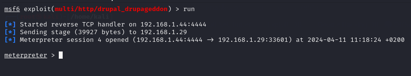                                                        |
| Remediación                      |         Actualizar a una versión superior a la 7.32 de Drupal.                                                     |
| Link de referencia               |              [https://attack.mitre.org/techniques/T1059/004/](https://attack.mitre.org/techniques/T1059/004/)                                                 |

<br>

| Descripción de la vulnerabilidad | El servidor web Apache que se ejecuta en el host remoto se ve afectado por una vulnerabilidad de divulgación de información. Un atacante remoto no autenticado puede aprovechar esto enviando una solicitud manipulada para mostrar una lista de un directorio remoto, incluso si existe un archivo de índice válido en el directorio. |
|----------------------------------|--------------------------------------------------------------|
| CVE/CWE                          | [CVE-2001-0731](https://nvd.nist.gov/vuln/detail/CVE-2001-0731)                                                                                |
| CVSS v3                          |                               [5.3](https://nvd.nist.gov/vuln-metrics/cvss/v3-calculator)                                                              |
| Severidad                        |                          Medio                            |
| Impacto                          | Un atacante puede listar los directorios del servidor web.                                                         |
| Sistemas afectados               |             Ubuntu Metasploitable 3                                                                                                 |
| Prueba de concepto (POC)         |      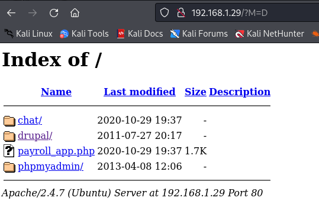                                                      |
| Remediación                      | Modificar el fichero .htaccess para deshabilitar el listado de directorios y actualizar a una versión superior de apache.                             |
| Link de referencia               |       [https://attack.mitre.org/techniques/T1592/](https://attack.mitre.org/techniques/T1592/)

<br>

#### Vulnerabilidades Kioptrix

| Descripción de la vulnerabilidad | Desbordamiento de búfer en la función call_trans2open en trans2.c en Samba 2.2.x, antes de la versión 2.2.8a, 2.0.10 y versiones anteriores 2.0.x, y anteriores a la 0.3.2 en Samba-TNG. Esto permite a atacantes remotos ejecutar código arbitrario. |
|----------------------------------|------------------------------------|
| CVE/CWE                          | CVE-2003-0201            |
| CVSS v3                          | [9.8](https://www.tenable.com/cve/CVE-2003-0201)                     |
| Severidad                        |     Crítica              |
| Impacto                          | Un atacante puede ejecutar código arbitrario de forma remota.        |
| Sistemas afectados               |             Kioptrix Level 1         |
| Prueba de concepto (POC)         |      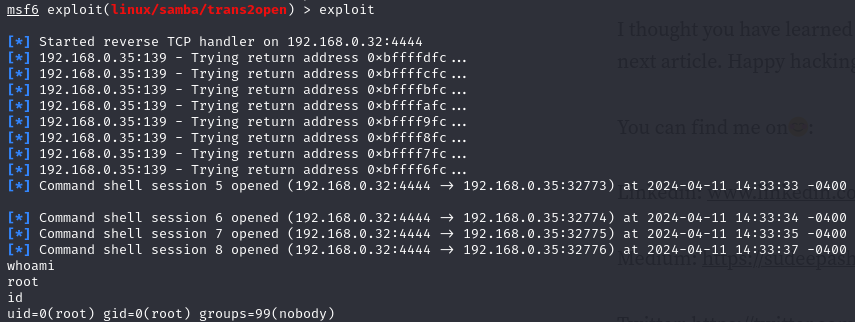                          
| Remediación                      |   Se recomienda actualizar a una versión de Samba 2.2.8a o posterior, o Samba-TNG 0.3.2 o posterior.                         |
| Link de referencia               |  [https://nvd.nist.gov/vuln/detail/CVE-2003-0201](https://nvd.nist.gov/vuln/detail/CVE-2003-0201)

### Máquina W1r3s


| Descripción de la vulnerabilidad | CWE-200: Exposure of Sensitive Information to an Unauthorized Actor. Apache                                                                                                                                                                                                                                                                                                                                                     |
| -------------------------------- | --------------------------------------------------------------------------------------------------------------------------------------------------------------------------------------------------------------------------------------------------------------------------------------------------------------------------------------------------------------------------------------------------------------------------------- |
| CVE/CWE                          | CWE-200                                                                                                                                                                                                                                                                                                                                                                                                                         |
| CVSS v3                          | 7.2                                                                                                                                                                                                                                                                                                                                                                                                                             |
| Severidad                        | Alto                                                                                                                                                                                                                                                                                                                                                                                                                            |
| Impacto                          | La exposición de información sensible puede tener un impacto significativo, dependiendo del tipo de información revelada. Esto puede variar desde la revelación de información personal privada, como mensajes personales, datos financieros, registros de salud, ubicación geográfica o detalles de contacto, hasta información sobre el estado y el entorno del sistema, como el sistema operativo y los paquetes instalados. |
| Sistemas afectados               | Apache2,  Máquina w1r3s                                                                                                                                                                                                                                                                                                                                                                                                         |
| Prueba de concepto (POC)         | Acceder al puerto 8080 a través de un navegador<br>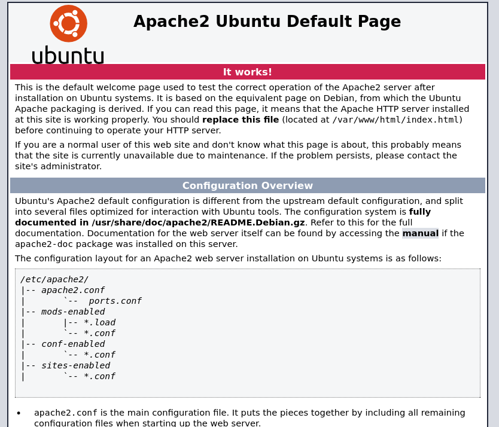                                                                                                                                                                                                                                                                                                                                        |
| Remediación                      |                                                                                                                                                                                                                                                                                                                                                                                                                                 |
| Link de referencia               | [CWE-200: Exposure of Sensitive Information to an Unauthorized Actor - MITRE](https://cwe.mitre.org/data/definitions/200.html)                                                                                                                                                                                                                                                                                                  |


<br>
<br>


| Descripción de la vulnerabilidad | Weak Password Requirements                                                                                                                                                                                                                                                                                                                                                    |
| -------------------------------- | ----------------------------------------------------------------------------------------------------------------------------------------------------------------------------------------------------------------------------------------------------------------------------------------------------------------------------------------------------------------------------- |
| CVE/CWE                          | CWE-52                                                                                                                                                                                                                                                                                                                                                                        |
| CVSS v3                          | 9.8                                                                                                                                                                                                                                                                                                                                                                           |
| Severidad                        | Crítica                                                                                                                                                                                                                                                                                                                                                                       |
| Impacto                          | La contraseña y usuario para entrar a este servicio es *anonymous:*, lo cual es un problema de seguridad crítico. Cualquier atacante que intente utilizar el servicio FTP podría acceder a los archivos del servidor con tan solo hacer una prueba manual básica o un ataque de fuerza bruta. Dentro de este servicio además existe información de empleados y de la empresa. |
| Sistemas afectados               | FTP                                                                                                                                                                                                                                                                                                                                                                           |
| Prueba de concepto (POC)         | Acceder al puerto 21 mediante un cliente FTP básico y realizar una prueba con varios conjuntos de credenciales básicas. Revisar el mensaje de que FTP se encuentra en modo "*anónimo*". Realizar un ataque de fuerza bruta con diccionarios básicos.<br><br>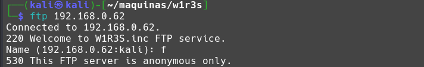                                                                              |
| Remediación                      | Desactivar modo anónimo en la configuración de FTP                                                                                                                                                                                                                                                                                                                            |
| Link de referencia               | https://www.cvedetails.com/cwe-details/521/Weak-Password-Requirements.html                                                                                                                                                                                                                                                                                                    |

<br>
<br>


| Descripción de la vulnerabilidad | Exposure of Sensitive Information to an Unauthorized Actor: Cuppa CMS                                                                                                                                                                                                                                                                                                                                                           |
| -------------------------------- | ------------------------------------------------------------------------------------------------------------------------------------------------------------------------------------------------------------------------------------------------------------------------------------------------------------------------------------------------------------------------------------------------------------------------------- |
| CVE/CWE                          | CWE-200                                                                                                                                                                                                                                                                                                                                                                                                                         |
| CVSS v3                          | 7.2                                                                                                                                                                                                                                                                                                                                                                                                                             |
| Severidad                        | Alto                                                                                                                                                                                                                                                                                                                                                                                                                            |
| Impacto                          | La exposición de información sensible puede tener un impacto significativo, dependiendo del tipo de información revelada. Esto puede variar desde la revelación de información personal privada, como mensajes personales, datos financieros, registros de salud, ubicación geográfica o detalles de contacto, hasta información sobre el estado y el entorno del sistema, como el sistema operativo y los paquetes instalados. |
| Sistemas afectados               | Cuppa CMS,  Máquina w1r3s                                                                                                                                                                                                                                                                                                                                                                                                       |
| Prueba de concepto (POC)         | Realizar una exploración con una herramienta de escaneo de directorios por fuerza bruta, en nuestro caso *dirbuser* y explorar los directorios hasta llegar a `administrator`:<br><br>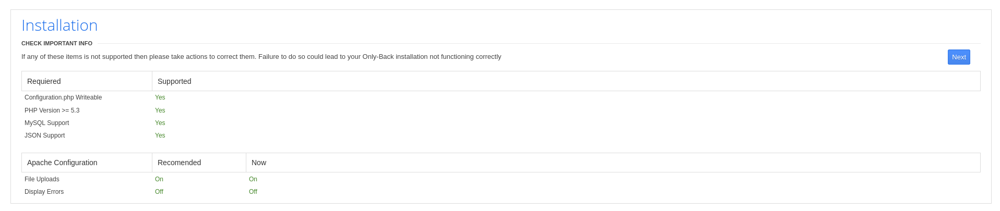                                                                                                                                                                                                      |
| Link de referencia               | [CWE-200: Exposure of Sensitive Information to an Unauthorized Actor - MITRE](https://cwe.mitre.org/data/definitions/200.html)                                                                                                                                                                                                                                                                                                  |
| Remediación                      |  Asegurarse de que se está utilizando la versión más reciente del software. Implementación de controles de acceso basados en roles o la segregación de deberes. Implementar un sistema de monitoreo y registro para detectar cualquier acceso no autorizado a la información sensible.                                                                                                                                                                                                                                                                                                                                                                                                                               |
| Link de referencia               | [CWE-200: Exposure of Sensitive Information to an Unauthorized Actor - MITRE](https://cwe.mitre.org/data/definitions/200.html)                                                                                                                                                                                                                                                                                                  |

<br>
<br>


| Descripción de la vulnerabilidad | Cuppa CMS - '/alertConfigField.php' Inclusión de archivo Local/Remota                                                                                                                                                                                                                                                                                                                                                                                                                                                                                                                                                                                                                                                                                                                                    |
| -------------------------------- | -------------------------------------------------------------------------------------------------------------------------------------------------------------------------------------------------------------------------------------------------------------------------------------------------------------------------------------------------------------------------------------------------------------------------------------------------------------------------------------------------------------------------------------------------------------------------------------------------------------------------------------------------------------------------------------------------------------------------------------------------------------------------------------------------------- |
| CVE/CWE                          | CWE-98                                                                                                                                                                                                                                                                                                                                                                                                                                                                                                                                                                                                                                                                                                                                                                                                   |
| CVSS v3                          |  9.8                                                                                                                                                                                                                                                                                                                                                                                                                                                                                                                                                                                                                                                                                                                                                                                                                                              |
| Impacto                          | La exposición de información sensible puede tener un impacto significativo, dependiendo del tipo de información revelada. Esto puede variar desde la revelación de información personal privada, como mensajes personales, datos financieros, registros de salud, ubicación geográfica o detalles de contacto, hasta información sobre el estado y el entorno del sistema, como el sistema operativo y los paquetes instalados.                                                                                                                                                                                                                                                                                                                                                                          |
| Sistemas afectados               | Cuppa CMS,  Máquina w1r3s                                                                                                                                                                                                                                                                                                                                                                                                                                                                                                                                                                                                                                                                                                                                                                                |
| Prueba de concepto (POC)         | Crear una URL maliciosa para explotar la vulnerabilidad y utilizar `curl` para traer el contenido devuelto por el CMS. La URL contiene una petición para obtener el archivo `/etc/passwd` de la máquina atacada.<br><br>```bash<br>curl "http://192.168.0.62/administrator/alerts/alertConfigField.php" --data-urlencode "urlConfig=../../../../../../../../../etc/passwd"<br>```<br><br>Con esto creado, al ejecutarlo obtenemos el contenido de los archivos `/etc/passwd` y `/etc/shadow`  exitosamente:<br><br>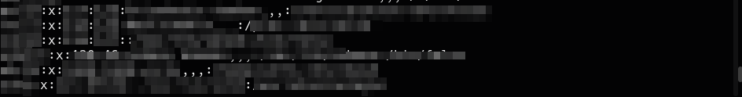<br>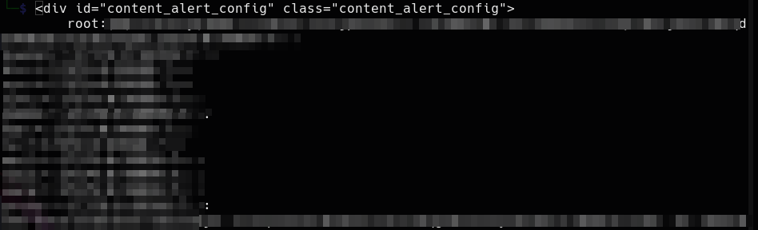<br>*Muestra de los contenidos obtenidos*<br><br>Estos contenidos pueden crackearse utilizando herramientas como `john` para realizar fuerza bruta, resultando en la exposición de credenciales críticas. |
| Remediación                      | Aplicar configuración correcta al archivo alertConfig del CMS Cuppa                                                                                                                                                                                                                                                                                                                                                                                                                                                                                                                                                                                                                                                                                                                                      |
| Link de referencia               | [CWE-98: Improper Control of Filename for Include/Require Statement in PHP Program (PHP Remote File Inclusion)](https://cwe.mitre.org/data/definitions/98.html)<br>[Exploit descrito en Exploit-db](https://www.exploit-db.com/exploits/25971)                                                                                                                                                                                                                                                                                                                                                                                                                                                                                                                                                           |

<br>
<br>


| Descripción de la vulnerabilidad | Weak Password Requirements                                                                                                                                                                                                                                                     |
| -------------------------------- | ------------------------------------------------------------------------------------------------------------------------------------------------------------------------------------------------------------------------------------------------------------------------------ |
| CVE/CWE                          | CWE-52                                                                                                                                                                                                                                                                         |
| CVSS v3                          | 10                                                                                                                                                                                                                                                                             |
| Severidad                        | Crítica                                                                                                                                                                                                                                                                        |
| Impacto                          | Hay varios usuarios en la máquina de los que se han obtenido credenciales y se ha conseguido exponer sus contraseñas mediante una herramienta de fuerza bruta, concretamente John The Ripper (`john`), resultando en la obtención de credenciales con los máximos privilegios. |
| Sistemas afectados               | Máquina w1r3s, SSH, FTP, MySQL.                                                                                                                                                                                                                                                |
| Prueba de concepto (POC)         | Tomar las credenciales filtradas a través de la vulnerabilidad de Cuppa CMS, tomar los usuarios y sus hashes, y utilizar la herramienta`john` para realizar ataques de fuerza bruta hasta sacarlas:<br><br>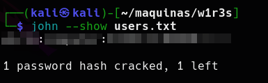                                |
| Remediación                      | Aumentar el nivel de seguridad de las contraseñas en los usuarios                                                                                                                                                                                                              |
| Link de referencia               | https://www.cvedetails.com/cwe-details/521/Weak-Password-Requirements.html                                                                                                                                                                                                     |


# Metodologías

## Herramientas utilizadas

- Nmap 7.94SVN
- Metasploit Framework 6.4.1-dev-
- Tenable© Nessus 10.7.2
- Hydra v9.5 (c) by Van Hauser THC & David Maciejak
- John The Ripper 1.9.0 by Solar Designers and Others
- OWASP DirBuster 1.0

## Procedimiento

### Fase 1: Reconocimiento

En primer lugar se han realizado escaneos automatizados utilizando la herramienta _Tenable© Nessus_, de la cual obtenemos un reporte que utilizaremos para guiar nuestra auditoría. 

Del reporte obtenemos información crucial que utilizaremos en la auditoría, como el nivel de riesgo que supone la vulnerabilidad para la seguridad de la máquina auditada, posibles CVEs que utilizaremos para guiarnos en su posterior intento de explotación y prueba de concepto (PoC).

Adicionalmente se realiza otro escaneo de puertos, servicios y posibles vulnerabilidades utilizando la herramienta _Nmap_ para listarlos, junto a los scripts por defecto de la herramienta, que se cruzarán con los resultados del reporte de _Nessus_ para mayor rigor.

### Fase 2: Explotación
Teniendo esta información disponible, se procederá a hacer uso del framework de pentesting _Metasploit_ para automatizar el uso de exploits debidamente elaborados para realizar una explotación de las vulnerabilidades descubiertas en la anterior fase de análisis. 

Una vez se realice un hallazgo, se documentará añadiendo su categoría y código en la clasificación CVE o CWE, su puntuación según CVSS asignada y en su defecto el cálculo de la misma por el auditor, una explicación concisa de la prueba de concepto realizada para llevar a cabo la explotación de esa vulnerabilidad, en la cual si es necesario se llevará a cabo la censura de la información sensible mediante el pixelado de la imagen. 

Finalmente se aportará un enlace de referencia a la vulnerabilidad en cuestión.

# Conclusión

En base a los hallazgos recabados en los análisis realizados, y las posteriores pruebas de pentesting llevadas a cabo, hemos llegado a las siguientes conclusiones:

