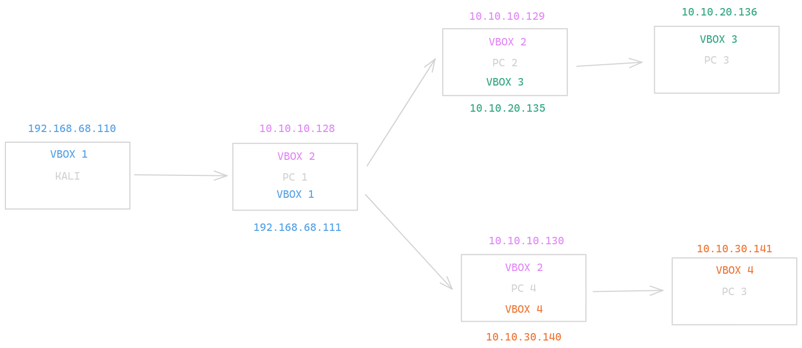

# Write Up Proyecto 7

## Esquema

En la siguiente captura se muestra el esquema de direccionamiento IP.

## kali - PC-1

### Escaneo de red

Primero de todo vamos a escanear la red para comprobar cual es la dirección IP de PC-1.

### Escaneo de puertos

Ahora que sabemos la dirección IP de la máquina que vamos a vulnerar, hacemos un escaneo de los puertos con nmap.

Como podemos comprobar, la máquina tiene un puerto 3389 abierto. Vamos a intentar comprobar si es vulnerable a ms12-020 para ello usaremos metasploit.
Creamos un workspace para el pentesting que estamos haciendo.

### Obtener acceso

Una vez creado, buscamos por ms12-020 con search. Usamos el 0 y añadiendo de manera global el RHOSTS con setg, ejecutamos el scanner para comprobar que es vulnerable.

Pero a mi esto no me interesa ya que lo que realmente me interesa es conseguir una shell meterpreter de manera fácil. 
Así que vamos a usar bluekeep para ver si podemos conseguirlo. Primero escaneamos para comprobar que es vulnerable a dicha vulnerabilidad usando el 0.

Como podemos comprobar, la máquina es 100% vulnerable.

Así que ahora vamos a intentar conseguir una shell de meterpreter en esta máquina. Volvemos a buscar bluekeep y usamos esta vez el tercero. Comprobamos las opciones y seteamos el LHOST con nuestra IP y el target lo ponemos en 2.

Lo ejecutamos para obtener la shell y como vemos somos SYSTEM.

Estas vulnerabilidades han sido encontradas buscando en google como explotar el puerto 3389.

### Crear túnel con chisel

Ahora que estamos dentro, nos interesa crear un túnel con chisel pero primero vamos a ejecutar el módulo autoroute para obtener las rutas de la sesión que se ha generado.

Ya tenemos las rutas, vamos a cambar a /Temp para subir con upload chisel.exe que se encuentra en nuestro kali.

En nuestro kali ejecutamos el servidor de chisel.

Y en el PC-1 ejecutamos el comando para ser cliente y crear el túnel pero primero tenemos que generar la shell con el comando del mismo nombre de meterpreter. Para ello colocamos nuestra dirección IP con R: seguido del puerto que está configurado en proxychains4.conf.

# PC-1 - PC-2

### Escaneo de puertos

Siguiendo nuestro esquema, la dirección IP del PC-2 sería 10.10.10.129. Para ello añadiremos proxychains4 antes del comando de nmap. Esta vez buscaremos los puertos 21, 22, 80 y 445 por ahora ya que suelen ser de los puertos más típicos.  Tras el intento no me cogía nada entonces probé con la .130 y ahí si me los pilló como filtered.

## Comprobación de servicios

Como aparecen en filtered al estar detrás de un firewall, vamos a intentar conectarnos en anónimo a ese ftp por ejemplo.

No nos ha conectado, eso significa que posiblemente el puerto no esté abierto o no haya un usuario anónimo.  Vamos a probar lo mismo pero con cmb.

¡Tenemos acceso anónimo! Ahora vamos a ver que contiene este usuario anónimo con ls. Vamos a descargar el fichero y comprobamos su contenido con cat. Tenemos 3 posibles contraseñas pero no los usuarios.

Vamos a ver que shares contiene smbclient con smblienct -L, la dirección IP y la contraseña de nuestro kali. Tenemos un helios que podría ser un usuario al igual que anonymous.

Probando una de las 3 contraseñas funcionó con qwerty.

Nos descargamos los dos ficheros que contiene el usuario.

Comprobamos el contenido de ambos ficheros. Leyendo el fichero research no he encontrado nada que sea interesante pero en todo.txt veo una posible ruta a una ¿Web?

Primero vamos a comprobar que existe una página web con proxychains y firefox. 

Como podemos ver si existe una página web.

Vamos a probar ahora con la ruta.

La ruta existe y encima podemos ver que es un wordpress.

Si buscamos en google como vulnerar wordpress nos aparece un video de youtube con una herramienta.

Si seguimos investigando un poco encontramos que tenemos que registrarnos para buscar con un token que nos genera los cve en su base de datos. La web usada es [Malcare](./img/https://www.malcare.com/blog/how-to-use-wpscan/)

Así que vamos a hacer exactamente lo mismo. Nos registramos y con nuestro token investigamos en la url. Como no me ha funcionado vamos a probar otra cosa.

Esto seguía sin funcionar así que buscando en internet encontré un comando para mostrar los plugins ya que la mayoría de wordpress son vulnerables. La dirección IP ha cambiado porque se reiniciaron las máquinas.

Además de estas reglas, he añadido la regla 4443 para el puerto que vamos a tener de escucha.
Investigando sobre estos plugins, vi que existe un plugin para mail-masta.

### Obtener acceso 

Lo primero es comprobar que funciona por ejemplo mostrando /etc/passwd, para ello vamos a abrir firefox con proxychains hacia la página web.

Ahora ponemos detrás de h3l105 "/wp-content/plugins/mail-masta/inc/campaign/count_of_send.php?pl=/etc/passwd"

Nos interesa ahora que sabemos que existe esta vulnerabilidad acceder. Para ello ponemos en escucha kali por el puerto 4443 por ejemplo.

Inyectamos el código a través de telnet con proxychains.

Ahora vamos a la url y ponemos lo siguiente después de h3l105/ para revisar que se ha ejecutado bien el comando. http://10.10.10.129/h3l105/wp-content/plugins/mail-masta/inc/campaign/count_of_send.php?pl=/var/mail/helios&comando=id

Ahora debemos crear la regla de firewall para el puerto 4443.

Creo la regla de netsh para redirigir las conexiones del 4443 de la máquina que contiene la red 10.10.10.129 para que pase a través de la ip de Windows 7 hacia mi máquina kali.

Entramos por localhost con el comando para crear una shell mientras escuchamos por el puerto 4443.

Si ejecutamos el comando id en nuestra shell creada veremos que somos helios.

Vamos ahora a estabilizar la shell con python -c “import pty; pty.spawn('/bin/bash')”

Vamos a buscar binarios con la flag SUID. Esta flag indica permisos de acceso que pueden asignarse a archivos o directorios. Estos permisos permiten ser ejecutados a estos ficheros con el usuario que los posee.
Vamos a buscar con --perm -u=s para especificar el permiso con el bit de SUID.
El único que difiere de los otros es /opt/statuscheck por eso vamos a intentar ver con strings que contiene.

Vemos que internamente ejecuta el comando curl.

Ahora nos interesa falsear el binario para poder escalar privilegios. Nos movemos hacia /tmp y con echo creamos el fichero curl.

Le damos permisos 777 al fichero que hemos creado.

Ahora con echo $PATH imprimos el valor de la acutal variable PATH.

Agregamos /tmp a la variable path.

Ejecutamos el binario y ya somos root.

