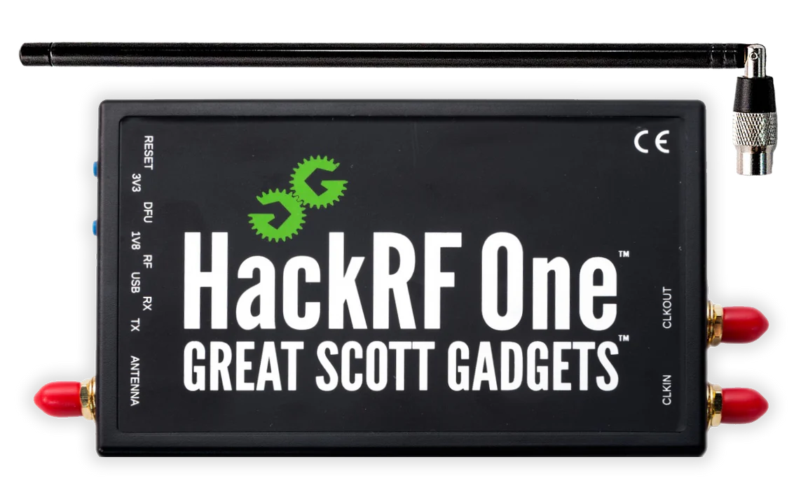

# Investigación Hackrf One

## Índice

- [Introducción](#introducción)
- [Características Técnicas](#características-técnicas)
- [Utilidades](#utilidades)
- [Referencias](#referencias)

## Introducción

El **HackRF One** es un transceptor de radio definido por software (SDR) que opera en un rango de frecuencia de **1 MHz a 6 GHz**. Desarrollado por **Great Scott Gadgets**, es conocido por su versatilidad y capacidad para sintonizar y transmitir señales de radio en una amplia gama de frecuencias.

Este dispositivo ha sido especialmente diseñado para agilizar el desarrollo y la prueba de tecnologías de comunicación por radio, tanto las actuales (con soporte para LTE) como aquellas en desarrollo para las nuevas generaciones de tecnologías radio y sus respectivos protocolos.

## Características Técnicas

- **Rango de frecuencia:** 1 MHz a 6 GHz
- **Ancho de banda:** 20 MHz
- **Sensibilidad de recepción:**
    - 121 dBm a 10 MHz
    - 117 dBm a 1 GHz
    - 110 dBm a 6 GHz
- **Sample rate:** 20 MS/s (millones de muestras por segundo)
- **Potencia de transmisión:** +10 dBm (100 mW)
- **Interfaz:** Hi-Speed USB 2.0
- **Formato de muestreo:** 8 bits
- **Alimentación:** USB
- **Dimensiones:**
    - Tamaño: 100 mm x 60 mm x 21 mm
    - Peso: 86 g
- **Muestras de cuadratura:** 8 bits (I de 8 bits y Q de 8 bits)
- **Compatibilidad con software:**
    - Compatible con las principales suites SDR a través de múltiples plataformas como GNU Radio, SDR#, SDR_Radio, Universal Radio Hacker, QSpectrumAnalyzer1.
    - Compatible con GNU Radio, SDR#, y más
- **Características adicionales:**
    - Filtro de ganancia de banda base y banda RX y TX configurables por software
    - Alimentación de puerto de antena controlada por software (50 mA a 3,3 V)
    - Conector de antena: SMA hembra
    - Conector SMA para reloj de entrada y salida hembra para sincronización
    - Botones convenientes para la programación
    - Encabezados internos para expansión
- **Código abierto:** Hardware de código abierto

## Utilidades

El HackRF es un transceptor half-duplex que opera entre 1 MHz - 6 GHz con hasta 20 MHz de ancho de banda. Es compatible con todas las principales suites SDR a través de múltiples plataformas: GNU Radio, SDR#, SDR_Radio, Universal Radio Hacker, QSpectrumAnalyzer. Hay extensos tutoriales y kits de herramientas disponibles para trabajar con el HackRF One.

La versatilidad del HackRF One lo hace útil en múltiples disciplinas y tareas:

- **Análisis de control remoto:** Analiza, reproduce y emula mandos de coches, alarmas, mandos de garaje, etc.
- **Manipulación de GPS:** Bloquee, manipule o ajuste las señales de GPS para los dispositivos con capacidad de localización.
- **Investigación de GSM:** Captura y análisis de IMSI.
- **Esnifado de Bluetooth:** Esnifar, capturar y analizar el tráfico Bluetooth y BLE.
- **Análisis avanzado de RFID:** Analiza y se comunica con todas las etiquetas RFID, independientemente de su frecuencia.
- **Funcionalidad SDR estándar:** Rastreo ADB-S, comunicación por satélite, detección de paquetes, análisis de señales, etc.

## Referencias

- Análisis software y hardware del SDR HackRF One. Recuperado de [https://digibug.ugr.es/bitstream/handle/10481/48019/RodriguezHaro_PFC_SDR_HackRF.pdf?sequence=1](https://digibug.ugr.es/bitstream/handle/10481/48019/RodriguezHaro_PFC_SDR_HackRF.pdf?sequence=1)

- [https://www.wimo.com/es/hackrf-one](https://www.wimo.com/es/hackrf-one)

- [https://www.amazon.es/HackRF-Software-Definida-ANT500-Adaptador/dp/B01K1CCHR0/ref=sr_1_5?adgrpid=1295225132299712&dib=eyJ2IjoiMSJ9.uhYU1kaYKizrG9Jx0BgQhr3h6jbAa9arPMcfJ6VAht_XbQnweT6fMTI9qrebmnKHvcvv8GEL9DxsN_ZP8SJHDkQD6HX1W3IEBlxfXHe36Q6D8XRs1bZQMAoBfhTAOw-_9KTixaJmr-bJhWo1OpWXmkHkH5uJiIHIcBa_dhSm-diDq1iQLKxQo1mgrSskTku0y5b74s6Pcg-aU64ikYRGtWeWetme_eFTeP5Ug10p6nm8SMa31taIVqZTWrTGLkNXWvPmL417Q6IJebxxOC0h69l-wYpwS6UeXC07JNlC_hc.BMpLK-EmYI0sdYS7c_-ZwbBAHI0uyfvxcv737MHuq6s&dib_tag=se&hvadid=80951659589295&hvbmt=bp&hvdev=c&hvlocphy=3178&hvnetw=o&hvqmt=p&hvtargid=kwd-80951805084598%3Aloc-170&hydadcr=11864_1899374&keywords=hackrf+one&qid=1715016674&sr=8-5](https://www.amazon.es/HackRF-Software-Definida-ANT500-Adaptador/dp/B01K1CCHR0/ref=sr_1_5?adgrpid=1295225132299712&dib=eyJ2IjoiMSJ9.uhYU1kaYKizrG9Jx0BgQhr3h6jbAa9arPMcfJ6VAht_XbQnweT6fMTI9qrebmnKHvcvv8GEL9DxsN_ZP8SJHDkQD6HX1W3IEBlxfXHe36Q6D8XRs1bZQMAoBfhTAOw-_9KTixaJmr-bJhWo1OpWXmkHkH5uJiIHIcBa_dhSm-diDq1iQLKxQo1mgrSskTku0y5b74s6Pcg-aU64ikYRGtWeWetme_eFTeP5Ug10p6nm8SMa31taIVqZTWrTGLkNXWvPmL417Q6IJebxxOC0h69l-wYpwS6UeXC07JNlC_hc.BMpLK-EmYI0sdYS7c_-ZwbBAHI0uyfvxcv737MHuq6s&dib_tag=se&hvadid=80951659589295&hvbmt=bp&hvdev=c&hvlocphy=3178&hvnetw=o&hvqmt=p&hvtargid=kwd-80951805084598%3Aloc-170&hydadcr=11864_1899374&keywords=hackrf+one&qid=1715016674&sr=8-5)

- [https://lab401.com/es-es/products/hackrf-one](https://lab401.com/es-es/products/hackrf-one)