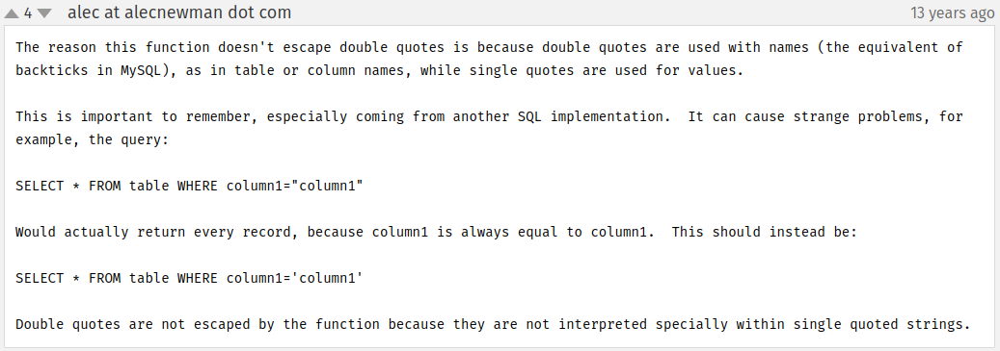

# Preguntas

# Parte 1 - SQL injection

La página no permite añadir jugadores a usuarios no autenticados, un formulario nos exige que introduzcamos un usuario y contraseña válidos. Lo primero que haremos es comprobar que este formulario es vulnerable a una inyección y aprovecharlo para saltarnos esta protección.

1. **a) Dad un ejemplo de combinación de usuario y contraseña que provoque un error en la consulta SQL generada por este formulario. Apartir del mensaje de error obtenido, decid cuál es la consulta SQL que se ejecuta, cuál de los campos introducidos al formulario utiliza y cuál no.**

Por ejemplo, tan solo introduciendo una secuencia de caracteres antecedida por `;` o de hecho el mismo caracter `;` ya tendríamos un error en el que realizamos un bypass del login y accedemos a cualquier parte de la aplicación, únicamente tendríamos que hacerlo cada vez que queramos cambiar de vista, pero solo eso es necesario.

| Descripción | Valor |
| --- | --- |
| Escribo los valores | ";" |
| En el campo | username |
| Del formulario de la página | list_players.php |
| La consulta SQL que se ejecuta es | SELECT userId, password FROM users WHERE username = ";" |
| Campos del formulario web utilizados en la consulta SQL | únicamente username |
| Campos del formulario NO utilizados | password |


1. **b) Gracias a la SQL Injection del apartado anterior, sabemos que este formulario es vulnerable y conocemos el nombre de los campos de la tabla “users”. Para tratar de impersonar a un usuario, nos hemos descargado un diccionario que contiene algunas de las contraseñas más utilizadas (se listan a continuación):**

    ```
    password
    123456
    12345678
    1234
    qwerty
    12345678
    dragon
    ```
    **Dad un ataque que, utilizando este diccionario, nos permita impersonar un usuario de esta aplicación y acceder en nombre suyo. Tened en cuenta que no sabéis ni cuántos usuarios hay registrados en la aplicación, ni los nombres de estos.**

    
| Explicación del ataque | El ataque consiste en repetir diferentes usuarios utilizando en cada interacción una contraseña diferente del diccionario |
| --- | --- |
| Campo de usuario con que el ataque ha tenido éxito | luis |
| Campo de contraseña con que el ataque ha tenido éxito | 1234 |

El ataque se realiza con hydra mediante el comando:

```bash
hydra -L user.txt -P pass.txt http-post-form "http://localhost:8000/list_players.php:username=^USER^&password=^PASS^
```

Donde:

- `hydra`: Es el nombre del programa que se utiliza para realizar ataques de diccionario.
- `-L user.txt`: Indica que se utilizará el archivo user.txt como lista de palabras para probar los nombres de usuario obtenido en la inyección SQL.
- `-P pass.txt`: Indica que se utilizará el archivo pass.txt como lista de palabras para probar las contraseñas.
- `http-post-form`: Indica que se utilizará el método POST para enviar los datos al servidor.


- **c) Si vais a private/auth.php, veréis que en la función areUserAndPasswordValid”, se utiliza “SQLite3::escapeString()”, pero, aun así, el formulario es vulnerable a SQL Injections, explicad cuál es el error de programación de esta función y como lo podéis corregir.**

Uno de los problemas que tiene `SQLite3::escapeString()` es que no escapa correctamente ciertos caracteres que pueden resultar críticos en una consulta SQL como por ejemplo las comillas dobles, como explica el usuario "alec" en un post de la documentación de PHP acerca de esta función:



Eso provoca efectivamente errores como mostrar la estructura del funcionamiento interno de las *queries* de la base de datos al caer en la instrucción "die()" y mostrar la consulta.

Para solucionarlo, en primer lugar se debe de separar los datos de SQL, para que nunca sean interpretados como comandos SQL. Eso se consigue con la función [`prepare()`](https://www.php.net/manual/en/pdo.prepare.php) que precisamente esta diseñada para construir consultas, de la siguiente manera:

```php
function areUserAndPasswordValid($user, $password) {
	global $db, $userId;

    $query = $db->prepare('SELECT userId, password FROM users WHERE username = :username');

    $query->bindValue(':username', $user, SQLITE3_TEXT);

	$result = $query->execute();

	$row = $result->fetchArray();

	if ($password === $row['password'])
	{
		$userId = $row['userId'];
		$_COOKIE['userId'] = $userId;
		return TRUE;
	}
	else
		return FALSE;
}
```

La función `prepare()` siempre va acompañada de `bindValue()` y `execute()` para garantizar que en el proceso los datos se separan y no son ejecutables por SQL.

Además es importante utilizar el operador de igualdad estricta `===` para que la contraseña y usuario sean exactamente las cadenas que se suministran. Por supuesto compararlo de esta manera implica que las contraseñas están guardadas en texto plano en la base de datos, por lo que habría que cambiar también la lógica de cómo se guardan, empezando por aplicarle una función de hash al guardarse.

- **d) Si habéis tenido éxito con el apartado b), os habéis autenticado utilizando elusuario “luis” (si no habéis tenido éxito, podéis utilizar la contraseña “1234” para realizar este apartado). Con el objetivo de mejorar la imagen de la jugadora “Candela Pacheco”, le queremos escribir un buen puñado de comentarios positivos, pero no los queremos hacer todos con la misma cuenta de usuario.**

    **Para hacer esto, en primer lugar habéis hecho un ataque de fuerza bruta sobre eldirectorio del servidor web (por ejemplo, probando nombres de archivo) y habéis encontrado el archivo “add_comment.php~”. Estos archivos seguramente se han creado como copia de seguridad al modificar el archivo “.php” original directamente al servidor. En general, los servidores web no interpretan (ejecuten) los archivos “.php~” sino que los muestran como archivos de texto sin interpretar.**

    **Esto os permite estudiar el código fuente de “add_comment.php” y encontrar una vulnerabilidad para publicar mensajes en nombre de otros usuarios. ¿Cuál es esta vulnerabilidad, y cómo es el ataque que utilizáis para explotarla?**

# Parte 2 - XSS

En vistas de los problemas de seguridad que habéis encontrado, empezáis a sospechar que esta aplicación quizás es vulnerable a XSS (Cross Site Scripting).

1. a) Para ver si hay un problema de XSS, crearemos un comentario que muestre un alert de Javascript siempre que alguien consulte el/los comentarios de aquel jugador (show_comments.php). Dad un mensaje que genere un «alert»de Javascript al consultar el listado de mensajes.

2. b) Por qué dice "&" cuando miráis un link(como elque aparece a la portada de esta aplicación pidiendo que realices un donativo) con parámetros GETdentro de código html si en realidad el link es sólo con "&" ?

3. c) Explicad cuál es el problema de show_comments.php, y cómo lo arreglaríais. Para resolver este apartado, podéis mirar el código fuente de esta página.

4. d) Descubrid si hay alguna otra página que esté afectada por esta misma vulnerabilidad. En caso positivo, explicad cómo lo habéis descubierto.

# Parte 3 - Control de acceso, autenticación y sesiones de usuarios

1. a) En el ejercicio 1, hemos visto cómo era inseguro el acceso de los usuarios a la aplicación. En la página de register.php tenemos el registro de usuario. ¿Qué medidas debemos implementar para evitar que el registro sea inseguro? Justifica esas medidas e implementa las medidas que sean factibles en este proyecto.

2. b) En el apartado de login de la aplicación, también deberíamos implantar una serie de medidas para que sea seguro el acceso, (sin contar la del ejercicio 1.c). Como en el ejercicio anterior, justifica esas medidas e implementa las que sean factibles y necesarias (ten en cuenta las acciones realizadas en el register). Puedes mirar en la carpeta private

3. c) Volvemos a la página de register.php, vemos que está accesible para cualquier usuario, registrado o sin registrar. Al ser una aplicación en la cual no debería dejar a los usuarios registrarse, qué medidas podríamos tomar para poder gestionarlo e implementa las medidas que sean factibles en este proyecto.

4. d) Al comienzo de la práctica hemos supuesto que la carpeta private no tenemos acceso, pero realmente al configurar el sistema en nuestro equipo de forma local. ¿Se cumple esta condición? ¿Qué medidas podemos tomar para que esto no suceda?

5. e) Por último, comprobando el flujo de la sesión del usuario. Analiza si está bien asegurada la sesión del usuario y que no podemos suplantar a ningún usuario. Si no está bien asegurada, qué acciones podríamos realizar e implementarlas.
# Parte 4 - Servidores web

¿Qué medidas de seguridad se implementariaís en el servidor web para reducir el riesgo a ataques?

# Parte 5 - CSRF

Ahora ya sabemos que podemos realizar un ataque XSS. Hemos preparado el siguiente enlace: http://web.pagos/donate.php?amount=100&receiver=attacker, mediante el cual, cualquiera que haga click hará una donación de 100€ al nuestro usuario (con nombre 'attacker') de la famosa plataforma de pagos online 'web.pagos' (Nota: como en realidad esta es una dirección inventada, vuestro navegador os devolverá un error 404).

a) Editad un jugador para conseguir que, en el listado de jugadores (list_players.php) aparezca, debajo del nombre de su equipo y antes de “(show/add comments)” un botón llamado “Profile” que corresponda a un formulario que envíe a cualquiera que haga clic sobre este botón a esta dirección que hemos preparado.

b) Una vez lo tenéis terminado, pensáis que la eficacia de este ataque aumentaría si no necesitara que elusuario pulse un botón.Con este objetivo, cread un comentario que sirva vuestros propósitos sin levantar ninguna sospecha entre los usuarios que consulten los comentarios sobre un jugador (show_comments.php).

c) Pero 'web.pagos' sólo gestiona pagos y donaciones entre usuarios registrados, puesto que, evidentemente, le tiene que restar los 100€ a la cuenta de algún usuario para poder añadirlos a nuestra cuenta.

Explicad qué condición se tendrá que cumplir por que se efectúen las donaciones de los usuarios que visualicen el mensaje del apartado anterior o hagan click en el botón del apartado a).

d) Si 'web.pagos' modifica la página 'donate.php' para que reciba los parámetros a través de POST, quedaría blindada contra este tipo de ataques? En caso negativo, preparad un mensaje que realice un ataque equivalente al de la apartado b) enviando los parámetros “amount” i “receiver” por POST.

