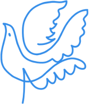

# Hacking ético

# **Proyecto 1 - Hack-Proof Inc.**
## Grupo 3

Raúl Ladrón de Guevara López
Juan Manuel cumbrera
Christian Romero Oliva

---

# **Introducción**

## Objetivos de la presentación

- Exploración de vulnerabilidades en nuestro tema seleccionado que es Sistemas Operativos.
- Comprender en qué consisten y como pueden explotarse.
- Aumentar la conciencia sobre la importancia de medidas preventivas para garantizar un entorno digital seguro.

---

# **CVE-2016-2414 - Minikin Android**

- Vulnerabilidad en *Minikin*, que es componente de Android encargado de renderizar las fuentes en la interfaz gráfica. 
- Minikin tenía un error en su implementación que provocaba un error donde se intentaba escribir datos en bucle (con la tabla cmap) en una dirección de memoria inválida, lo que desemboca en una denegación de servicio (DoS)

---

## ¿Como podríamos explotarla?
Un archivo .TTF malicioso que modifique la tabla cmap 

---

# **Conclusión:**

- Enfatiza la importancia de entender componentes de sistemas a bajo nivel para una ciberseguridad efectiva.
- Destaca la importancia de mantener sistemas actualizados para prevenir vulnerabilidades.
- Fomenta el uso de medidas de seguridad como firewalls, antivirus y sistemas de detección de intrusiones.

---

# **Recomendaciones:**

- Utilizar antivirus/antimalware y escáneres de vulnerabilidades.
- Implementar firewalls y cambiar puertos de servicios.
- Mantener sistemas actualizados y monitorear signos de actividad maliciosa.
- Fomentar una cultura de conciencia en ciberseguridad para minimizar riesgos.

---

# **Referencias:**

- [NIST](https://nvd.nist.gov/vuln) y [ExploitDB](https://www.exploit-db.com/): Recursos valiosos para información de vulnerabilidades.
- [Marp](https://marp.app/): Una herramienta útil para crear presentaciones basadas en markdown.

---
