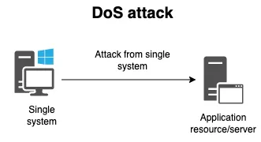
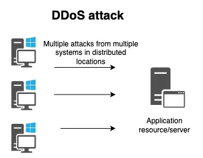
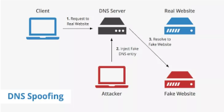
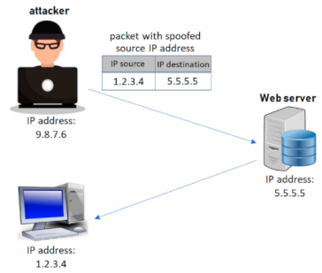

# Investigación sobre los ataques de redes, metodología y herramientas de pentesting

## Tipos de ataque en la red

### Ataque de denegación de servicio o Denial of Service (DoS) y 

Este tipo de ataque apunta a colapsar una red inundandola de tráfico. Lo hace mediante envío de muchas peticiones, por lo tanto los recursos se desbordan, el sitio no puede responder, se apaga y se vuelve innacesible.

Dentro de este tipo de ataques hay muchos tipos, entre ellos el ICMP Flood Attack que es un tipo de degenación de servicio que envia una gran cantidad de paquetes ICMP Echo Request.

Además de este ataque, existen varias posibilidades más como el Ping of the Dead igual al anterior pero con un tamaño de los paquetes de 65536 bytes.

Hay muchos tipos de ataques DoS que no se explicarán en este documento pero al menos los nombraremos siendo los siguientes:

- Tear Drop Attack
- Jolt Dos Attack
- Land Attack
- Smurf Attack
- SYN Flood
- Fraggle DoS Attack

Estos ataques son ataques DoS que se ejecutan a través de distintas técnicas pero con el objetivo de saturar una red o un servidor.

### Ataque de denegación de servicio o Distributed Denial of Service (DDoS)

Este ataque es un ataque DoS que utiliza múltiples dispositivos (Equipos remotos, bots o zombis) para que la red objetivo se vea desbordada, esto hace que el servidor se sobrecargue de forma más rápida que con un ataque DoS. 

Un ejemplo de este ataque es el que recibió AWS en Febrero de 2020 que generó un tráfico de 2,3 terabits por segundos. Los atacantes usaron servidores web pirateados del protocolo CLDAP. este protocolo es de los más usado en los últimos años.

### Spoofing de DNS y Spoofing IP

El spoofing de DNS consiste en alterar el DNS para por ejemplo redigir el tráfico a una página web falsa que emula una legítima.

Esto permite que la victima introduzca un nombre de usuario y contraseña y el atacante puede robar su información de acceso.

En el Spoofing IP se suplanta la dirección IP de origen de un determinado equipo, de esta forma se pueden enviar TCP, UDP o IP con una dirección IP falsa.

### Ataque Man in the Middle (MitM)

El atacante en este tipo de ataques intercepta una comunicación entre dos personas de forma secreta e incluso puede alterarla.

En este ataque se puede por ejemplo hacer en una red WiFi no cifrada. Las victimas no saben que el atacante está espiando o modificando la comunicación.

### Tunelización de DNS

Se usa el protocolo DNS para comunicar tráfico que no pertenece al tráfico DNS por el puerto 53. Por ejemplo se puede enviar HTTP y otro tipo de tráfico.

También se puede utilizar para tráfico VPN de tunelización DNS, manipular las solicitudes DNS a fin de exfiltrar los datos de un sistema comprometido y para encubrir tráfico saliente ocultando los datos que se suelen compartir mediante una conexión a internet. 

### ARP Spoofing

Este ataque permite atacar a equipos que esten en la misma red local, ya sea cableada o inalámbrica.

El atacante se hace pasar por el router haciendo que todo el tráfico de la red hacia internet pase directamente por él, pudiendo leer, modificar o bloquear este tráfico.

### Ataque de inundación MAC

Este tipo de ataques es uno de los más comunes y consiste en inundar la tabla CAM de un Switch con diferentes MAC como dirección de origen, con el objetivo de que el Switch acabe funcionando como un HUB.

### TCP Session Hijacking

Consiste en tomar posesión de una sesión TCP que ya existe y la victima ya está utilizando. 

Este tipo de ataque se debe utilizar en un momento concreto que es en el inicio de las conexiones TCP que es donde se realiza la autenticación. 

## Tipos de auditoria ofensiva en la red

### Auditoría de red inalámbrica

El proceso de auditar las conexiones Wi-Fi se realiza con la intención de determinar el nivel de segguridad y confidencialidad que proporcionan este tipo de redes. Normalmente en este tipo de redes se suelen encontrar configuraciones ni cifrados óptimos. 

Esta auditoría tiene como intención englobar todos los sistemas referentes a la red inalámbrica, segmentos de red, IP's etc.

La auditoría de red inalámbrica tiene dos fases, de reconocimiento del entrono y de descubrimiento de la infraestructura. Se utilizan analizadores de red para visualizar los distintos tipos de cifrado, el número de puntos de acceso, los canales por los que se emiten, el número de clientes conectados y a que puntos de acceso, calidad de la señal, etc.

Después se utilizan técnicas de análisis de vulnerabilidades dobre router, técnicas de suplantación de identidad, envenenamiento de la red y técnicas de ataques a contraseñas.

Esta auditoría tiene como beneficio proporcionar información veraz y fiable del estado de seguridad de la red WLAN de la organización, poniendo barreras de protección y control para determinar la seguridad de dicha red.

### Auditoría externa o perimetral

La auditoría externa o perimetral consiste en realizar un examen detallado y crítico con el fin de expresar un criterio profesional sobre la eficiencia y el funcionamiento de una prganización a la hora de desarrollar una gestión determinada.

El objetivo es estudiar el nivel de seguridad de los elementos públicos pr parte de la empresa, por ello, se estudiará el estado de seguridad del perimetro analizando las posibles entradas desde el exterior a la DMZ y zonas internas.

El alcance de esta auditoría se encuentra la aplicación o servicios web, extranet, intranet, sistemas perimetrales etc.

Dispone de dos fases de recolección de información, footprinting y fingerprinting. Con ellas, se realiza la recogida de información global y pública de internet para analizarla y determinar que roles disponen los sistemas perimetrales, puertos abiertos, versiones de productos públicas, etc.

Trás recolectar la información se numera y analiza para encontrar las vulnerabilidades existentes.

Una vez haber identificado los posibles vectores de acceso y vulnerabilidades, se planifican los metodos de ataque con mayor viabilidad y efectividad, por lo que habrá que buscar como acceder al sistema.

Gracias a esto se dispone de los vectores de accesom configuraciones erróneas y vulnerabilidades existentes en el perimtro, permitiendonos corregir y subsanar estas brechas de seguridad.

## Metodología OSSTMM

La metodología Open Source Security Testing Methodology Manual (OSSTMM) es una metodología que se utiliza para evaluar la seguridad de los sistemas de información y las redes. Esta es la metodología que escogeremos para el área de redes.

Esta metodología tiene varias fases que se basan en principios y técnicas de prueba de seguridad y ofrece además una guía sistemática para llevarlas a cabo.

### 1. Recopilación

Lo primero es recopilar información sobre el sistema o la red que se va a evaluar. Se pueden utilizar varias técnicas como la exploración de puertos, enumeración de serviciós y obtención de información a través de internet y fuentes públicas.

### 2. Análisis de la información

En esta fase se analiza la información recopilada para identificar las debilidades en la seguridad del sistema.

### 3. Explotación de vulnerabilidades

Trás un análisis de la información, pasamos a esta fase en la que se explotan las vulnerabilidades identificadas para demostrar los riesgos de seguridad y evaluar la capacidad del sistema para resistir estos ataques.

### 4. Evaluación de seguridad

Después de haber explotado las vulnerabilidades, se evalúa la eficacia de las medidas de protección implementadas en el sistema o la red. Por ejemplo, puede incluir pruebas de autenticación y autorización, prueba de protección de red, entre otras.

### 5. Documentación

Al finalizar las fases anteriores, se documentan los hallazgos, las debilidades y las recomendaciones para asegurar el sistema o la red en cuestión. Se pueden incluir pruebas y planes de acción además de las ya nombradas recomendaciones.

## Metodología OWISAM

La metodología Open Wireless Security Assessment Methodology (OWISAM) tiene como objetivo poner en común controles de seguridad que se deben verificar sobre redes inalámbricas, ayudando a diferentes administradores de redes, de sistema y analista de seguridad a identificar riesgo a los que minimizar el impacto de futuros ataques de infraestructuras Wireless basadas en el estándar 802.11.

Esta metodología consiste en 64 controles técnicos agrupados en 10 categorías para poder garantizar una auditoría de seguridad optima en infraestructura inalámbrica.

Debemos conocer las restricciones que tiene la infraestructura Wi-Fi en el alcance, existen varios tipos de restricciones:

- Área geográfica: Está definido para aquellas redes y dispositivos ubicados en un área geográfica concreta, como una oficina. Debemos asegurarnos que los dispositivos a analizar realmente pertenecen a la organización y verificar su ubicación física antes de iniciar las pruebas.
- ESSID: Se identifica una o varias redes Wi-Fi en base a su nombre.
- BSSID: Se identifica la dirección MAC de los dispositivos y redes a verificar, esto permite centrar las pruebas sobre los dispositivos clientes obviando el resto de ruido en la red.
- Pruebas de fuerza bruta: Se debe definir si dentro de las pruebas se autoriza al auditor realizar pruebas de verificación de usuarios y contraseñas contra los mecanimos de autenticación y en que condiciones para evitar bloquear cuentas de usuarios o realizar DoS como efecto secundario.
- Ataques DoS: Identificar que pruebas están permitidas en este ámbito y que dispositivos deben de ser excluidos.
- Ventana horaria: Posiblemente se necesitará realizar las pruebas en un horario concreto.
- Análisis activo: Revisión de seguridad inalámbrica que se considera una revisión activa del auditor siempre y cuando esté autorizado a interactuar con los dispositivos incluidos en el alcance.
- Análisis de perimetro: Puede ser necesario realizar las pruebas de análisis y ataques desde el exterior del perimetro de la organización.
- Visibilidad de las pruebas: Se puede establecer que las pruebas se realicen de un modo que pasen inadvertidas por parte del personal de la empresa.

Además de estas restricciones, existen una serie de fases que se emplean en el análisis de seguridad wi-Fi, son 7 fases y son las siguientes:

1. Planificación: Realizamos los pasos previos al análisis técnico.
2. Recopilación de información: Análisis pasivo de dispositivos.
3. Identificación de dispositivos: Extración  de información relevante de la infraestructura.
4. Ataques: Identificar debilidades en los dispositivos Wi-Fi.
5. Acceso a la red: Análisis e interacción con la infraestructura.
6. Pruebas sobre normativa y directivas: Verificación del cumplimiento de los controles normativos.
7. Generación de resultados: Documentación de informes, análisis final de evidencias y clasificación de riesgos.

## Herramientas de pentesting referentes a la red

En este apartado se nombrarán, explicarán y presupuestarán las diferentes herramientas pentesting para redes conocidas. Todas las herramientas investigadas son de código abierto y por lo tanto gratuitas.

### NMAP

NMAP es una de las herramientas credas para administradores, auditores y profesionales de seguridad. Tiene muchas funcionalidades, entre ellas permite la ejecución de scripts personalizados que permiten la identifiaciones de informaciones específicas.

Opera realizando un escaneo de objetivos que pueden ser redes y hosts, esntén abiertos a internet o no.

También escanea puertas de servicios que estén abiertas, determina el tipo de servicio, versión y los sistemas operacionales.

Con ella podemos hacer un barrido de la red y obtener respuestas de todos los dispositivos que estén conectados a la misma.

### NetCat

Conocido como nc, es una de las herramientas más antiguas. Fue creada para interactuar con puertas de servicios directamente a través de la entrega de una dirección IP, una puerta y un protocolo.

Esta herramienta también puede transferir archivos y establecer sesiones de host a host.

### Kismet Wireless

Es un sistema de detección de intrusos, detector de redes inalámbricas y rastreador de contraseñas, funciona con otras tarjetas inalámbricas y admite el modo de monitoreo sin formato.

Es la mejor herramienta para probar redes inalámbricas y piratear LAN inalámbrica o wardriving. Identifica redes de forma pasiva y recopila paquetes y detecta redes ocultas y sin baliza con la ayuda del tráfico de datos.

Funciona principalmente con redes Wi-Fi(IEEE 802.11) y se le pueden ampliar sus funcionalidades mediante numerosos complementos.

Funciona en sistemas Linux, Ubuntu y más.

### NetStumbler

Se utiliza para evitar wardriving, funciona en sistemas operativos Windows. Es capaz de detectar redes IEEE 802.11g, 802 y 802.11b. La versión más actualizada se llama MiniStumbler

### Aircrack-ng

Ofrece una variedad de herramientas de línes de comandos que verifican y evalúan la seguridad de la red Wi-Fi. Se dedica a actividades como ataque, monitoreo, prueba y descifrar contraseñas de redes inalámbricas WEP/WAP/WPA2.

Su funcionamiento se basa en tomar los paquetes de la red, y analizarlos mediante contraseñas recuperadas.

### Wireshark

Se utiliza para analizar paquetes de datos, también puede realizar inspecciones profundas de gran cantidad de protocolos establecidos. Podemos exportar los resultados del análisis a muchos formatos de archivo diferentes.

Realiza capturas en vivo y análisis fuera de línea.

### Ettercap

Es un sniffer/interceptor/logger para redes LAN con switchs, que soportan la disección activa y pasiva de muchos protocolos e incluye muchas características para el análisis de la red y el host anfitrión.

Filtra contenido y puede rastrear conexiones en vivo.

### Angry IP Scanner

Sirve para escanear direcciones IP y puertos. Puede usarse en internet o en LAN y es compatible con varios Sistemas Operativos. Permite realizar un rastreo y exportar los resultados en distintos formatos.

### TCPDump y WinDump

TCPDump es una herramienta diseñada para analizar el tráfico que circula por la red. Basada en línea de comandos y permite capturar y representar todo el tráfico que pasa por la red.

La versión de Windows se llama WinDump y requiere la instalación previa de WinPCAP.

## Referencias

- [https://blog.invgate.com/es/tipos-de-ciberataque](https://blog.invgate.com/es/tipos-de-ciberataque)
- [https://www.cisco.com/c/es_mx/products/security/common-cyberattacks.html#~tipos-de-ciberataques](https://www.cisco.com/c/es_mx/products/security/common-cyberattacks.html#~tipos-de-ciberataques)
- [https://www.f5.com/es_es/glossary/syn-flood-attack](https://www.f5.com/es_es/glossary/syn-flood-attack)
- [https://www.redeszone.net/tutoriales/seguridad/listado-completo-ataques-redes-como-evitarlos/](https://www.redeszone.net/tutoriales/seguridad/listado-completo-ataques-redes-como-evitarlos/)
- [https://afsh4ck.gitbook.io/ethical-hacking-cheatsheet/introduccion/introduccion/metodologia-osstmm](https://afsh4ck.gitbook.io/ethical-hacking-cheatsheet/introduccion/introduccion/metodologia-osstmm)
- [https://www.hackbysecurity.com/servicios-empresas/auditoria-informatica/auditoria-externa-o-perimetral](https://www.hackbysecurity.com/servicios-empresas/auditoria-informatica/auditoria-externa-o-perimetral)
- [https://ostec.blog/es/aprendizaje-descubrimiento/pentest-las-10-mejores-herramientas-usadas-en-el-mercado/](https://ostec.blog/es/aprendizaje-descubrimiento/pentest-las-10-mejores-herramientas-usadas-en-el-mercado/)
- [https://www.ctxdetectives.com/que-es-el-owisam/](https://www.ctxdetectives.com/que-es-el-owisam/)
- [https://institutotecnologicoeuropeo.com/mejores-herramientas-software-etico-para-hackers-2022/](https://institutotecnologicoeuropeo.com/mejores-herramientas-software-etico-para-hackers-2022/)
- [https://jotelulu.com/blog/5-herramientas-para-comprobar-la-seguridad-de-nuestra-red/](https://jotelulu.com/blog/5-herramientas-para-comprobar-la-seguridad-de-nuestra-red/)
