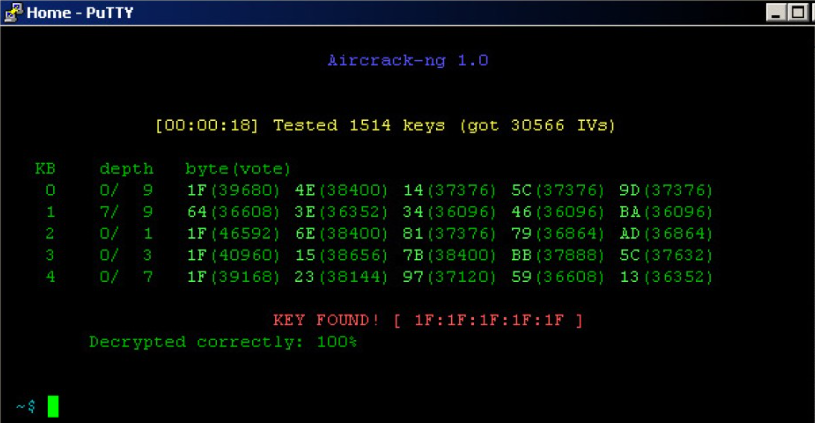
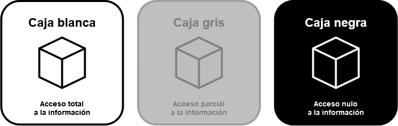
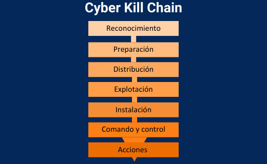
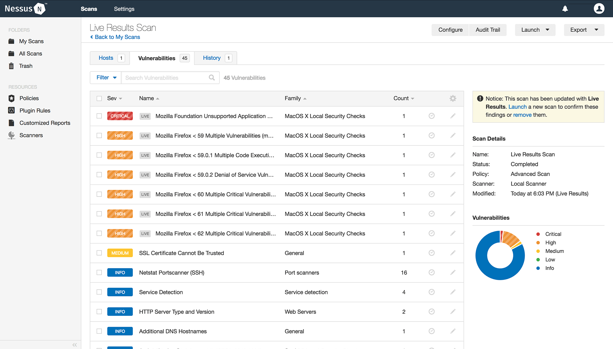
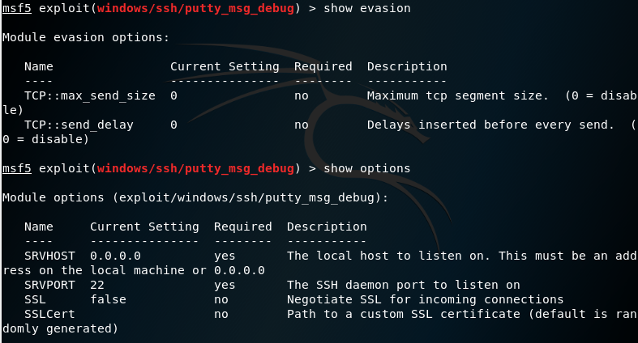
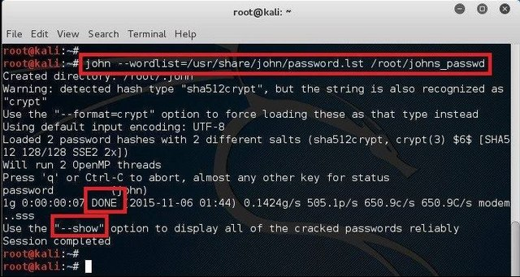

# Proyecto 2: Offensive Audit Services

 

**Autores:** *Grupo 3*

**Integrantes:**
- Raúl Ladrón de Guevara García
- Juan Manuel Cumbrera López
- Christian Romero Oliva
- Sergio Guerrero Merlo

## Índice

- [Introducción](#introducción)
- [Clasificación de Tipos de Ataque](#clasificación-de-tipos-de-ataque)
    - [Investigación de Tipos de Ataque](#investigación-de-tipos-de-ataque)
        - [Software](#software)
    - [Tipos de Auditoría Ofensiva](#tipos-de-auditoría-ofensiva)
        - [Auditoría de Seguridad de Software](#auditoría-de-seguridad-de-software)
    - [Descripción de los Servicios](#descripción-de-los-servicios)
        - [Auditoría de Seguridad de Software](#auditorc3ada-de-seguridad-de-software-1)
- [Investigación de Fases de Ataque](#investigación-de-fases-de-ataque)
    - [Investigación de Fases de Ataque](#investigación-de-fases-de-ataque)
    - [Investigación de las Metodologías de Pentesting](#investigación-de-metodologías-de-pentesting)
        - [PTES (Penetration Testing Execution Standard)](#metodología-ptes-penetration-testing-execution-standard)
    - [Selección de una metodología](#selección-de-una-metodología)
- [Herramientas de Monitorización](#herramientas-de-monitorización)
    - [Herramientas de Monitorización de Software](#herramientas-de-monitorización-de-software)
- [Conclusión](#conclusión)
- [Bibliografía](#bibliografía)

## Introducción

En el mundo actual en la era digital la evolución es frenética y constante. Este hecho supone grandes avances en materia informática, lo que lleva a mejorar las vidas de millones de personas, ofreciendo facilidades y soluciones que en años pasados se antojaban como ‘fantásticas’, y en algunos casos hasta ’futuristas’. La realidad, sin embargo, no está carente de ciertos problemas, y esto se debe principalmente a dos factores, el factor humano, ya sea debido a un descuido o el desconocimiento por parte de un trabajador o particular, o por la maldad inherente a ciertas personas, que les mueve a querer perpetrar acciones ilegales contra empresas y/o particulares, ya sea por motivo de lucro, por motivos políticos o incluso simplemente sólo por el placer de hacerlo; y las múltiples vulnerabilidades y fallos de seguridad en sistemas existentes, que abren una puerta a una infinidad de posibles ataques, lo que conforma el mundo de la ciberseguridad. 

Debido a estas dos poderosas razones, hemos podido ver un aumento exponencial de las amenazas cibernéticas, lo que ha llevado a profesionales de la seguridad ofensiva a comprender, clasificar y abordar una amplia variedad de tipos de ataques capaces de poner en peligro la seguridad de las organizaciones. Estos profesionales se dan a la tarea de estudiar estos ataques, analizarlos a profundidad y clasificarlos, para así poder entenderlos en términos de sus características, métodos y objetivos, para poder determinar cuáles son los más críticos desde el punto de vista de una organización.

Además de clasificar estos ataques, también se busca diseñas estrategias de auditoría ofensiva, lo cual es un componente esencial en el ámbito de la ciberseguridad. Las auditorías ofensivas nos permiten identificar debilidades y vulnerabilidades en sistemas, aplicaciones y redes antes que los atacantes las puedan explotar.

 

## Clasificación de Tipos de Ataque

Como antes hemos explicado, el modus vivendi de los profesionales de la ciberseguridad orbita en torno a la búsqueda y estudio de las vulnerabilidades y fallos de seguridad informáticos, analizando y comprendiendo los diversos tipos de ataques que los sistemas y aplicaciones pueden sufrir, anticipándose a ellos. 

Precisamente por ese motivo llevaremos a cabo una investigación y subsiguiente clasificación de la amplia gama de tipos de ataques posibles, así como de los tipos de auditorías ofensivas que ofrecemos, exponiendo una descripción de los susodichos servicios.

### Investigación de Tipos de Ataque

Cuando hablamos de tipos de ataques informáticos, nos viene a la mente una gran cantidad y diversidad de formas, comúnmente maliciosas, de acceder de una forma no autorizada a sistemas e incluso controlarlos, obtener datos confidenciales, e incluso producir daños en los equipos, redes, sistemas y servicios que sufran estos ataques cibernéticos. El mundo de la informática es amplio, así como por extensión lo es el de la ciberseguridad, y es por ello que hemos de comprender la rama de posibles áreas donde estos cibercrímenes son perpetrados.

Por motivos de comprensión y de organización, dividiremos este abanico de ataques entre las diferentes áreas susceptibles de sufrir ataques, que son el software, los servicios de mensajería electrónica, las páginas web, las redes informáticas y el IOT (Internet of Things).

#### Software

El *software* es un conjunto de programas, aplicaciones y datos que permiten que un equipo informático realice tareas específicas. Es la parte lógica y no física de un sistema que le permite funcionar y llevar a cabo diversas funciones tales como el procesamiento de datos, la gestión del hardware o la ejecución de aplicaciones. Como podremos imaginar, cualquier software no está exento de la posibilidad de sufrir diversos tipos de ciberataques, los cuales clasificaremos y analizaremos, con el fin de comprender mejor cómo funcionan y qué buscan lograr.

Antes de comenzar a clasificar las formas usadas por los atacantes para vulnerar un sistema debemos entender la diferencia entre un *exploit* y un *virus*. Mientras que un exploit es un software malicioso usado para aprovechar las vulnerabilidades de un sistema objetivo, un virus se acopla en un programa legítimo para camuflarse, y al ser ejecutado, el código malicioso entra en escena, copiándose en programas y ficheros del sistema.

##### Ataque de Fuerza Bruta Estándar

*Características*

- Es un ataque de fuerza bruta es un método utilizado para descubrir contraseñas o claves de cifrado desconocidas. 
- Este tipo de ataque trata de probar todas las combinaciones posibles de caracteres, números y símbolos hasta encontrar la correcta.

*Métodos*

- A través de un software especializado, los atacantes automatizan este proceso, probando miles de combinaciones por segundo. 
- Es común enfocarse en encontrar contraseñas débiles.

*Objetivos*

- El objetivo principal es el de obtener acceso no autorizado a cuentas, sistemas o datos protegidos por contraseña.
- Suele ser usado en cuentas online, sistemas protegidos por contraseñas o incluso en el descifrado de datos.

##### Ataque de Fuerza Bruta de Diccionario

*Características*

- A diferencia del tipo de ataque anterior, en un ataque de diccionario se utiliza una lista predefinida de palabras y combinaciones de caracteres. 
- Estos ataques suelen ser más eficientes que los de fuerza bruta, ya que se centran en contraseñas comunes y más probables.

*Métodos*

- Uso de software especializado o scripts en su defecto, que automatizan la prueba de contraseñas en la lista del diccionario. 
- Se puede personalizar el diccionario para adaptarlo al objetivo.

*Objetivos*

- El objetivo principal es adivinar la contraseña de un usuario, cuenta, sistemas o datos protegidos.
- Tras la obtención de la contraseña, el objetivo suele ser robar información confidencial, acceder a sistemas no autorizados, etc.

*Ejemplos*

- Aircrack-ng

##### Ataque de Fuerza Bruta con Algoritmo de Búsqueda Inteligente

*Características*

- Es un tipo de ataque de fuerza bruta en el que los atacantes usan algoritmos diseñados para predecir las combinaciones de contraseñas más probables.
- El ataque usa una base de información conocida de la víctima, así como de pautas usuales al crear contraseñas.  

*Métodos*

- Uso de software especializado o scripts en su defecto, aunque existe la posibilidad de usar una IA para esta tarea.

*Objetivos*

- El objetivo es el mismo que los demás ataques de fuerza bruta, que es obtener un acceso no autorizado a una cuenta de un usuario online, adivinar contraseñas, y acceder a sistemas o datos protegidos.

##### Ataque de Fuerza de Fuerza Bruta Híbrido

*Características*

- Este tipo de ataque combina tanto los ataques de fuerza bruta comunes como los ataques de diccionario.
- Se suele crear un diccionario con contraseñas comunes, y a través de fuerza bruta estándar agregar caracteres especiales o números.

*Métodos*

- Uso de software especializado o scripts en su defecto.

*Objetivos*

- Estos ataques buscan poder acceder de forma no autorizada a sistemas, cuentas de usuario, contraseñas o información confidencial.

##### Ataque de Escalada de Privilegios

*Características*

- Intento por parte del atacante de lograr un nivel de acceso o privilegios en un sistema superior al concedido inicialmente. 
- Esta clase de ataque suelen servirse de vulnerabilidades y fallos en la configuración de seguridad de sistemas para obtener dichos privilegios.
- El atacante suele buscar cuentas de root o administrador.
- Se distinguen entre la escalada de privilegios vertical, donde el atacante eleva sus privilegios desde una cuenta con privilegios de nivel bajo; y la escalada de privilegios horizontal, donde el atacante a pesar de usar una cuenta con bajos privilegios, gana acceso a datos y funcionalidades a las que no debería poder acceder.

*Métodos*

- No existe un solo método para lograr una escalada de privilegios, dado que esto varía de un sistema operativo a otro. 
- Algunas de las técnicas usadas por atacantes para lograr dichos privilegios incluyen la inyección de código o la suplantación de identidad.
- Estos ataques pueden suceder en sistemas locales, donde el atacante ya tiene acceso al mismo, o en sistemas remotos, donde se ha comprometido previamente una cuenta con un nivel menor de privilegios.

*Objetivos*

- El objetivo principal de este tipo de ataque es lograr un mayor control sobre un sistema, abriendo la puerta a atacantes a acciones que previamente les serían imposibles, tales como acceder a datos confidenciales, instalar malware o incluso modificar el propio sistema a su antojo.

##### Rootkit

*Características*

- Tipo de software malicioso diseñado para ocultarse en un sistema objetivo y proporcionar a los atacantes acceso no autorizado al mismo. 
- El término “rootkit” viene de “root”, que alude a los mayores privilegios en sistemas UNIX, lo que serían privilegios de administración en Windows.
- Los rootkits suelen funcionar ocultándose de los usuarios y de los sistemas de seguridad.
- Pueden llegar a modificar el SO, aumentando su control del mismo y asegurando su persistencia. 

*Métodos*

- Este tipo de malware suele instalarse en los sistemas objetivo de diferentes maneras, ya sea a través del uso de la ingeniería social como el phishing, ocultos en software de otra índole, aparentemente inocuo, etc.

*Objetivos*

- El principal objetivo es el de otorgar a los atacantes acceso al sistema infectado, así como de mantener dicho acceso de forma persistente.
- El objetivo de los atacantes es robar contraseñas o datos financieros, información confidencial o alterar o destruir el sistema objetivo.

*Ejemplos*

- Uroburos (2014). El rootkit Uroburos tenía como objetivo robar datos en compañías de alto perfil, pudiendo afectar desde empresas hasta organizaciones gubernamentales.
- Rustock (2006). Este rootkit tenía el siguiente *modus operandi*: infectar equipos informáticos de toda índole, desde ordenadores personales hasta sistemas empresariales, para convertirlos en *bots*, agregándolos a una *botnet* dedicada a enviar spam de manera masiva.

##### Troyano

*Características*

- Malware destinado a camuflarse como un programa legítimo e inocuo, y así otorgar acceso no autorizado a un sistema a los atacantes. 
- Aunque pueda parecer lo mismo que un rootkit, la diferencia radica en la detección de ambos por parte del sistema, ya que el rootkit se enfoca más en ocultar su presencia tanto del usuario como de sus sistemas de seguridad, mientras que el troyano trata de ejecutar acciones maliciosas en el sistema directamente. 

*Métodos*

- Esta clase de software malicioso puede transmitirse en correos de phishing, descarga de software pirata, enlaces malintencionados, la explotación de alguna vulnerabilidad, o incluso documentos o imágenes.

*Objetivos*

- Al igual que un rootkit, los troyanos pueden dar acceso no autorizado a un sistema, y también suelen utilizarse para robar todo tipo de información.
- Los troyanos suelen usarse para crear puertas traseras (backdoors) en los sistemas atacados.
- También poseen capacidades de espionaje tales como el uso de keyloggers (software que registra las pulsaciones de teclado) o capturar la pantalla.

*Ejemplo*

- URSNIF. Troyano especializado en robar datos bancarios, contraseñas, y datos personales. Ezste malware además, puede ser usado como puente para instalar más malware en el sistema

##### Adware

*Características*

- El adware es un tipo de software diseñado para mostrar anuncios no deseados en el sistema objetivo, y suelen manifestarse como banners, pop-ups, etc. 

*Métodos*

- Comúnmente el adware se instala en un sistema formando parte de un software legítimo.

*Objetivos*

- El objetivo principal del adware es generar ingresos para los anunciantes y desarrolladores del mismo.
- Algunos tipos de adware pueden llegar a recopilar información del usuario, a fin de poder mostrar publicidad personalizada a estas personas, o directamente vender esta información a otras empresas.

*Ejemplo*

- Appearch. Adware que usa software gratuito instalado como medio para poder colarse en el sistema, ya que es instalado junto con el software gratis aparentemente inocuo. Una vez instalado, llena el navegador de la víctima con publicidad basura.

##### Spyware

*Características*

- El spyware es un tipo de software malicioso diseñado para ser capaz de recopilar información de la víctima.
- Este tipo de malware se oculta, funcionando en segundo plano.
- Es capaz de rastrear la navegación en Internet, registrar pulsaciones de teclado y robar contraseñas o información sensible.

*Métodos*

- El spyware se suele instalar de forma encubierta en un sistema objetivo, a través de descargas de programas pirata, phishing o incluso unido a software legítimo.
- Una vez que se instala funciona de forma sigilosa, en segundo plano.

*Objetivos*

- El objetivo consiste en la recopilación de información del usuario infectado.
- Estos datos pueden incluir tarjetas de crédito, contraseña, historial de Internet o correos electrónicos.

*Ejemplo*

- Pegasus. Malware de espionaje (spyware) diseñado por la compañia israelí NSO Group. Pegasus puede instalarse de diversas formas en los móviles de sus víctimas, habiendo hecho uso para su ventaja de varias vulnerabilidades 0-Day. Este spyware es capaz de afectar tanto a iOS como a Android.

##### Gusano

*Características*

- Clase de malware que funciona propagándose a través de redes y sistemas informáticos, sin necesidad de intervención humana.
- La diferencia con otros tipos de virus o malware no necesitan ir adjuntos a archivos o programas, dado que se replican de forma automática.

*Métodos*

- Los gusanos aprovechan vulnerabilidades para propagarse por redes y sistemas informáticos.
- Una vez infectado un sistema, el gusano analiza la red en busca de otros objetivos a los que copiarse, y si no los encuentra usará Internet para esa misma tarea.

*Objetivos*

- El objetivo principal y razón de la existencia de un gusano es propagarse a otros sistemas, infectándolos para poder seguir propagándose.
- Algunos gusanos pueden contener payloads maliciosos.

*Ejemplos*

- Morris Worm (1998). El gusano Morris fué el primer gusano que causó un impacto significativo en Internet, siendo desarrollado por el entonces estudiante de postgrado, Robert Tappan Morris.
- Sasser Worm (2004). Gusano que explotaba una vulnerabilidad en sistemas Windows, bloqueando y reiniciando los equipos. Este gusano fué desarrollado por un estudiante alemán de 18, el cual fué capturado y condenado.

##### Botnets

*Características*

- El término “botnet” viene de la expresión robot network o red de robots.
- Esta es una red de sistemas infectados (“bots” o “zombis”) por un atacante.

*Métodos*

- Los bots que componen una botnet suelen integrarse a esta a través de malware que los infectó previamente.
- Una vez infectado, el bot se comunica con un servidor de Comando y Control (C&C), controlado por el atacante.
- Algunas botnet tienen varios C&C.

*Objetivos*

- Ataques DDoS.
- Distribución de Spam.
- Robo de Datos.
- Infección de más dispositivos.
- Cryptojacking o minado de criptomonedas.

*Ejemplos*

- CONFICKER (2008). Botnet dedicada a los ataques DDoS y al envío masivo de spam. Llegó a infectar entre 9 y 15 millones de equipos.

- GAMEOVER ZEUS (2012). Con su origen en Rusia, esta botnet infectó entre medio millón y un millón de equipos, y está diseñada para propagar entre los bots el malware CryptoLocker, que es un malware de tipo RansomWare, el cual encripta los equipos de las víctima y pide un rescate a cambio de la clave de desencriptado.

##### Rogueware

*Características*

- El rogueware es un software malicioso y fraudulento, diseñado para aparentar ser un software legítimo y/o de seguridad, cuando realmente lleva a cabo acciones ilegales.
- Suelen venderse como programas diseñados para mejorar el rendimiento de un dispositivo, pero realmente realizan acciones maliciosas.

*Métodos*

- El rogueware suele contraerse a través de descargar software de sitios no oficiales ni confiables, phishing, etc.
- Una vez instalado, este tipo de software muestra alertas de “supuestos problemas” que requieren de nuestra atención de forma inmediata.
- Incluso existen casos que poseen una versión “premium”, que no ofrece ningún beneficio real, siendo además de una intrusión informática, una estafa.

*Objetivos*

- El objetivo prioritario del rogueware es el lucro y la estafa a las víctimas a través de la venta de un software falso, que no sólo no los protege, sino que los daña.
- El rogueware es además capaz de robar información del usuario y su sistema.
- También posee la capacidad de instalar malware adicional.

*Ejemplo*

- WinWebSec. Familia de supuestos escáneres que emulan ser un sistema de seguridad legítimo, pero en realidad pueden llegar a infectar el equipo, convirtiéndolo en un *bot*. Algunos ejemplos son Live Security Platinum, Smart Protection y Win XP Security System.

 

#### Tipos de Auditoría Ofensiva

A fin de garantizar la seguridad de los sistemas, redes y dispositivos de los clientes, ofrecemos diversos tipos de auditorías ofensivas, con un enfoque práctico y directo. Este enfoque nos permite llegar a la raíz de los posibles problemas, fallos y/o debilidades en configuraciones de seguridad, localizar contraseñas débiles o encontrar vulnerabilidades críticas que pudieran ser explotadas por cibercriminales.

Antes de comenzar es importante proponer acuerdos, establecer límites y estudiar las regulaciones y normas de su compañía, a fin de delimitar el área que auditar, así como los horarios a los que llevar a cabo la auditoría en cuestión. Otro aspecto a tener en cuenta es discutir el tipo de prueba a llevar a cabo, siendo las opciones a elegir las siguientes:

- **Pruebas de Caja Negra (Black Box Testing).** En las pruebas de caja negra, los analistas de seguridad no conocemos los detalles internos y exactos del funcionamiento de su sistema, dado que el enfoque debe simular un ataque por parte de un elemento externo a la empresa, identificando vulnerabilidades sin acceso al código o a la estructura interna del sistema.
- **Pruebas de Caja Gris (Gray Box Testing).** Las pruebas de caja gris otorgan un conocimiento parcial del sistema al analista de ciberseguridad, ofreciendo detalles sobre el diseño o arquitectura del sistema, pero sin entrar en el código del mismo. Esto permite realizar pruebas con un enfoque mayor en un área concreta.
- **Pruebas de Caja Blanca (White Box Testing).** En las pruebas de caja blanca, a los evaluadores se les da un conocimiento completo del sistema, incluido el acceso al código fuente y la arquitectura interna del mismo. Esto da la posibilidad de llevar a cabo pruebas complejas, profundas y exhaustivas, con el objeto de identificar vulnerabilidades y/o fallos en el código del sistema.

Conociendo esto, se explicarán los tipos de auditorías ofensivas. Estas se dividen entre las diferentes áreas informáticas, y el objetivo de cada tipo es centrar los esfuerzos en un área concreta, para mayor efectividad y profundidad de las pruebas. 

##### Auditoría de Seguridad de Software

Una de las áreas más importantes en el panorama actual de la tecnología y de la información en general es el software, dado el papel fundamental que este desempeña en la operación de las organizaciones. 

No es de extrañar que este sea uno de los puntos clave por los que los atacantes suelen encontrar vulnerabilidades y fallos de seguridad y/o de configuración, usándolos para perpetrar sus ataques y acceder de forma no autorizada a los sistemas ajenos. Es por ello que ofrecemos una auditoría exclusiva al ámbito del software, analizando los programas en la red y sistemas de su empresa, ofreciendo un informe detallado de los resultados encontrados, ofreciendo soluciones para fortalecer su seguridad, la de su compañía y de sus empleados.

#### Descripción de los Servicios

Ahora que dispone de una lista de posibles auditorías que puede contratar, podrá ver a continuación una explicación a detalle de cada una de las auditorías anteriormente mencionadas, ofreciéndole una descripción precisa de los servicios ofertados.

##### Auditoría de Seguridad de Software

Nuestra Auditoría de Seguridad Ofensiva orientada al Software está diseñada para simular los ataques de cibercriminales reales, con el objetivo de identificar vulnerabilidades, fallos en configuraciones de seguridad, contraseñas débiles o por defecto en todas las aplicaciones y programas utilizados en su organización. Este estudio le permitirá mantener a salvo sus sistemas y datos confidenciales, mejorando su seguridad.

Comenzando por el entorno donde se llevarán a cabo las pruebas, existe la opción de realizarse de forma interna o externa a su organización, según los intereses que tenga el cliente. Obviamente, ambos enfoques ofrecen resultados distintos, así como enfoques distintos:

- *Auditoría Interna.* Una auditoría interna se realiza teniendo acceso a la red interna de la empresa cliente, llevando a cabo las pruebas de penetración o pentesting desde allí, pudiendo incluir las propias oficinas, su Intranet o una VPN. En esta clase de auditoría el experto en seguridad actúa como un usuario que previamente disponía de acceso a la red de la empresa.
- *Auditoría Externa.* Las auditorías externas se llevan a cabo desde fuera de la red de la organización, no teniendo acceso a los sistemas internos o datos de la empresa cliente. A diferencia del tipo de auditoría interna, en esta el auditor asume el papel de un atacante externo, el cual obviamente carece de un acceso autorizado a los sistemas de la empresa.

Una vez que hemos elegido si queremos una auditoría externa o interna, también debemos optar entre enfoques diferentes a la hora de realizar las pruebas, dado que estas podrán tener una mayor superficie para realizarlas, o llegar a una mayor profundidad en el sistema de la empresa cliente, obteniendo resultados más concretos en un área. Estos tres enfoques son los siguientes:

- *Análisis de Vulnerabilidades (Vulnerability Assessment).* Los análisis de vulnerabilidades consisten en la identificación y la recopilación de vulnerabilidades, fallos de configuraciones de seguridad, contraseñas débiles o por defecto, y en general fallos en la seguridad general de la empresa que puedan proporcionar un vector de ataque a un posible atacante. Este tipo de pruebas son las que cubren una mayor superficie, pero alcanzan un nivel de penetración menor en los sistemas de la empresa cliente.	
- *Test de Penetración (Pentesting).* Los tests de pentesting buscan realizar simulaciones de ataque controladas a la infraestructura, red y sistemas de la empresa cliente, con el fin de lograr resultados más precisos que un análisis superficial. Estas pruebas siempre se realizan siguiendo un código ético y cumpliendo unas normas acordadas con el cliente, tales como vetar ciertas partes de la infraestructura de la red de la empresa, limitar el pentesting a ciertas horas, etc.  Normalmente en esta clase de pruebas no es necesario hacer hincapié en el ocultamiento de los sistemas de seguridad de la empresa, y en la discreción, dado que la misión consiste en obtener el mayor número de fallas de seguridad posibles, sin preocuparse del sigilo. 
- *Red Teaming.* Las pruebas de Red Team podría decirse que son las más realistas de las tres, dado que alcanzan el mayor nivel de profundidad posible en los sistemas de la empresa, simulando un ataque real por parte de cibercriminales. Este tipo de prueba no posee constricciones de ningún tipo, pudiendo usar técnicas de Ingeniería Social como el Spear-Phishing, así como buscar ocultarse de los sistemas de seguridad de la empresa o explotar vulnerabilidades, tal y como lo haría un atacante real. El objetivo consiste no sólo en analizar las vulnerabilidades y fallos de seguridad de la compañía, sino en evaluar también la capacidad de respuesta de la misma.

Ya elegido el tipo exacto de pruebas que desea para su empresa, pasaremos a explicar el esquema general de la auditoría, desde la realización de las pruebas hasta la presentación del informe con los resultados obtenidos.

Se ha de remarcar que este es un mero esquema general con un enfoque claro en la seguridad del software de la empresa, haciendo hincapié en esta área concreta. Si se elige un enfoque de análisis externo, obviamente se obtendrá una evaluación general de la seguridad de sus programas, pero careciendo de un nivel alto de detalles.

Para enfocarnos en el entorno del software, respetando es esquema construido para ejecutar la auditoría ofensiva, orientándola al software, se deberán incluir las siguientes pruebas:

- **Ataques de Fuerza Bruta.** Se recomienda poner a prueba las constraseñas encontradas haciendo uso de ataques de fuerza bruta, tanto estándar, como de diccionario, híbridos e incluso con algoritmos de búsqueda inteligente.

- **Uso de exploits.** El uso de exploits es ampliamente utilizado por agresores en ataques reales, a fin de obtener un acceso no autorizado al sistema objetivo, por lo que el uso de estos es recomendado para entender las técnicas empleadas por los atacantes.

- **Ingeniería Social.** Si el cliente contrata una auditoría ofensiva con un enfonque de Red Teaming, se llevarían a cabo estrategias de ingeniería socialcon el fin de obtener acceso a sistemas no autorizados, tal y como lo harían atacantes reales. Esto se puede emplear en un ámbito de software, accediendo a herramientas empresariales que hagan uso de sistemas de autentificación.

- **Uso generalizado de malware (Troyanos, Rootkits, Spyware, etc).** Lo que se busca con esto es usar malware diseñado para lograr un acceso permanente a los sistemas de la empresa, creando incluso puertas traseras (*backdoors*) que faciliten el acceso a los mismos. El objetivo no es damnificar dichos sistemas, sino evaluar la capacidad de respuesta de los equipos de seguridad de la empresa, y buscar formas de sobrepasar las defensas informáticas de la misma, a fin de mitigar ataques reales a futuro.

- **Análisis de fallos a nivel de código.** Es necesario usar herramientas que evalúen de forma automática el código de diferentes aplicaciones de la empresa, con el objetivo de encontrar fallos de seguridad que puedan llevar a accesos no autorizados e incluso posibles vulnerabilidaes.

 

## Investigación de Fases de Ataque

### Identificación de las fases de un ataque

La cadena de fases de un ciberataque son cada uno de los pasos dados por un atacante para lograr el acceso no autorizado a un sistema, sirviéndose de diversos medios. Una vez dentro, la misión consiste en lograr persistir en el sistema, elevando los privilegios para robar datos confidenciales o sensibles, espiando la actividad de la víctima o directamente tomando el control completo sobre el sistema e incluso bloqueándolo o dañándolo.

Para lograr este cometido, los atacantes deben seguir una serie de pasos que se detallarán a continuación, en los que se podrá observar el proceso existente desde la recolección de información acerca de la víctima potencial hasta el acceso no autorizado, persistencia en el sistema y robo de datos, contraseñas, etc.

Existen múltiples modelos que presentan un diferente número de fases en un ciberataque, que van desde 5 hasta 14, como el modelo perteneciente a Mitre Att&ck. A continuación se expone el modelo desarrollado por la compañía estadounidense Lockheed Martin y más conocido como "*Cyber Kill Chain*", que consta de 7 pasos.  

1. **Fase de Reconocimiento.** La primera etapa del ataque consiste en la recopilación de información sobre la víctima, ya sea un usuario en particular o incluso una empresa concreta. Para ello se realiza un seguimiento, buscando información pública, redes sociales, analizar el tipo de tecnología utilizada, e incluso llegar hasta una interacción social real con la propia compañía.
2. **Fase de Preparación.** Una vez obtenida la información deseada, se comienza a preparar el ataque. De esta forma, se decide el tipo de método que será usado, así como la forma de hacerlo. Un ejemplo bastante común y que se suele barajar entre las opciones de ataque suele ser una campaña de Ingeniería Social, sirviéndose de malware para poder lograr del acceso remoto al sistema de la víctima.
3. **Fase de Distribución.** En esta fase se inicia el ataque, y es donde se espera que la víctima incauta descargue un software en concreto, aparentemente inocuo, abra un enlace malicioso o descargue el documento infectado que se le ha enviado por correo electrónico.
4. **Fase de Explotación.** Ya abierto y ejecutado el malware, la víctima ha quedado infectada, y su seguridad comprometida. En esta fase los atacantes ganan acceso al sistema objetivo. Normalmente esto se logra a través de vulnerabilidades explotadas en el sistema de la víctima, lo que permite de forma efectiva ganar una vía de acceso al mismo.
5. **Fase de Instalación.** Cuando los atacantes han logrado vulnerar el sistema objetivo accediendo a él, comienza la fase de instalación, que puede ser automática o manual. Si la instalación estaba programada en el código del malware, se dice que es automática, mientras que si es manual, los propios atacantes se encargarían de realizar esta operación. Los objetivos de los atacantes suelen incluir el robo de credenciales y datos sensibles, datos bancarios, hasta llegar a capturar las pulsaciones de teclado de la víctima o realizar capturas a su pantalla directamente.
6. **Fase de Comando y Control.** En esta fase los atacantes ya han logrado tomar el control completo del sistema vulnerado, pudiendo realizar las acciones que desee, como encriptar los datos de la víctima o robarlos, integrar el equipo en una botnet (aunque esto se suele hacer de forma automática por el propio malware), etc.
7. **Fase de Acciones sobre los objetivos.** Ya llegados a esta fase, el atacante ha logrado culminar todos los objetivos propuestos, pudiendo expandirse a otras víctimas, o realizar las acciones que considere pertinentes sobre la víctima actual.

Como hemos podido comprobar, en muchas ocasiones se emplean tácticas de manipulación psicológica e ingeniería social, para lograr que la víctima haga clic en el enlace malicioso preparado con antelación por el criminal, o descargue el malware que permita el acceso a su equipo. Por todo esto es crucial comprender estas formas de operar de los delincuentes, para así poder mitigar los ataques y aumentar la seguridad, dado que es mucho más fácil frustrar el ataque en las primeras fases, donde el agresor no tiene acceso a nuestro sistema, manteniéndonos seguros.

### Investigación de Metodologías de Pentesting

Las pruebas de pentesting son importantes en el ámbito de la seguridad informática, dado que poniendo a prueba los sistemas en los que realizan las pruebas, logran obtener resultados y, por ende, posibles soluciones o mitigaciones a fallos de seguridad y vulnerabilidades.

Teniendo en cuenta las auditorías que ofrecemos, hemos elegido implementar la metodología PTES (Penetration Testing Execution Standard), que posee un enfoque en un amplio espectro de áreas. Esta metodología está diseñada para poder ser aplicada tanto en redes y sistemas, aplicaciones web, redes, aplicaciones (software), ingeniería social e incluso seguridad física. Esta elección se hace debido al hecho de no existir una metodología concreta para el ámbito del software, pero sí una que cubre en gran medida, la mayoría de campos relevantes en el campo de la seguridad informática.

#### Metodología PTES (Penetration Testing Execution Standard)

La metodología PTES proporciona una forma clara y estructurada de auditar la seguridad de múltiples ámbitos. Para lograr esto, esta metodología dispone de una serie de fases, las cuales expondremos a continuación:

1. **Fase de Interacción Previa.** Fase inicial, en la que se planifica el pentesting, definiendo los objetivos del mismo, el alcance que va a tener, acordar una autorización con la empresa objetivo, así como llevar a cabo una recopilación básica de información.

2. **Fase de Recopilación de Información.** En esta fase se comienza a analizar el objetivo, llevándose a cabo a través de fuentes OSINT. Con esto obtenemos información detallada sobre la organización objetivo, incluyendo sus sistemas, aplicaciones y recursos de red. Este análisis puede llegar a cubrir el escaneo de puertos, enumeración de servicios y repopilación de información sobre empleados y archivos. 

3. **Fase de Modelado de Amenazas.** Esta fase consiste en analizar tanto el entorno interno como el externo del objetivo en busca de elementos susceptibles de ser explotados por posibles atacantes, pudiendo llevar a futuros ataques contra la organización objetivo. Su propósito es doble: primero, identificar los activos que serán objeto de la auditoría, evaluando su valor para la empresa y su importancia en los procesos de la organización; y en segundo lugar, evaluar quiénes podrían ser los posibles atacantes y su capacidad, se busca comprender y describir las amenazas en profundidad. Esta fase permite perfilar los tipos de ataques más probables, que serán los que se considerarán principalmente en las etapas posteriores del proceso.

4. **Fase de Análisis de Vulnerabilidades.** Fase en la que se realiza el proceso de análisis de vulnerabilidades y fallos en la configuración de los sistemas del objetivo, adelantándose al posible atacante. Una configuración de seguridad errónea, una contraseña débil o por defecto o un diseño inseguro pueden facilitar un posible ataque, y son objetivos en esta fase del pentesting.

5. **Fase de Explotación.** Una vez recopilada una lista de fallos de seguridad y vulnerabilidades, los pentesters o expertos en seguridad informática comienzan el proceso de acceso al sistema objetivo, saltándose los mecanismos de seguridad sirviéndose de exploits y apoyándose en las vulnerabilidades descubiertas. El fin último es lograr el control del sistema bajo prueba.

6. **Fase de Post-Explotación.** Una vez logrado el acceso al sistema, se busca lograr una persistencia en el mismo, así como llevar a cabo movimientos laterales cuyo objetivo sea alcanzar el control de otros activos. Con estas acciones se busca, a través del acceso conseguido, analizar y recopilar la información con mayor valor posible.

7. **Fase de Reporte.** Es la última fase, y consiste en la elaboración de un informe que detallen las conclusiones de las pruebas de pentesting. En este documento se resumen los resultados obtenidos, se evalúan los riesgos identificados y se sugiere un plan para reducir o gestionar dichos riesgos.

Finalmente, se elimina cualquier acceso y rastro dejado durante el pentesting, lo que devuelve el sistema a su estado original.

### Selección de una Metodología

[...]

 

## Herramientas de Monitorización

### Herramientas de Monitorización de Software

En este apartado incluimos un abanico de aplicaciones destinadas al uso del pentesting en el ámbito de la seguridad del software. Para ello hemos elegido cuidadosamente una serie de herramientas que nos facilitarán dicho trabajo:

- **Nessus.** Herramienta de evaluación de vulnerabilidades en sistemas operativos. Esta herramienta se compone de dos módulos, siendo *Nessusd* y *Nessus Client*. El primero se encarga de realizar el escaneo, mientras que el segundo controla las exploraciones y muestra los resultados acerca de las vulnerabilidades encontradas.
Este software es capaz de escanear puertos, así como los dispositivos conectados a una red, es capaz de detectar servicios, identificando los que son usados por las aplicaciones del sistema, identifica vulnerabilidades y finalmente, realiza un sondeo, asegurándose de no cometer falsos positivos. El precio oscila entre 500€ a 4482,49€ la versión más cara, aunque existe la posibilidad de solicitar una demo gratutita por 7 días.

- **Metasploit.** Plataforma de pruebas de penetración y desarrollo de exploits ampliamente utilizada en al ámbito de seguridad informática. Esta herramienta permite el desarrollo y prueba de exploits, ofreciendo una amplia biblioteca, de modo que el pentester tan sólo tiene que elegir el que necesite en cada momento; también permite escanear y enumerar servicios en una red y recopilar información en sistemas objetivo. Metasploit incluye también una shell remota, permitiendo acceder a sistemas previamente comprometidos, ejecutando comandos de forma remota; ofrece un sistema de gestión de sesiones de explotación en una misma consola, y provee al pentester de un sistema de genración de informes. Esta herramienta es gratuita, pero existe una versión Pro por 14000€.

- **John the Ripper.** Software de crackeo de contraseñas muy útil en tests de penetración por su capacidad de poner a prueba la robustez de contraseñas frente a ataques de fuerza bruta, llegando a romper hashes MD5 y SHA-1, pudiendo detectar el tipo de hash utilizado. Esta herramienta es ampliamente utilizada y funciona tanto en Windows como en sistemas Linux. Existen tres versiones, siendo la gratuita; John the Ripper Pro, que cuesta x€ y finalmente tenemos John the Ripper Jumbo, costando x€.

 

## Conclusión

[...]

## Bibliografía

### Software

- https://masterenciberseguridadonline.es/tipos-de-ataques-de-fuerza-bruta/
- https://winempresas.pe/blog/ataques-informaticos-causas-y-12-tipos-de-ciberataques
- https://cnipj.es/tipos-ataques-informaticos/
- https://ciberseguridad.blog/25-tipos-de-ataques-informaticos-y-como-prevenirlos/
- https://www.hackbysecurity.com/servicios-empresas/auditoria-informatica/tipos-de-auditorias-de-seguridad-informatica
- https://www.deltaprotect.com/blog/auditoria-de-seguridad-informatica
- https://resources.infosecinstitute.com/topics/hacking/popular-tools-for-brute-force-attacks/
- https://www.ciberseguridad.eus/ciberglosario/escalada-de-privilegios
- https://softwarelab.org/es/blog/que-es-un-rootkit/
- https://www.20minutos.es/tecnologia/ciberseguridad/5-troyanos-muy-peligrosos-que-te-pueden-vaciar-la-cuenta-5040746/
- https://nordvpn.com/es/blog/que-es-adware/
- https://es.gridinsoft.com/spyware
- https://softwarelab.org/es/blog/que-es-un-gusano-informatico/
- https://www.danysoft.com/los-12-peores-botnets/
- https://ayudaleyprotecciondatos.es/2021/04/23/rogueware/
- https://www.platinumciber.com/las-fases-de-un-ciberataque/
- https://www.ymant.com/blog/las-7-fases-de-un-ciberataque/
- http://www.pentest-standard.org/index.php/Main_Page
- https://keepcoding.io/blog/que-es-nessus/
- https://keepcoding.io/blog/que-es-metasploit-ciberseguridad/
- https://www.redeszone.net/tutoriales/seguridad/crackear-contrasenas-john-the-ripper/