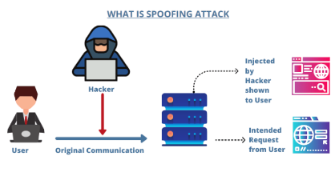
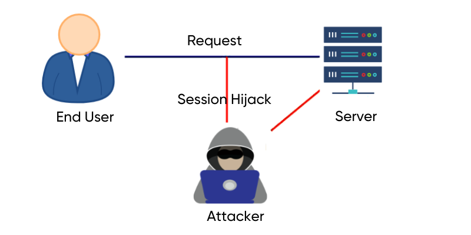

# Proyecto 2: Offensive Audit Services

<br/>


**Autores:** *Grupo 3*

**Integrantes:**
- Raúl Ladrón de Guevara García
- Juan Manuel Cumbrera López
- Christian Romero Oliva
- Sergio Guerrero Merlo

## Índice

- [Introducción](#introducción)
- [Tipos de Ataque y su Clasificación](#tipos-de-ataques-y-su-clasificación)

## Introducción

En el mundo actual en la era digital la evolución es frenética y constante. Este hecho supone grandes avances en materia informática, lo que lleva a mejorar las vidas de millones de personas, ofreciendo facilidades y soluciones que en años pasados se antojaban como ‘fantásticas’, y en algunos casos hasta ’futuristas’. La realidad, sin embargo, no está carente de ciertos problemas, y esto se debe principalmente a dos factores, el factor humano, ya sea debido a un descuido o el desconocimiento por parte de un trabajador o particular, o por la maldad inherente a ciertas personas, que les mueve a querer perpetrar acciones ilegales contra empresas y/o particulares, ya sea por motivo de lucro, por motivos políticos o incluso simplemente sólo por el placer de hacerlo; y las múltiples vulnerabilidades y fallos de seguridad en sistemas existentes, que abren una puerta a una infinidad de posibles ataques, lo que conforma el mundo de la ciberseguridad. 

Debido a estas dos poderosas razones, hemos podido ver un aumento exponencial de las amenazas cibernéticas, lo que ha llevado a profesionales de la seguridad ofensiva a comprender, clasificar y abordar una amplia variedad de tipos de ataques capaces de poner en peligro la seguridad de las organizaciones. Estos profesionales se dan a la tarea de estudiar estos ataques, analizarlos a profundidad y clasificarlos, para así poder entenderlos en términos de sus características, métodos y objetivos, para poder determinar cuáles son los más críticos desde el punto de vista de una organización.

Además de clasificar estos ataques, también se busca diseñas estrategias de auditoría ofensiva, lo cual es un componente esencial en el ámbito de la ciberseguridad. Las auditorías ofensivas nos permiten identificar debilidades y vulnerabilidades en sistemas, aplicaciones y redes antes que los atacantes las puedan explotar.

## Tipos de Ataques y clasificación por área

Como antes hemos explicado, el modus vivendi de los profesionales de la ciberseguridad orbita en torno a la búsqueda y estudio de las vulnerabilidades y fallos de seguridad informáticos, analizando y comprendiendo los diversos tipos de ataques que los sistemas y aplicaciones pueden sufrir, anticipándose a ellos. 

Precisamente por ese motivo llevaremos a cabo una investigación y subsiguiente clasificación de la amplia gama de tipos de ataques posibles, así como de los tipos de auditorías ofensivas que ofrecemos, exponiendo una descripción de los susodichos servicios.

### Ataques en correos electrónicos

#### 1. Phishing

El **phishing** es una técnica de estafa en la que se hace uso de técnicas de ingeniería social para engañar a un usuario con el fin de obtener información privada, beneficios económicos o incluso para instalar malware en el dispositivo.


Dentro del phising existen múltiples variantes como:

- **Deceptive Phishing (Phishing clásico):** Consiste en suplantar la identidad mediante el envío de un correo electrónico por parte de un ciberdelincuente a un usuario simulando ser una entidad legítima (red social, banco, institución pública, etc.) con el objetivo de robarle información privada, realizarle un cargo económico o infectar el dispositivo. Para ello, adjuntan archivos infectados o enlaces a páginas fraudulentas en dicho correo electrónico.
  
- **Spear phishing (dirigido a individuos específicos):** Consiste en un tipo de estafa muy similar al phishing clásico, pero con la diferencia de que van dirigidos a una o varias víctimas en concreto. Este tipo de correos electrónicos se preparan de manera bastante más sofisticada ya que primero estudian a las víctimas (sus gustos, preferencias, etc..) y luego elaboran el correo electrónico según el perfil estudiado de la víctima por lo que es mucho más efectivo ya que es más complicado que un usuario lo detecte.

- **Whaling (Caza de la ballena):** Esta estafa consiste en la suplantación de identidad de altos cargos de las empresas, como directores generales, directores de operaciones, presidentes o personas importantes dentro de esta para que compartan credenciales, acceder a redes que están muy protegidas o simplemente robar dinero o datos. Emplean tácticas más avanzadas y sofisticadas que otros tipos de ataques hasta el punto de realizar una investigación y planificación previa.
Se utilizan nombres, direcciones, cargos u otra información personal para crear una apariencia más sólida y creíble para el ataque.

- **Pharming:** Es un método en el que el tráfico de la navegación, vinculado a un correo recibido, se redirige para que el usuario crea que está navegando en el sitio web deseado. En realidad, se conecta al sitio web del ciberdelincuente, lo que puede resultar en la obtención de credenciales o información personal con el fin de usurpar la identidad de alguien.
Este tipo de ataque suele aprovechar la navegación en línea de las víctimas al corromper el sistema de nombres de dominio (DNS). El atacante envenena el DNS y lo modifica de manera que los usuarios visiten sitios web maliciosos en lugar de los sitios legítimos, sin que ellos lo sepan.

- También existen más variantes como por ejemplo, el Vishing (phishing a través de llamadas telefónicas) o como el Smishing (phishing a través de mensajes de texto), Angler Phishing (Dirigido a los usuarios de las redes sociales), etc.. pero en estos no me centraré ya que no entran en el área de los correos electrónicos.

#### 2- Spoofing

El **email spoofing** consiste en la suplantación de identidad por correo electrónico, que se produce cuando un atacante envía un correo electrónico a un usuario haciéndose pasar por otra persona o empresa. Esto se consigue camuflando la dirección de correo electrónico de forma que la sustituyen por una legítima. Un ejemplo puede ser que el atacante use paypa1.com en vez de paypal.com. La mayoría de usuarios a los que van destinados estos correos no se suelen fijar bien en la dirección si el nombre le resulta familiar o simplemente ni la leen por lo que no se dan cuenta de que se trata de una dirección de correo falsa.


Los atacantes consiguen camuflar las direcciones de correo electrónico debido a la falta de seguridad del protocolo simple de transferencia de correo (SMTP), que no admite cifrado, autenticación ni otras medidas de seguridad similares. Por ejemplo, los servidores de correos más reconocidos como pueden ser Gmail o Outlook utilizan este protocolo por lo que es muy fácil para los atacantes hacer este cambio de dirección.

Si bien es similar al phishing, estos dos ataques son distintos. El phishing busca robar información personal o credenciales a través de engaños o estafas, mientras que el email spoofing su objetivo principal es suplantar la identidad de alguien en un correo electrónico, lo que puede llevar a ataques de phishing, pero su objetivo principal es la suplantación de identidad.

#### 3. Spam

El spam de correos electrónicos es un tipo de comunicación masiva que se envía principalmente por motivos comerciales. A los atacantes que realizan el envió de este tipo de correos se les suele llamar "Spammers". Estos correos electrónicos suelen contener publicidad no deseada, promociones, malware, enlaces a sitios web falsos o contenido irrelevante. 


Algunos ejemplos pueden ser:

- Ofertas para ganar dinero rápido.
- Ofertas incitantes como descuentos o promociones.
- Mensajes de préstamos o créditos no solicitados.
- Notificaciones de facturas falsas.

Aunque en la mayoría de los casos no se considera dañino, puede resultar molesto y difícil de filtrar. También es importante destacar que el spam puede llevar a la pérdida de productividad y tiempo para los usuarios, ya que deben dedicar tiempo a eliminar o ignorar estos correos no deseados.
Para combatir el spam, se utilizan filtros de correo electrónico que intentan bloquear estos mensajes no deseados antes de que lleguen a la bandeja de entrada del usuario.

#### 4. Scam

El scam son los intentos de estafas llevadas a cabo a través de correos electrónicos, cuyo objetivo es engañar al usuario para que cometan una acción legítima, pero en realidad no lo son. En la mayoría de los casos, se pretende estafar económicamente pero también se utiliza para instalar malware o robar información.


Algunos ejemplos pueden ser:

- Correos de servicios donde piden actualizar información.
- Donaciones.
- Premios de lotería.
- Pago de donaciones a ONGs falsas.
- Servicios de renovación como por ejemplo seguros de coches o plataformas de streaming (Netflix, Twitch, HBO, etc...)
- Soporte o asistencia técnica.

El funcionamiento del scam se divide en tres etapas:

- 1: Los estafadores establecen contacto con la víctima a través de correos electrónicos no solicitados e intenta atraer la atención de la víctima y establecer una comunicación inicial.
  
- 2: Una vez que se ha establecido el contacto, el estafador comienza a engañar o manipular a la víctima ofreciéndole ofertas, soporte o algunos de los ejemplos que especifico arriba.

- 3: Una vez que se ha conseguido engañar a la víctima, el atacante recibe dinero, información confidencial o simplemente infecta el dispositivo de la víctima con malware.


#### 5. Malware

**Malware o “software malicioso”** es un término amplio que describe cualquier programa o código malicioso que es dañino para los sistemas. Los ataques de malware a través del correo electrónico son muy habituales y generan una amenaza persistente y creciente en el mundo actual. Los atacantes lo usan para robar, cifrar o borrar datos, alterar o secuestrar funciones básicas del dispositivo e incluso para espiar su actividad sin su permiso.


Como existen muchos tipos de malware y mis compañeros también lo van a detallar y a explicar, mostraré algunos ejemplos de los más comunes que se distribuyen por correo electrónico:

##### - Troyanos (Caballos de Troya): 
Es un tipo de archivo que contiene malware y que comúnmente se camuflar dentro de un software legítimo adjunto a un correo electrónico. Aunque el correo electrónico y el archivo adjunto parezcan legítimos y procedan de una fuente fiable, cuando la víctima hace clic en ellos, el malware se instala en su ordenador. Los troyanos pueden utilizarse para robar datos, controlar el equipo para ser usado por una red de bots (BotNet) o incluso borrar completamente todos los archivos del disco duro.

Algunos ejemplos de troyanos relacionados con los correos electrónicos pueden ser:

- **Mailfinders:** Este troyano está diseñado para recopilar direcciones de correos electrónicos desde un dispositivo y luego enviarlos a los atacantes a través de un correo, un servidor FTP u otros medios. Una vez el atacante consigue todos estos correos electrónicos, los utiliza para realizar spam de todo tipo de correos.

- **Emotet:** Es un troyano que a menudo se distribuye a través de correos electrónicos de phishing. Funciona de tal manera que, si hay una red conectada, se propaga utilizando una lista de contraseñas comunes y averigua el camino hacia otros sistemas conectados en un ataque de fuerza bruta.

- **Dridex:** Es un troyano bancario que ha sido conocido por propagarse a través de correos electrónicos de phishing. Los correos electrónicos contienen documentos maliciosos de Microsoft Word o Excel que, cuando se abren, descargan y ejecutan el malware.

- **TrickBot:** Es un conocido troyano bancario que se utiliza principalmente para robar información financiera y realizar actividades maliciosas en los dispositivos infectados.

##### - Gusanos:
Son un tipo de malware que tienen la peculiaridad de replicarse para propagarse a otras dispositivos. Utiliza la red para propagarse, aprovechando las fallas de seguridad en el dispositivo de destino para acceder a él.
<br>
Un ejemplo muy común es el del gusano ILOVEYOU que se propagó a través de un correo electrónico con un asunto que decía "ILOVEYOU". Este afectó a millones de dispositivos en todo el mundo en el año 2000. Una vez abierto, el virus se replicaba y se enviaba a todos los contactos en la libreta de direcciones de la víctima.

##### - Backdoors (Puertas traseras): 
Este tipo de malware permite al atacante tener control remoto total en el dispositivo infectado. 
El atacante puede hacer lo que quiera en el dispositivo, como, por ejemplo, enviar y recibir archivos, ejecutar archivos, mostrar mensajes, borrar datos, reiniciar el equipo, etc...
  
##### - Rootkits: 
Este de malware es diseñado para no ser detectado por los sistemas operativos y los antivirus/ antimalwares y trabajar en segundo plano. Con este tipo de malware consiguen tener acceso al dispositivo durante un periodo más largo.

##### - Keyloggers: 
Es un tipo de malware que se ejecuta en nuestro dispositivo en segundo plano y que permite registrar todas las pulsaciones de teclas que se realicen en este.

##### - Ransomware: 

Es un tipo de malware que impide a los usuarios acceder a su sistema o a sus archivos personales y que exige el pago de un rescate para poder acceder de nuevo a ellos.

Es muy común que los atacantes o ciberdelincuentes utilicen ataques como el phishing o el spam para incluir este malware en el contenido del correo electrónico de alguna forma.

#### 6. Apropiación de cuentas de correo electrónico

La apropiación de cuentas de correos electrónicos es una práctica muy común entre los ciberdelincuentes. 
Los atacantes se apropian de los correos electrónicos de los usuarios reales con la intención de realizar actividades como controlar sus mensajes, robar información, enviar malware a otras cuentas, realizar spam.


Existen muchas técnicas que usan los atacante para apropiarse de las cuentas:

- **Phishing:** Podrían engañar a al usuario redirigiéndolos a sitios web falsos donde tienen que ingresar sus credenciales.

- **Fuerza bruta:** Consiste en ir probando diferentes combinaciones de contraseñas hasta que encuentran la correcta. Puede ser lento y requiere paciencia, pero puede ser efectivo si la contraseña es débil.

- **Ataque de diccionario:** Los atacantes utilizan herramientas que prueban una lista de contraseñas comunes y palabras para adivinar la contraseña de la cuenta.

- **Reutilización de contraseñas:** Es muy común que los usuarios utilicen la misma contraseña para varios servicios o páginas web por lo que si alguno de estos servicios sufre una brecha de seguridad en la que se filtran credenciales los atacantes podrían comprobar esas mismas credenciales en otros servicios o páginas web.

- **Ingeniería social:** Consiste en manipular a la víctima para que revele sus credenciales de correo electrónico. Por ejemplo, haciéndose pasar por alguien de confianza, por alguien de alguna empresa y utilizar excusas o justificaciones para obtener la información.

- **Malware:** El malware infecta el dispositivo de la víctima por lo que se podría utilizar por ejemplo un keylogger para obtener las credenciales. Otro ejemplo seria usar malware capaz de robar las cookies de inicio de sesión o tokens de acceso.

- **Recuperación de contraseñas débiles:** Si la opción de recuperación de contraseña se basa en información personal que es fácil de obtener (como una pregunta de seguridad que se puede responder buscando en las redes sociales), los atacantes pueden restablecer la contraseña de la cuenta.

- **Explotación de vulnerabilidades:** El atacante podría aprovechar vulnerabilidades en los protocolos del servidor de correo para acceder a las cuentas de los usuarios.

#### 7. Interceptación de correos electrónicos

La interceptación de correos electrónicos es una actividad que implica que el atacante pueda leer o incluso modificar los correos electrónicos que se envían desde una persona a otra, situándose en medio de la comunicación (man-in-the-middle). 
Los atacantes interceptan los mensajes para robar la información que contienen, o para llevar a cabo ataques en los que se hacen pasar por ambas partes de una conversación.
El método más común para hacerlo es la monitorización de los paquetes de datos de la red en las redes de área local, ya que interceptar un correo electrónico mientras viaja por Internet es muy complicado.


#### 8. E-mail Bombing

El ataque de bombardeo de correos electrónicos consiste en enviar grandes volúmenes de correos electrónicos a una dirección en específico con la intención de desbordar el buzón y saturar el servidor de correos donde está alojado. Su función es la misma que un ataque de denegación de servicio (ataque DoS) pero en este caso contra las cuentas de correos.


Estos mensajes se almacenan en el servidor hasta que el dueño de dicha cuenta de correo los lea. Cuando el dueño abra su correo, el último mensaje tardará demasiado tiempo en abrirse y la dirección de correo electrónico quedará inservible. También una cosa a tener en cuenta es que en ocasiones el e-mail bombing se utiliza para intentar distraer a los usuarios, a las empresas y organizaciones, y de esta forma pasar por alto otros correos importantes que puedan recibir.

### Ataques en la red

#### 1.Ataque de denegación de servicio o Denial of Service (DoS) y 

Este tipo de ataque apunta a colapsar una red inundandola de tráfico. Lo hace mediante envío de muchas peticiones, por lo tanto los recursos se desbordan, el sitio no puede responder, se apaga y se vuelve innacesible.

Dentro de este tipo de ataques hay muchos tipos, entre ellos el ICMP Flood Attack que es un tipo de degenación de servicio que envia una gran cantidad de paquetes ICMP Echo Request.

Además de este ataque, existen varias posibilidades más como el Ping of the Dead igual al anterior pero con un tamaño de los paquetes de 65536 bytes.

Hay varios tipos de ataque DoS con técnicas distintas además de los ya mencionados. Entre ellos estan los siguientes más conocidos:

- TearDrop Attack: Consiste en el envío de una serie de paquetes muy grandes, con el objetivo de que el destino no sea capaz de ensamblar esos paquetes., saturando el sistema operativo y bloqueándose. Es posible que el ataque pare y necesite que sea reiniciado para que pueda volver a funcionar correctamente.
- Jolt Dos Attack: Este tipo de ataque consiste en fragmentar un paquete ICMP, con el objetivo que la victima no pueda volver a reensamblarlo. Esto hace que el uso de CPU aumente y tenga cuello de botella. El objetivo es que la máquina victima se vuelva lenta debido a que la CPU está muy ocupada ensamblando los paquetes.
- Land Attack: Consiste en enviar un paquete TCP SYN falso donde la dirección IP del objetivo se utiliza tanto como origen como de destino, con el objetivo de que cuando se reciba el paquete, la máquina objteivo se confunda y no sepa donde enviar el paquete y bloquearse. Es un ataque fácilmente reconocido por los Sistemas Operativos, Firewall y antivirus.
- Smurf Attack: Consiste en enviar una gran cantidad de mensajes ICMP Echo Request a la dirección IP de broadcast con la IP de origen de la victima. La victima recibirá todas las respuesta ICMP Echo Reply de toda la red, haciendo que se sature. Se debe hacer IP Spoofing para falsificar la dirección IP de origen, este ataque se explicará más adelante.
- SYN Flood: Este ataque es uno de los más utilizados, consiste en enviar paquetes TCP con el flag SYN activasdo, con el objetivo de enviar una gran cantidad de paquetes a un servidor y abrirle diferentes conexiones, saturandolo por completo. Se utiliza un ataque IP Spoofing como en el ataque anterior para falsificar la dirección IP de origen. Se puede evitar fácilmente con firewall o limitando el número de paquetes TCP SYN que se pueden recibir.
- Fraggle DoS Attack: Este ataque enviar mucho tráfico UDP a una dirección IP broadcast, estos paquetes tiene la IP de origen de la victima, como anteriormente, este ataque también necesita que se haga un IP Spoofing para el ataque La red entregará el tráfico de red a todos los hosts y los equipos responderan. Esto ocasionará que la máquina objetivo reciba una gran cantidad de tráfico que no sea capaz de gestionar de manera adecuada, y será incapaz de trabajar con normalidad.


#### Ataque de denegación de servicio o Distributed Denial of Service (DDoS)

Este ataque es un ataque DoS que utiliza múltiples dispositivos (Equipos remotos, bots o zombis) para que la red objetivo se vea desbordada, esto hace que el servidor se sobrecargue de forma más rápida que con un ataque DoS. 

Un ejemplo de este ataque es el que recibió AWS en Febrero de 2020 que generó un tráfico de 2,3 terabits por segundos. Los atacantes usaron servidores web pirateados del protocolo CLDAP. este protocolo es de los más usado en los últimos años.


#### Spoofing de DNS y Spoofing IP

El spoofing de DNS consiste en alterar el DNS para por ejemplo redigir el tráfico a una página web falsa que emula una legítima.

Esto permite que la victima introduzca un nombre de usuario y contraseña y el atacante puede robar su información de acceso.


En el Spoofing IP se suplanta la dirección IP de origen de un determinado equipo, de esta forma se pueden enviar TCP, UDP o IP con una dirección IP falsa.



#### ARP Spoofing

Este ataque permite atacar a equipos que esten en la misma red local, ya sea cableada o inalámbrica.

El atacante se hace pasar por el router haciendo que todo el tráfico de la red hacia internet pase directamente por él, pudiendo leer, modificar o bloquear este tráfico.

#### Ataque Man in the Middle (MitM)

El atacante en este tipo de ataques intercepta una comunicación entre dos personas de forma secreta e incluso puede alterarla.

En este ataque se puede por ejemplo hacer en una red WiFi no cifrada. Las victimas no saben que el atacante está espiando o modificando la comunicación.


#### Tunelización de DNS

Se usa el protocolo DNS para comunicar tráfico que no pertenece al tráfico DNS por el puerto 53. Por ejemplo se puede enviar HTTP y otro tipo de tráfico.

También se puede utilizar para tráfico VPN de tunelización DNS, manipular las solicitudes DNS a fin de exfiltrar los datos de un sistema comprometido y para encubrir tráfico saliente ocultando los datos que se suelen compartir mediante una conexión a internet. 

#### Ataque de inundación MAC

Este tipo de ataques es uno de los más comunes y consiste en inundar la tabla CAM de un Switch con diferentes MAC como dirección de origen, con el objetivo de que el Switch acabe funcionando como un HUB.

#### TCP Session Hijacking

Consiste en tomar posesión de una sesión TCP que ya existe y la victima ya está utilizando. 

Este tipo de ataque se debe utilizar en un momento concreto que es en el inicio de las conexiones TCP que es donde se realiza la autenticación. 



### Ataques en el área de web

El área de web es una de las áreas de acción más comunes de las empresas. Muchas empresas de todos los tamaños se fundamentan en el correcto funcionamiento de una página web, ya sea porque es su medio de contacto con sus clientes, porque es una parte fundamental de su soporte o porque es de hecho su producto. 

Por ello, el área de web puede resultar de crucial interés para todo tipo de perfiles de clientes. Se han enumerado en esta sección los ataques más destacables que podemos encontrar y una descripción de los mismos

#### Inyección de SQL
Una inyección SQL en web consiste como bien dice el nombre en introducir código malicioso en algún lugar de la web que lo permita, normalmente formularios, parámetros de la misma URL o barras de búsqueda. Este código aprovechará la forma en la que una aplicación web maneja las entradas de usuario, poniendo a prueba la forma en la que se validan o sanitizan.

Para comprenderlo mejor podríamos pensar en este caso:

Supongamos que una aplicación web realiza en algún punto la siguiente consulta a la hora de realizar una autenticación:

```sql
SELECT * 
FROM usuarios 
WHERE nombre_usuario = 'user' 
AND contraseña = '1234';
```

Pensando en esta posibilidad, un usuario malicioso podría intentar introducir un código malicioso como el siguiente:

```sql
usuario' OR '1'='1'; --
```

Si el campo donde se introdujo ese código no está validado ni sanitizado, lo que el servidor procesará será lo siguiente:

```sql
SELECT * 
FROM usuarios 
WHERE nombre_usuario = 'user' 
OR '1'='1'; 
--' AND contraseña = 'contraseña123';
```

El atacante ha utilizado el operador lógico `OR` para añadir la condición verdadera  `'1'='1'`, y luego ha añadido dos guiones `--` que crearían un comentario, eludiendo la comprobación de la contraseña. 

De esta manera un atacante sortea el proceso de autenticación con facilidad y sin ni siquiera conocer la contraseña.

#### Cross-Site Scripting
El Cross-Site Scripting o XSS, son principalmente ataques que permiten la ejecución de código malicioso que ha sido inyectado en sitios benignos y fiables, provocando que los usuarios que también visiten o utilicen esa página web se vean afectados por la acción maliciosa. Los problemas de seguridad que se pueden provocar por este problema abarcan desde una suplantación de la identidad hasta el robo de información sensible.

Este tipo de ataque intenta evadir la *política del mismo origen* (SOP, Same-Origin Policy), la cual consiste de una manera resumida en que un documento o script de un origen concreto ( entendiéndose origen como la combinación entre dominio, protocolo y puerto ) no podrá afectar ni interactuar con un recurso de otro origen.

Estos ataques podemos clasificarlos en 3 categorías principales:

**XSS Almacenados**
En este caso, el código inyectado se almacena permanentemente en los servidores o el código de la página o aplicación web concretos, provocando que cada vez que un cliente recupere datos del servidor se traiga consigo el script malicioso de nuevo. Suelen darse en cajas de comentarios, mensajes del foro incluso secciones como tweets de twitter podrían ser vulnerables.

**XSS Reflejados**
En los XSS reflejados, el código malicioso lo inyecta un usuario en el momento y el servidor lo muestra de vuelta en una petición HTTP. Suelen ser menos peligrosos que los anteriores.

**XSS Basados en el DOM**
Los XSS basados en el DOM se producen cuando un atacante logra inyectar código en el DOM de la web, siendo ésta la abstracción lógica que indica la jerarquía de los elementos de la página web. En este caso la página en sí misma no cambia, pero el código del cliente se ejecuta de manera distinta y probablemente maliciosa.
![[que-es-dom.png]]

Un ejemplo de XSS podría ser el siguiente:

Supongamos un sitio web con un buscador y una caja de comentarios que tiene debilidades en su implementación y no validan el código adecuadamente. Esto permite que por ejemplo podamos inyectar código directamente en ese buscador, por ejemplo algo tan simple como:

```html
<script>alert("Este es un ataque XSS!");</script>
```

Se consideraría un XSS Reflejado, ya que en principio el código actuaría en la respuesta HTTP de la búsqueda. 

Al inyectarlo en la caja de comentarios por ejemplo, podríamos conseguir que ese código se quedase almacenado en la base de datos de esa web, por lo que estaríamos hablando de un XSS Almacenado.
 
Y si por ejemplo integrásemos una etiqueta `<script>` y luego consiguiéramos ejecutar un código como éste:

```javascript
const script = document.createElement("script");
script.textContent = `console.log("Hi there");`;
document.body.appendChild(script);
```

Estaríamos realizando un XSS basado en el DOM.
#### Cross-Site Request Forgering
Este tipo de ataque consiste en trucar a un usuario para que realice una acción en una aplicación en la que está logueado.

Por ejemplo se podría trucar a un usuario para que realice una solicitud a una aplicación web en la que ya está autenticado, y siendo así, la aplicación no podría distinguir entre una solicitud maliciosa y una legítima. 

Se podría conseguir muy fácilmente de la siguiente manera:

Supongamos que ésta es una petición normal para que un banco nos haga una transferencia de 100€:

```HTTP
GET http://netbank.com/transfer.do?acct=PersonB&amount=100€ HTTP/1.1
```

Es importante la parte de `acct=PersonB`, ya que indica el usuario que recibirá la transacción.

Un atacante podría modificar esta petición para que la petición se le haga a él:

```http
GET http://netbank.com/transfer.do?acct=USUARIOATACANTE&amount=100€ HTTP/1.1
```

Ya estaría *forjada* la petición, ahora solo tendría que distribuirse. Esto sería el ejemplo de como podríamos camuflarla en un formulario:

```html
<body onload="document.forms[0].submit()">
   <form action="http://netbank.com/transfer.do" method="POST">
     <input type="hidden" name="acct" value="USUARIOATACANTE"/>
     <input type="hidden" name="amount" value="100€"/>
     <input type="submit" value="Reclama tu premio!!!!"/>
   </form>
 </body>
```

Este sería un esquema su funcionamiento:

![[CSRF.png]]
#### Session Hijacking

El *session hijacking* o secuestro de sesión consiste en valerse de un token de inicio de sesión, una cookie o un session ID y utilizarlo para tomar el control. Una vez que la sesión ha sido robada, el atacante pasará totalmente desapercibido y ni siquiera ha tenido que preocuparse de averiguar la contraseña.

Para entender bien este ataque, debemos comprender qué es una sesión HTTP.

> Las sesiones HTTP debido a que este protocolo no tiene un *estado*, es decir, no existe algo constante que monitorice si la sesión está activa. Los desarrolladores necesitaban algo para no tener que obligar al usuario a autenticarse cada vez que pulsara un link (múltiples conexiones de un mismo usuario). Para ello crearon la *sesión*, parámetros que almacenan mientras el usuario está logueado en el sistema y se destruye cuando éste cierra su sesión.
> 
> Los ID de sesión suelen ser cadenas largas alfanuméricas y aleatorias comúnmente almacenadas en cookies o URLs entre otras.

Sabiendo como funcionan las sesiones, deducimos que si consiguiéramos hacernos con ese id de sesión podríamos hacer *hijack* a esa sesión, hay diferentes técnicas para conseguirlo:

- **Session Sniffing**: El atacante usaría un analizador de tráfico o un proxy para capturar precisamente el tráfico de una red, escrutarlo y sacar un ID o cookie de sesión de ello.
- **Tokens predecibles**: Muchos servidores y páginas web utilizar algoritmos y patrones predefinidos para generar los ID de sesión. Un atacante podría probar patrones conocidos o deducir el patrón tras recopilar una serie de ellos y analizarlos.
- **Man-in-the-browser**: En este caso, el atacante debería de infectar a una víctima con por ejemplo un troyano, para que realizara peticiones desde su navegador a una web concreta y se la mandase a él, pudiendo analizar esas peticiones y sacar el ID de sesión del usuario infectado.
- **XSS**: El anteriormente mencionado, podría tratarse de un script para extraer cookies o IDs directamente.
- **Session fixation attacks**: Este tipo de ataque consiste en un atacante que ha conseguido robar o crear un ID de formato válido para una web, y luego intenta trucar a un usuario para que lo use para autenticarse (es decir, que lo *fije*), ganando control sobre la cuenta de ese usuario. Las técnicas para conseguir que un usuario fije un ID varían desde tokens ocultos en formularios, cookies o URLs.

****

#### Ataques DoS y DDoS

Los ataques de Denegación de Servicio (*Denial Of Service* o *DoS*) tienen como objetivo saturar la capacidad de un sistema, red o servicio al inundarlo con un gran volumen de tráfico falso. Existen dos variantes principales de este tipo de ataque:

**DoS**: Denegación de servicio a secas. Es la denegación de servicio provocada por un aluvión de peticiones desde un solo equipo a otro concreto.

**DDoS**: Denegación de servicio *Distribuida*. En esta variante se utilizan múltiples equipos para hacer peticiones simultáneamente a un solo equipo. Habitualmente se crean *botnets* o *redes zombies*, que son básicamente grandes conjuntos de equipos infectados para hacer peticiones en masa.

![[639f433abf3d71a94ef2e5fd_ataque-ddos.png]]
*Imagen de la web de DeltaProyect.com*

Dentro de los ataques DoS, existen varios tipos:

- Ataques para consumir los recursos de red y colapsar el servicio de un dispositivo
- Alteración de una configuración de un protocolo, habitualmente causándole un error a través de la explotación de una vulnerabilidad
- Interrupciones de comunicaciones por TCP (TCP Reset)
- Obstrucción de la comunicación entre los usuarios y la víctima.
- Explotación de vulnerabilidades en un sistema para lograr que el mismo deje de funcionar

En cuanto a los ataques DDoS, existen 3 tipos principales que destacar:

- **Ataque Volumétrico**: El tipo de ataque mayoritario, consiste en enviar una gran cantidad de datos mediante técnicas de creación de tráfico masivo como redes de bots. Principalmente se podrían subdividir en:
	- *Inundación UDP*: Se utilizan paquetes UDP (*User Datagram Protocol*), un tipo de paquete más ligero que el TCP frecuentemente utilizado en aplicaciones que requieren latencia baja (juegos, streaming).
	- *Inundación ICMP*: ICMP es el protocolo de mensajes de control de internet, utilizado para enviar mensajes de control y diagnóstico en redes IP. Los sistemas están obligados a contestar estos mensajes, por lo que suelen ser una elección interesante.
	- *Reflejo de DNS*: Este ataque se orquesta normalmente con la ayuda de un bot que mande solicitudes a múltiples servidores DNS con la IP de la víctima, que resuelven las peticiones y reenvía los datos a la misma víctima, sobrecargando sus sistemas.
- **Ataque de protocolo**: Los ataques DDoS de protocolo intentan agotar los recursos de la capa 3 (sesión) y 4 (transporte) del modelo OSI, donde se encuentran firewalls o servidores. Podemos diferenciar 2 tipos:
	- *Inundación SYN*: En el momento de una conexión a internet, se activa el protocolo TCP que requiere tres pasos para funcionar: Envío de un paquete SYN, otro envío de paquete SYN-ACK para confirmar la conexión y uno ACK para completarla. Este tipo de ataque envía muchos paquetes SYN, *sin* enviar el paquete de confirmación, por lo que un servidor queda a la espera de los paquetes de confirmación
	- *Ataque Smurf*: En este ataque se envían paquetes ICMP con la dirección de IP de la víctima a una extensa red de dispositivos que se ven obligados a dar una respuesta, por lo que se dirigen todas a la IP de la víctima. Su nombre fue tomado de "The Smurfs" (*Los pitufos*), capaces de derrotar a un enemigo mas grande que ellos siendo muchos.
- **Ataque a la capa de aplicación**: Ataques dirigidos a la capa 7 de OSI, de aplicación, generalmente se suelen realizar a través de múltiples peticiones HTTP.
#### Credential Stuffing

El relleno de credenciales por fuerza bruta (*Credential Stuffing*) implica intentar adivinar contraseñas probando muchas combinaciones posibles. Normalmente los atacantes utilizarían una herramienta que automatice este proceso y utilizarán un *diccionario*, construido normalmente de filtraciones de credenciales. Realmente se considera un subconjunto de la categoría ataques de fuerza bruta, sin embargo estos ataques suelen intentar adivinar las contraseñas sin contexto ni pistas, mientras que en estos ataques mayormente se suelen utilizar credenciales expuestas.

Un ejemplo sería un ataque en el que un atacante utiliza un programa automatizado para probar sistemáticamente diversas combinaciones de nombres de usuario y contraseñas hasta encontrar la correcta.

#### API Abuse

El abuso de API implica el uso indebido de una interfaz de programación de aplicaciones (API), como realizar solicitudes no autorizadas o manipuladas.

Para entender este tipo de ataque por supuesto es necesario entender en qué consiste una API.

> Una API (Application Programming Inteface) es un componente de software que proporciona una fuente de datos o recursos a varios solicitantes, como podrían ser aplicaciones, webs o servicios. Funcionan habitualmente mediante peticiones HTTP y tienen bien definidas las formas de solicitar datos mediante llamadas concretas, formatos de devolución específicos y convenciones que deberían ser respetadas. 

Sabiendo esto, podremos entender que existen atacantes que realizan un proceso de ingeniería inversa a diferentes APIs para comprender como funcionan y así realizar *API Call Hijack* (Secuestro de llamada de una API), suele hacerse con por ejemplo servidores proxies que interceptan una petición y ésta se modifica para por ejemplo devolver una vista de un sitio web malicioso, siendo éste tan solo uno de los ejemplos. 

Por supuesto las APIs también se ven afectadas por ataques DDoS provocados normalmente por pequeñas llamadas que solicitan cantidades enormes de datos, lo que consume muchos recursos del servidor. También, reciben ataques de atacantes que utilizan *botnets* cargadas con datos de datos robados de cuentas de usuario para conseguir combinaciones válidas.  

Las APIs reciben ataques también de *Web Scraping*, que en sí no tiene por que ser un ciberataque, pero en este caso existen cibercriminales que mediante llamadas masivas a una API consiguen clonar en su totalidad un sitio web, con intención de falsearlo y utilizarlo como trampa para otras actividades maliciosas.

#### Third-Party Code Exploitation

El abuso de código de terceros implica explotar vulnerabilidades en códigos externos, como por ejemplo CMS (Wordpress, Joomla!), librerías de desarrollo, plugins de servicios de terceros o incluso vulnerabilidades en el propio javascript.

Este tipo de ataque puede darse debido a que directamente muchos atacantes buscan vulnerabilidades en componentes de terceros muy utilizados por la comunidad, aunque existen distintos casos en los que por ejemplo los cibercriminales se hacen pasar por vendedores y creadores de software web de terceros que contienen puertas traseras y vulnerabilidades que puedan explotar más tarde.

Existen también casos en los que muchos cibercriminales distribuyen parches de seguridad falsos, que añaden debilidades a la infraestructura de una aplicación.

![[Pasted image 20231023014038.png]]
*Imagen proveniente de [DVV solutions](https://www.dvvs.co.uk/third-party-javascript-attack/), TrendMicro*

Un ejemplo sería un atacante que aprovecha una vulnerabilidad en un plugin de WordPress para inyectar código malicioso en un sitio web y comprometer la seguridad del mismo.
#### Zero-Days attack

Las vulnerabilidades zero-day son un punto más a tener en cuenta en las aplicaciones web y son una de las más críticas. 

Básicamente consisten en brechas de seguridad desconocidas para el fabricante y en varias ocasiones incluso para la comunidad general, por lo que no tienen parche ni arreglo. Una vulnerabilidad *Zero-day* debe de venir junto a un *exploit Zero-day* para que efectivamente podamos considerarlo peligrosa de verdad, ya que muchas de ellas son tan difíciles de explotar que se abandonan.

No tienen por que encontrarse en una página o aplicación web en sí, una vulnerabilidad en un navegador o servicio web concreto podría llegar a explotarse y causar grandes estragos.

Como ejemplo de ataque zero day en web podríamos mencionar la [CVE-2020-0674](https://nvd.nist.gov/vuln/detail/cve-2020-0674) que consistía en un fallo de manejo de objetos en memoria del navegador ya anticuado Internet Explorer. El error permitía ejecutar código de manera remota. 

En la siguiente sección detallamos los servicios ofrecidos por nuestra empresa en las diferentes áreas en las que nos especializamos. 

Basándonos en la anterior clasificación de ataques, hemos definido las siguientes auditorías como servicio.

## Auditorías ofrecidas por la empresa

### Auditoría de correos electrónicos

La auditoría ofensiva de correos electrónicos nos puede ayudar mucho ya que con ella podemos evaluar la seguridad para identificar y corregir vulnerabilidades que podrían ser explotadas por atacantes. 


En esta auditoría ofreceremos dos servicios. Uno centrado en analizar la configuración del sistema de correos y otro centrado en realizar pruebas de penetración para comprobar la seguridad de los sistemas:

#### 1. Análisis de la configuración del sistema de correo electrónico: 

El análisis de las configuraciones del sistema de correo electrónico es una parte muy importante a tener en cuenta ya que nos ayudará a analizar todas las posibles malas configuraciones que existan en el servidor de correos. 

En este primer servicio trataremos los siguientes puntos:

- Configuración de los servidores: En este apartado analizaremos todas las configuraciones del servidor exhaustivamente para encontrar los posibles puntos débiles que existan. También se comprobarán las versiones de las actualizaciones de seguridad del servidor.
  
- Políticas de seguridad: En este apartado analizaremos las políticas de seguridad que se están utilizando para proteger el servidor.
  
- Protocolos utilizados: En este apartado comprobaremos la seguridad de los protocolos utilizados en el servidor de correos como SMTP, POP, IMAP, MX o DKIM.
  
- Informe sobre los resultados obtenidos: Le entregaremos a la empresa un informe detallado donde indicaremos todas las vulnerabilidades, malas configuraciones, versiones desactualizadas, protocolos inseguros, etc...

#### 2. Pruebas de penetración de correo electrónico

En este servicio nos centraremos en explotar todas las vulnerabilidades encontradas en el primer servicio utilizando técnicas de pentesting para demostrar a la empresa todas las vulnerabilidades que tienen listadas en un informe o documento.

En este segundo servicio nos centraremos en los siguientes puntos:

- Realizaremos ataques por fuerza bruta y por diccionario a las cuentas.

- Explotaremos protocolos, puertos y configuraciones que no sean seguros.

- Enviaremos correos electrónicos de phishing para intentar engañar a los usuarios para que revelen información personal o de la empresa.
  
- Enviaremos correos electrónicos con malware para que lo descarguen y lo ejecuten en el sistema.
  
- Enviaremos correos de spam para comprobar si los filtros antispam funcionan correctamente.

- Realizaremos bombardeos de correos (email bombing).

- Utilizaremos técnicas de ingeniería social de forma física dentro de la empresa.

- Utilizaremos scripts, exploits y herramientas para intentar vulnerar el servidor de correos.

- Realizaremos pruebas de autenticación y autorización.

Obviamente todos estos ataques se realizarán con el consentimiento de la empresa y sin poner en riesgo los datos.

### Auditoría de red inalámbrica

El proceso de auditar las conexiones Wi-Fi se realiza con la intención de determinar el nivel de segguridad y confidencialidad que proporcionan este tipo de redes. Normalmente en este tipo de redes se suelen encontrar configuraciones ni cifrados óptimos. 

Esta auditoría tiene como intención englobar todos los sistemas referentes a la red inalámbrica, segmentos de red, IP's etc.

La auditoría de red inalámbrica tiene dos fases, de reconocimiento del entrono y de descubrimiento de la infraestructura. Se utilizan analizadores de red para visualizar los distintos tipos de cifrado, el número de puntos de acceso, los canales por los que se emiten, el número de clientes conectados y a que puntos de acceso, calidad de la señal, etc.

Después se utilizan técnicas de análisis de vulnerabilidades dobre router, técnicas de suplantación de identidad, envenenamiento de la red y técnicas de ataques a contraseñas.

Esta auditoría tiene como beneficio proporcionar información veraz y fiable del estado de seguridad de la red WLAN de la organización, poniendo barreras de protección y control para determinar la seguridad de dicha red.

### Auditoría externa o perimetral

La auditoría externa o perimetral consiste en realizar un examen detallado y crítico con el fin de expresar un criterio profesional sobre la eficiencia y el funcionamiento de una prganización a la hora de desarrollar una gestión determinada.

El objetivo es estudiar el nivel de seguridad de los elementos públicos pr parte de la empresa, por ello, se estudiará el estado de seguridad del perimetro analizando las posibles entradas desde el exterior a la DMZ y zonas internas.

El alcance de esta auditoría se encuentra la aplicación o servicios web, extranet, intranet, sistemas perimetrales etc.

Dispone de dos fases de recolección de información, footprinting y fingerprinting. Con ellas, se realiza la recogida de información global y pública de internet para analizarla y determinar que roles disponen los sistemas perimetrales, puertos abiertos, versiones de productos públicas, etc.

Trás recolectar la información se numera y analiza para encontrar las vulnerabilidades existentes.

Una vez haber identificado los posibles vectores de acceso y vulnerabilidades, se planifican los metodos de ataque con mayor viabilidad y efectividad, por lo que habrá que buscar como acceder al sistema.

Gracias a esto se dispone de los vectores de acceso, configuraciones erróneas y vulnerabilidades existentes en el perimtro, permitiendonos corregir y subsanar estas brechas de seguridad.

### Auditoria IoT

En los últimos años la cantidad de dispositivos conectados que existen han ido incrementando exponencialmente, desde dispositivos como relojes, básculas o pulseras, hasta dispositivos implicados en la seguridad de nuestros hogares.

Gracias a esto este tipo de dispositivos presenta un aumento de superficie expuesta a actores maliciosos, tanto para las empresas que los gestiona como para los clientes que conviven con ellos.

El objetivo de la auditoria IoT es evaluar el estado de seguridad de estas tecnologías, clasificando los ataques dependiendo de la naturaleza del dispositivo y los datos gestionados por él. Permitiremos al cliente conocer el estado de la seguridad de su infraestructura, incluyendo las soluciones a los problemas encontrados.

El alcance de esta auditoria hace referencia a cualquier dispositivo conectado a internet, como por ejemplo los ya mencionados anteriormente relojes, básculas, seonsores, la nube u otros medios de almacenamiento.

Los beneficios de este tipo de auditoria son conocer potenciales problemas en los dispositivos, incluyendo vulnerabilidades en componentes del sistema operativo que ejecute.

Estudiar los posibles fallos de seguridad en el flujo de datos del dispositivo, tanto en conexiones locales a través de redes de corto alcance, como en su procesamiento posterior en servidores si los hubiese, así como sus posibles soluciones tanto a nivel técnico como de diseño.

Análisis de las posibles implicaciones de seguridad derivadas de la arquitectura y tecnologías usadas por el dispositivo IoT. Identificacar las debilidades en el dispositivo físico mediante pruebas de hardware hacking y análisis del ifrmware del dispositivo con ingienería inversa.

## Metodologías con las que operamos

### Metodología para auditorias de correos electronicos

#### Justificación de la Elección:

**Elección:** OWASP

Tras investigar todas las metodologías posibles me he encontrado con el inconveniente de que no existe una metodología especifica o perfecta para este área de correos electrónicos por lo que me he decantado por la metodología de OWASP ya que me parece que comparten muchos campos en común como pruebas de configuración, análisis de vulnerabilidades, pruebas de autenticación, pruebas de autorización y pruebas de servicios web y además proporciona un enfoque completo y sistemático para el análisis y las pruebas de penetración que ofrezco en los servicios de mi auditoria. También es flexible y se puede adaptar a necesidades específicas de nuestra empresa o de nuestros clientes.

#### Fases de la metodología OWASP

La metodología de OWASP tiene muchas variantes en cuanto al número sus fases por lo que me centraré en describir las 4 fases que yo considero más importantes para nuestra empresa: 

- **1. Reconocimiento:** En esta fase recolectamos toda la información posible sobre el sistema de correo electrónico de la empresa, sus políticas de seguridad, configuraciones, protocolos, versiones, etc...

- **2. Análisis de vulnerabilidades:** En esta fase analizamos toda la información obtenida en la fase anterior y buscamos y listamos todas las posibles vulnerabilidades que podemos explotar. 
Por ejemplo, también podemos buscar CVE's conocidas de algunos protocolos que se estén utilizando.

- **3. Explotación:** En esta fase nos dedicaremos a explotar todas las vulnerabilidades posibles listadas en la fase anterior para comprometer el sistema de correos y comprobar los puntos débiles de este.

- **4. Informes:** En esta fase se generará un informe que resuma los hallazgos de la auditoría y las recomendaciones para mejorar la seguridad del sistema de correo electrónico.

### Metodología para auditorias de Iot

#### Justificación de la elección:

Elección: OWASP-FSTM (Firmware Security Testing Methodology)

Tras realizar una investigación en profundidad de las posibles metodologías para realizar auditorías de Iot (Internet de las cosas) me he decantado por la metodología OWASP-FSTM ya que cubre todas las etapas que en mi opinión necesitaría dicha auditoria. Es una metodología bastante completa y muy recomendada por los expertos en el área de Iot. Además, es bastante flexible por lo que podremos adaptarla a diferentes dispositivos y entornos con los que trabajemos en nuestra empresa.

#### Descripción

La metodología OWASP-FSTM (Firmware Security Testing Methodology) es una guía que se centra en la comprobación de seguridad del firmware de los dispositivos Iot. Se basa en las mejores prácticas de seguridad y cubre todas las fases del proceso para realizar auditorías de Iot, desde la recolección de información de los dispositivos hasta la explotación de los mismos, por lo que nos ayudará a realizar un análisis completo y detallado para poder entregárselos a las empresas o usuarios que nos contraten.

#### Fases de la metodología OWASP-FSTM

La metodología OWASP-FSTM consta de 9 fases. En nuestro caso creo que le añadiría una fase más que se llamará "Informes" o "Documentación" donde le reflejaríamos a la empresa todos los resultados obtenidos y como podrían mejorarlos.

##### 1. Reconocimiento y búsqueda de información: 

Esta fase consiste en recopilar toda la información técnica y documental posible de los dispositivos y analizar de forma física los dispositivos.
   
En nuestro caso la utilizaríamos para buscar toda la información posible relacionada con la arquitectura, sistema operativo, firmware, etc... Esto lo haríamos visitando las páginas web de los fabricantes y con el uso de herramientas que nos permitan ver esta información.
   
##### 2. Obtención del firmware: 

Esta fase consiste en obtener el firmware del dispositivo.

En nuestro caso lo descargaríamos de la página oficial del fabricante si es posible y sino lo buscaríamos en otra fuente como páginas web con reputación, repositorios de github, etc...
   
##### 3. Analizar el firmware: 

Esta fase consiste en examinar las características del firmware obtenido en la fase anterior.

En nuestro caso analizaríamos el firmware a fondo con la ayuda de herramientas para buscar todas las vulnerabilidades posibles.
   
##### 4. Extraer el sistema de archivos: 

Esta fase consiste en realizar la extracción del sistema de archivos contenidos en el firmware.

Utilizaríamos herramientas especializadas en la extracción de sistemas de datos como por ejemplo la herramienta binwalk.  
   
##### 5. Análisis del contenido del sistema de archivos: 

En esta fase nos centrarémos en analizar todos los datos extraídos en la fase anterior para buscar información relevante a nivel de seguridad.

En nuestro caso utilizaríamos herramientas especializadas para ello como pueden ser file, strings y herramientas de ingeniería inversa como Ghidra o IDA. Con estas herramientas detectaríamos todas las posibles vulnerabilidades que pudiera haber en los datos del firmware.
   
##### 6. Emulación del firmware: 

Esta fase consiste en la ejecución del firmware fuera del dispositivo.

Ejecutaríamos el firmware de forma completa o por partes en un entorno seguro y controlado como por ejemplo con Qemu.
   
##### 7. Análisis dinámico: 

Esta fase consiste en realizar pruebas de seguridad dinámicas del dispositivo y las interfaces de las aplicaciones para encontrar todas las vulnerabilidades posibles.

En nuestro caso haríamos lo mismo que en la fase anterior pero esta vez intentando encontrar un mayor número de vulnerabilidades. Esto lo haríamos por ejemplo combinando Quemu con herramientas de Fuzzing como ClusterFuzz o FormatFuzzer.
   
##### 8. Análisis en tiempo de ejecución: 

Esta fase consiste en analizar los ejecutables durante el tiempo de ejecución en el dispositivo con el fin de encontrar problemas de seguridad.

En esta fase usaríamos herramientas de depuración como Eclipse CDT, NetBeans o gdbgui para detectar, identificar y comprobar puntos críticos del ejecutable, ya sea de forma parcial o completa.
   
##### 9. Explotación: 

Esta fase se centraría en explotar todas las vulnerabilidades descubiertas en las fases anteriores para obtener ejecución de código arbitrario, elevación de privilegios, etc.

En esta fase de explotación utilizaríamos todas las técnicas posibles para conseguir vulnerar el dispositivo mediante el uso de herramientas como Metaexploit, exploits de desbordamiento de búfer o inyección de código, scripts, etc...

##### 10. Documentación: 

Esta fase la he querido incluir yo para realizar un informe completo y detallado donde especifiquemos todas las vulnerabilidades encontradas y como se podrían solucionar si fuera posible así como algunas medidas de seguridad que deben aplicar la empresa para mejorar la seguridad de la misma.

### Metodología OWISAM para redes inalámbricas

#### Justificación de su uso

OWISAM es la metodología más utilizada para las auditorias de redes Wi-Fi. Esta metodologia fue creada específicamente para su uso en redes Wireless y define perfectamente las restricciones que pueden abarcar este tipo de redes y las fases para auditar correctamente trabajando sobre los estándares de red 802.11.

#### Descripción

La metodología Open Wireless Security Assessment Methodology (OWISAM) tiene como objetivo poner en común controles de seguridad que se deben verificar sobre redes inalámbricas, ayudando a diferentes administradores de redes, de sistema y analista de seguridad a identificar riesgo a los que minimizar el impacto de futuros ataques de infraestructuras Wireless basadas en el estándar 802.11.

Esta metodología consiste en 64 controles técnicos agrupados en 10 categorías para poder garantizar una auditoría de seguridad optima en infraestructura inalámbrica.

#### Restricciones a tener en cuenta

Debemos conocer las restricciones que tiene la infraestructura Wi-Fi en el alcance, existen varios tipos de restricciones:

- Área geográfica: Está definido para aquellas redes y dispositivos ubicados en un área geográfica concreta, como una oficina. Debemos asegurarnos que los dispositivos a analizar realmente pertenecen a la organización y verificar su ubicación física antes de iniciar las pruebas.
- ESSID: Se identifica una o varias redes Wi-Fi en base a su nombre.
- BSSID: Se identifica la dirección MAC de los dispositivos y redes a verificar, esto permite centrar las pruebas sobre los dispositivos clientes obviando el resto de ruido en la red.
- Pruebas de fuerza bruta: Se debe definir si dentro de las pruebas se autoriza al auditor realizar pruebas de verificación de usuarios y contraseñas contra los mecanimos de autenticación y en que condiciones para evitar bloquear cuentas de usuarios o realizar DoS como efecto secundario.
- Ataques DoS: Identificar que pruebas están permitidas en este ámbito y que dispositivos deben de ser excluidos.
- Ventana horaria: Posiblemente se necesitará realizar las pruebas en un horario concreto.
- Análisis activo: Revisión de seguridad inalámbrica que se considera una revisión activa del auditor siempre y cuando esté autorizado a interactuar con los dispositivos incluidos en el alcance.
- Análisis de perimetro: Puede ser necesario realizar las pruebas de análisis y ataques desde el exterior del perimetro de la organización.
- Visibilidad de las pruebas: Se puede establecer que las pruebas se realicen de un modo que pasen inadvertidas por parte del personal de la empresa.

#### Fases de OWISAM

Además de estas restricciones, existen una serie de fases que se emplean en el análisis de seguridad wi-Fi, son 7 fases y son las siguientes:

1. Planificación: Realizamos los pasos previos al análisis técnico.
2. Recopilación de información: Análisis pasivo de dispositivos.
3. Identificación de dispositivos: Extración  de información relevante de la infraestructura.
4. Ataques: Identificar debilidades en los dispositivos Wi-Fi.
5. Acceso a la red: Análisis e interacción con la infraestructura.
6. Pruebas sobre normativa y directivas: Verificación del cumplimiento de los controles normativos.
7. Generación de resultados: Documentación de informes, análisis final de evidencias y clasificación de riesgos.

## Herramientas

### Herramientas para correos electrónicos

#### 1. Herramientas OSINT (Open Source INTelligence)

Estas herramientas nos serán muy útil para nuestra auditoría de correos electronicos ya que nos ahorrará mucho tiempo buscando direcciones de correos de los empleados de la empresa, direcciones IP, nombres de los servidores, arquitectura de red, etc...

**Herramientas:**

En esta sección se han definido las herramientas más adecuadas para cada área que nuestra empresa utilizará. 

Son las siguientes:

##### - The Harvester: Gratis

Es una herramienta para la obtención de informacióna a través de los diferentes motores de los principales buscadores y servicios utilizados, o si lo preferimos haciendo fuerza bruta, resoluciones inversas, etc…
 
##### - Hunter.io: 34€/mes, 408€/año (500 busquedas mensuales)

Es un portal web que permite buscar los emails de personas que trabajan en una empresa con solo introducir su página web.

##### - MAILSHUNT: 

Esta extensión de navegador enumera todas las direcciones de correo electrónico de las personas que trabajan en una empresa en concreto.

##### - MXTOOLBOX: $129/month

MxToolbox no es tan útil para correos electrónicos de dominios de correo electrónico conocidos como Gmail, pero si nuestro objetivo utiliza su propio servidor de intercambio de correo (lo que suelen hacer la gran mayoría de las grandes empresas), nos puede ayudar, ya que identificar la dirección IP de un servidor de intercambio de correo puede ser un buen punto de partida para nuestra investigación (podremos observar las direcciones IP compartidas, los nombres de los servidores, su arquitectura de red, etc).
MxToolbox también ofrece un servicio de análisis de encabezados de correo electrónico.


##### - Maltego: 999 EUR / año

Maltego es un servicio que tiene el potencial de encontrar información sobre personas y empresas en Internet, permitiendo cruzar datos para obtener servidores de correo entre otras cosas.

#### NMAP: Gratis

Nmap es una herramienta que permite encontrar qué dispositivos se están ejecutando en la red, descubrir puertos y servicios abiertos y detectar vulnerabilidades.

Nmap es indispensable para nuestra empresa ya que nos permitirá identificar servidores de correo, enumerar cuentas de correo, detectar cuentas de correo, etc...

#### Wireshark: Gratis

Es una herramienta de análisis de tráfico de red que se utiliza para capturar y analizar paquetes de datos que se transmiten a través de una red. 

Esta herramienta también nos resultará muy util ya que podremos para analizar todo el tráfico de la red de la empresa e identificar correos electrónicos sospechosos, recopilar evidencia de actividad y evaluar la seguridad de los servidores de correo.

#### Network Miner: Gratis

Es similar a Wireshark.
Es una herramienta de análisis de tráfico de red que puede ser utilizada para capturar y analizar paquetes de datos que se transmiten a través de una red. 

Esta herramienta también nos resultará muy util ya que podremos para analizar todo el tráfico de la red de la empresa e identificar correos electrónicos sospechosos, recopilar evidencia de actividad y evaluar la seguridad de los servidores de correo.

#### Nessus:  1 año - 4482,49 €

Nessus es una herramienta de escaneo de vulnerabilidades desarrollada por Tenable Network Security. Es una de las herramientas de escaneo de vulnerabilidades más populares del mundo, y es utilizada por organizaciones y empresas de todos los tamaños para evaluar sus sistemas y redes en busca de vulnerabilidades conocidas.

Creemos que nessus es una herramienta bastante completa y bastante útil ya que es analizador de vulnerabilidades más potente del mercado por lo que nos ahorra mucho tiempo para encontrarlas ya que dispone de escaneo de puertos y servicios, escaneos de aplicaciones web, escaneos de configuración y escaneos de software.

### SpoofCheck: Gratis

Esta herramienta se encarga de ir comprobando una serie de condiciones para verificar si un servidor de correos es spoofeable o no.

Nos será bastante útil ya que podremos comprobar si el servidor de correos es vulnerable o no ejecuntando la herramienta por lo que nos ahorrará tiempo.

### Splunk: el precio depende de los datos usados

Es una plataforma de análisis de datos en tiempo real que permite recopilar, almacenar, analizar y visualizar datos generados por los dispositivos.

En nuestra empresa necesitamos de un SIEM que nos ayude a mejorar la eficiencia de nuestras auditorías y creemos que Splunk es la mejor opción ya que es bastante flexible y se paga por la cantidad de datos utilizados.


### Herramientas para pentesting de redes

#### NMAP: Gratis

NMAP es una de las herramientas credas para administradores, auditores y profesionales de seguridad. Tiene muchas funcionalidades, entre ellas permite la ejecución de scripts personalizados que permiten la identifiaciones de informaciones específicas.

Opera realizando un escaneo de objetivos que pueden ser redes y hosts, esntén abiertos a internet o no. También escanea puertas de servicios que estén abiertas, determina el tipo de servicio, versión y los sistemas operacionales. Con ella podemos hacer un barrido de la red y obtener respuestas de todos los dispositivos que estén conectados a la misma.

#### NetCat: Gratis

Conocido como nc, es una de las herramientas más antiguas. Fue creada para interactuar con puertas de servicios directamente a través de la entrega de una dirección IP, una puerta y un protocolo. Esta herramienta también puede transferir archivos y establecer sesiones de host a host.

#### Kismet Wireless: Gratis

Es un sistema de detección de intrusos, detector de redes inalámbricas y rastreador de contraseñas, funciona con otras tarjetas inalámbricas y admite el modo de monitoreo sin formato.

Es la mejor herramienta para probar redes inalámbricas y piratear LAN inalámbrica o wardriving. Identifica redes de forma pasiva y recopila paquetes y detecta redes ocultas y sin baliza con la ayuda del tráfico de datos.

Funciona principalmente con redes Wi-Fi(IEEE 802.11) y se le pueden ampliar sus funcionalidades mediante numerosos complementos. Funciona en sistemas Linux, Ubuntu y más.

#### NetStumbler: Gratis

Se utiliza para evitar wardriving, funciona en sistemas operativos Windows. Es capaz de detectar redes IEEE 802.11g, 802 y 802.11b. La versión más actualizada se llama MiniStumbler

#### Aircrack-ng: Gratis

Ofrece una variedad de herramientas de línes de comandos que verifican y evalúan la seguridad de la red Wi-Fi. Se dedica a actividades como ataque, monitoreo, prueba y descifrar contraseñas de redes inalámbricas WEP/WAP/WPA2.

Su funcionamiento se basa en tomar los paquetes de la red, y analizarlos mediante contraseñas recuperadas.

#### Wireshark: Gratis

Se utiliza para analizar paquetes de datos, también puede realizar inspecciones profundas de gran cantidad de protocolos establecidos. Podemos exportar los resultados del análisis a muchos formatos de archivo diferentes.

Realiza capturas en vivo y análisis fuera de línea.

#### Ettercap: Gratis

Es un sniffer/interceptor/logger para redes LAN con switchs, que soportan la disección activa y pasiva de muchos protocolos e incluye muchas características para el análisis de la red y el host anfitrión.

Filtra contenido y puede rastrear conexiones en vivo.

#### Angry IP Scanner: Gratis

Sirve para escanear direcciones IP y puertos. Puede usarse en internet o en LAN y es compatible con varios Sistemas Operativos. Permite realizar un rastreo y exportar los resultados en distintos formatos.

#### TCPDump y WinDump: Gratis

TCPDump es una herramienta diseñada para analizar el tráfico que circula por la red. Basada en línea de comandos y permite capturar y representar todo el tráfico que pasa por la red.

La versión de Windows se llama WinDump y requiere la instalación previa de WinPCAP.

## Conclusión

## Bibliografía

En este apartado hemos dividido la bibliografía de cada área investigada.

### Bibliografía para la investigación de redes

- [https://blog.invgate.com/es/tipos-de-ciberataque](https://blog.invgate.com/es/tipos-de-ciberataque)
- [https://www.cisco.com/c/es_mx/products/security/common-cyberattacks.html#~tipos-de-ciberataques](https://www.cisco.com/c/es_mx/products/security/common-cyberattacks.html#~tipos-de-ciberataques)
- [https://www.f5.com/es_es/glossary/syn-flood-attack](https://www.f5.com/es_es/glossary/syn-flood-attack)
- [https://www.redeszone.net/tutoriales/seguridad/listado-completo-ataques-redes-como-evitarlos/](https://www.redeszone.net/tutoriales/seguridad/listado-completo-ataques-redes-como-evitarlos/)
- [https://afsh4ck.gitbook.io/ethical-hacking-cheatsheet/introduccion/introduccion/metodologia-osstmm](https://afsh4ck.gitbook.io/ethical-hacking-cheatsheet/introduccion/introduccion/metodologia-osstmm)
- [https://www.hackbysecurity.com/servicios-empresas/auditoria-informatica/auditoria-externa-o-perimetral](https://www.hackbysecurity.com/servicios-empresas/auditoria-informatica/auditoria-externa-o-perimetral)
- [https://ostec.blog/es/aprendizaje-descubrimiento/pentest-las-10-mejores-herramientas-usadas-en-el-mercado/](https://ostec.blog/es/aprendizaje-descubrimiento/pentest-las-10-mejores-herramientas-usadas-en-el-mercado/)
- [https://www.ctxdetectives.com/que-es-el-owisam/](https://www.ctxdetectives.com/que-es-el-owisam/)
- [https://institutotecnologicoeuropeo.com/mejores-herramientas-software-etico-para-hackers-2022/](https://institutotecnologicoeuropeo.com/mejores-herramientas-software-etico-para-hackers-2022/)
- [https://jotelulu.com/blog/5-herramientas-para-comprobar-la-seguridad-de-nuestra-red/](https://jotelulu.com/blog/5-herramientas-para-comprobar-la-seguridad-de-nuestra-red/)
- [https://ostec.blog/es/aprendizaje-descubrimiento/pentest-las-10-mejores-herramientas-usadas-en-el-mercado/](https://ostec.blog/es/aprendizaje-descubrimiento/pentest-las-10-mejores-herramientas-usadas-en-el-mercado/)
- [https://www.ctxdetectives.com/que-es-el-owisam/](https://www.ctxdetectives.com/que-es-el-owisam/)
- [https://institutotecnologicoeuropeo.com/mejores-herramientas-software-etico-para-hackers-2022/](https://institutotecnologicoeuropeo.com/mejores-herramientas-software-etico-para-hackers-2022/)
- [https://jotelulu.com/blog/5-herramientas-para-comprobar-la-seguridad-de-nuestra-red/](https://jotelulu.com/blog/5-herramientas-para-comprobar-la-seguridad-de-nuestra-red/)

### Bibliografía para la investigación de correos electrónicos

- https://www.skysnag.com/es/blog/example-of-email-based-attacks/#8_Denial-of-service_DoS_attacks
- https://www.globalsign.com/es/blog/tipos-comuns-ataques-de-phishing
- https://www.checkpoint.com/es/cyber-hub/threat-prevention/what-is-email-security/
- https://noticias.aixacorpore.es/iso-27001/ataques-por-medio-del-correo-electronico-email-spoofing/
- https://keepcoding.io/blog/tipos-de-amenazas-a-correos-electronicos/
- https://www.acronis.com/es-es/blog/posts/email-cyber-attack/
- https://powerdmarc.com/es/what-are-email-based-attacks/
- https://www.skysnag.com/es/blog/example-of-email-based-attacks/#1_Phishing
- https://www.incibe.es/ciudadania/blog/que-es-el-phishing
- https://latam.kaspersky.com/resource-center/definitions/what-is-a-whaling-attack
- https://support.microsoft.com/es-es/office/suplantaci%C3%B3n-de-identidad-phishing-y-comportamiento-sospechoso-0d882ea5-eedc-4bed-aebc-079ffa1105a3
- https://www.ing.es/seguridad-internet/vishing-que-es#:~:text=Llamada%20de%20alguien%20que%20se,tarjeta%20u%20otra%20incidencia%20grave.
- https://www.trendmicro.com/es_es/what-is/phishing/types-of-phishing.html
- https://www.uach.cl/direccion-de-tecnologias-de-informacion/seguridad/tipos-de-phishing
- https://latam.kaspersky.com/resource-center/definitions/pharming
- https://latam.kaspersky.com/resource-center/definitions/what-is-a-whaling-attack
- https://www.pandasecurity.com/es/mediacenter/seguridad/whaling/
- https://easydmarc.com/blog/es/12-tipos-de-ataques-phishing-y-como-identificarlos/
- https://www.welivesecurity.com/la-es/2015/04/17/que-es-un-backdoor/
- https://encyclopedia.kaspersky.es/knowledge/backdoor/
- https://www.cyberghostvpn.com/es_ES/privacyhub/que-es-una-puerta-trasera-backdoor/
- https://www.kaspersky.es/blog/que-es-un-rootkit/594/
- https://latam.kaspersky.com/resource-center/definitions/what-is-rootkit
- https://es.wikipedia.org/wiki/Rootkit
- https://www.avast.com/es-es/c-keylogger
- https://latam.kaspersky.com/resource-center/definitions/keylogger
- https://encyclopedia.kaspersky.es/knowledge/trojan-mailfinder/
- https://www.ninjaone.com/es/blog/como-prevenir-los-ataques-de-spoofing/
- https://powerdmarc.com/es/what-are-email-based-attacks/
- https://noticias.aixacorpore.es/iso-27001/ataques-por-medio-del-correo-electronico-email-spoofing/
- https://easydmarc.com/blog/es/que-son-los-correos-spam-y-como-podemos-prevenirlos/
- https://www.eset.com/es/caracteristicas/spam/
- https://www.strato.es/faq/correo/que-es-spam-y-como-puedo-protegerme/
- https://www.mailjet.com/es/blog/entregabilidad/que-es-spam/
- https://www.avast.com/es-es/c-spam
- https://www.proofpoint.com/es/threat-reference/email-scams
- https://medac.es/blogs/masteres-online/que-es-scam
- https://es.wikipedia.org/wiki/Scam
- https://www.pandasecurity.com/es/security-info/scam/
- https://www.uv.mx/infosegura/general/noti_scam-3/
- https://uniblog.unicajabanco.es/-que-es-el-scam-
- https://www.cloudflare.com/es-es/learning/email-security/what-is-email-security/
- https://es.linkedin.com/pulse/descifrando-las-t%C3%A1cticas-y-los-impactos-del-fraude-de-paola-noriega
- https://dynamics.microsoft.com/es-es/ai/fraud-protection/account-takeover/
- https://www.skrill.com/es/skrill-news/inside-skrill/prevencion-del-fraude-de-apropiacion-de-cuentas/
- https://www.cloudflare.com/es-es/learning/insights-bec-proactive-security/
- https://easydmarc.com/blog/es/como-hacen-los-estafadores-de-phishing-para-obtener-tu-direccion-de-correo-electronico/
- https://peritosinformaticos.es/fraude-por-cambio-de-numero-de-cuenta-bancaria-en-correos-electronicos/#:~:text=La%20t%C3%A9cnica%20de%20intercepci%C3%B3n%20de,-est%C3%A1n%20cruzando%20conversaciones%20por%20email.
- https://foro.elhacker.net/hacking/se_pueden_interceptar_correos_electronicos-t517901.0.html;msg2270313
- https://es.ccm.net/aplicaciones-e-internet/museo-de-internet/enciclopedia/10566-que-es-el-email-bombing/
- https://medium.com/@edinsonrequena/tutorial-qu%C3%A9-es-un-email-bomb-attack-y-como-crearlo-con-python-3-c566d688944a
- https://zonavirus.com/noticias/2021/e-mail-bombing-como-usan-el-spam-para-atacar_71650
- https://es.wikipedia.org/wiki/Gusano_inform%C3%A1tico
- https://www.pandasecurity.com/es/security-info/worm/
- https://www.kaspersky.es/resource-center/threats/ransomware-wannacry
- https://es.malwarebytes.com/ransomware/
- https://es.wikipedia.org/wiki/Ransomware
- https://www.fortra.com/es/blog/pentesting-herramientas-tecnicas
- https://www.disruptivos.com/auditoria-email-mejorar-resultados/
- https://blog.mailup.es/2021/02/email-auditorias/
- https://www.acronis.com/es-es/blog/posts/cyber-security-audit/
- https://secuora.es/blog/auditoria-de-ciberseguridad-red-team-conoce-por-que-necesitas-realizarla/
- https://www.hiberus.com/crecemos-contigo/pentesting-owasp-fases-metodologia/
- https://www.reydes.com/d/?q=Metodologia_de_Pruebas_OWASP
- https://www.arsys.es/blog/owasp#:~:text=6%20Conclusiones-,%C2%BFQu%C3%A9%20es%20OWASP%3F,las%20mejores%20pr%C3%A1cticas%20de%20seguridad.
- https://www.osintux.org/documentacion/the-harvester
- https://hunter.io/
- https://consejoderedaccion.org/sello-cdr/hunter-busca-correos-emails#:~:text=Hunter.io%20es%20un%20portal,solo%20introducir%20su%20p%C3%A1gina%20web.&text=Durante%20la%20investigaci%C3%B3n%20period%C3%ADstica%20es,con%20personas%20que%20no%20conocemos.
- https://medium.com/devrolabs/find-email-addresses-in-seconds-mailshunt-9f15b9692ed6
- https://blog.dopplerrelay.com/herramientas-para-investigar-problemas-de-entregabilidad/#:~:text=MXToolBox%20es%20una%20fuente%20probada,listas%20negras%20de%20correo%20electr%C3%B3nico.
- https://mxtoolbox.com/
- https://www.maltego.com/
- https://www.welivesecurity.com/la-es/2023/05/11/maltego-herramienta-muestra-tan-expuesto-estas-internet/
- https://keepcoding.io/blog/que-es-maltego-ciberseguridad/
- https://nmap.org/
- https://www.freecodecamp.org/espanol/news/que-es-nmap-y-como-usarlo-un-tutorial-para-la-mejor-herramienta-de-escaneo-de-todos-los-tiempos/
- https://openwebinars.net/blog/wireshark-que-es-y-ejemplos-de-uso/
- https://www.incibe.es/ciudadania/herramientas/wireshark
- https://www.cyberseguridad.com.mx/nessus-escaner-de-vulnerabilidades-overview/
- https://fferia.wordpress.com/nessus/
- https://behacker.pro/nessus-como-hallar-vulnerabilidades/
- https://keepcoding.io/blog/que-es-nessus/
- https://es-la.tenable.com/products/nessus
- https://www.computing.es/seguridad/splunk-la-herramienta-para-anticiparse-a-los-ataques/
- https://aprenderbigdata.com/splunk/
- https://www.flu-project.com/2016/08/simpleemailspoofer-y-spoofcheck.html

### Bibliografía para la investigación del área web
- https://www.imperva.com/learn/application-security/csrf-cross-site-request-forgery/

- https://owasp.org/www-community/Types_of_Cross-Site_Scripting
- https://lenguajejs.com/javascript/dom/que-es/
- https://developer.mozilla.org/es/docs/Glossary/Cross-site_scripting
- https://venafi.com/blog/what-session-hijacking/

- https://www.deltaprotect.com/blog/ataques-ddos-que-son
- https://academy.bit2me.com/que-son-ataques-dos/
- https://owasp.org/www-community/attacks/Credential_stuffing
- https://www.cloudflare.com/learning/bots/what-is-credential-stuffing/
-  https://www.codemotion.com/magazine/cybersecurity/cybersecurity-threats-web-developer/
- https://portswigger.net/web-security/xxe
- https://security.packt.com/json-web-token-attack/
- https://attack.mitre.org/
- https://www.dvvs.co.uk/third-party-javascript-attack/

### Bibliografía IoT

- [https://www.tarlogic.com/es/auditoria-seguridad-iot/](https://www.tarlogic.com/es/auditoria-seguridad-iot/)
- [https://www.isaca.org/es-es/resources/isaca-journal/issues/2018/volume-5/is-audit-basics-auditing-the-iot](https://www.isaca.org/es-es/resources/isaca-journal/issues/2018/volume-5/is-audit-basics-auditing-the-iot)
