# Investigación Pasiva a una Empresa

**Autores:** Grupo 3

Integrantes:

- Raúl Ladrón de Guevara García

- Juan Manuel Cumbrera López

- Christian Romero Oliva

- Sergio Guerrero Merlo

 

## NSLOOKUP

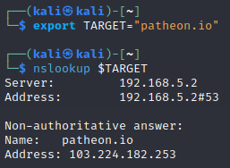

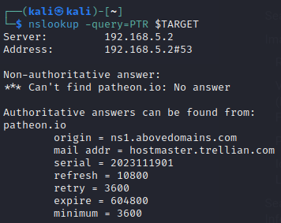

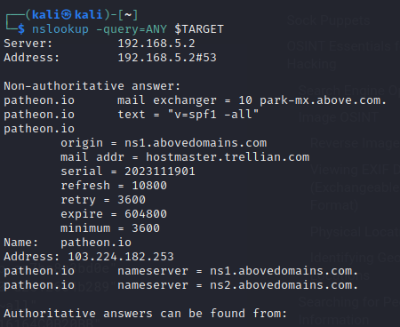

 

## DIG

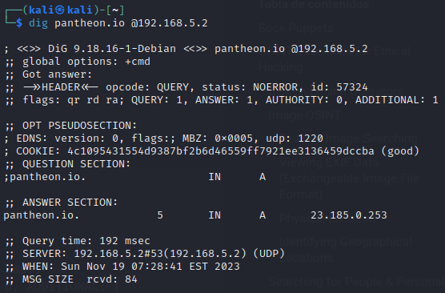

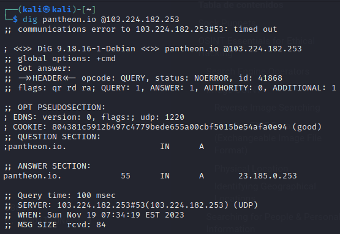

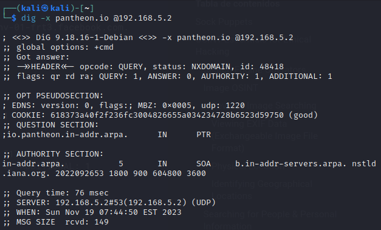

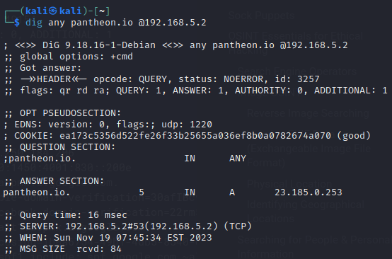

## WhoIs

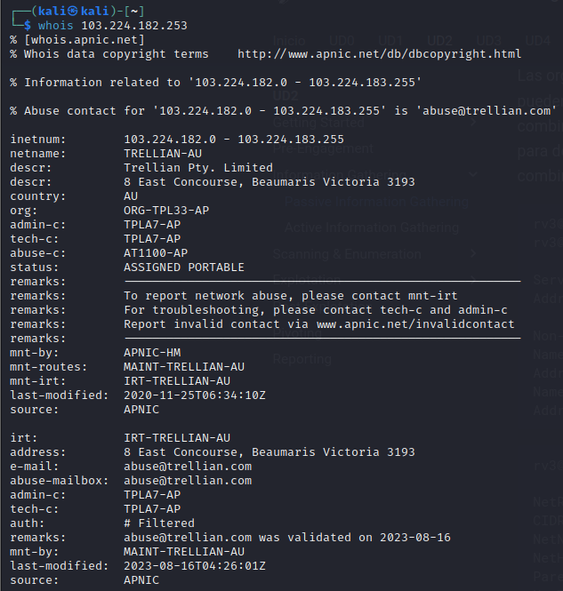

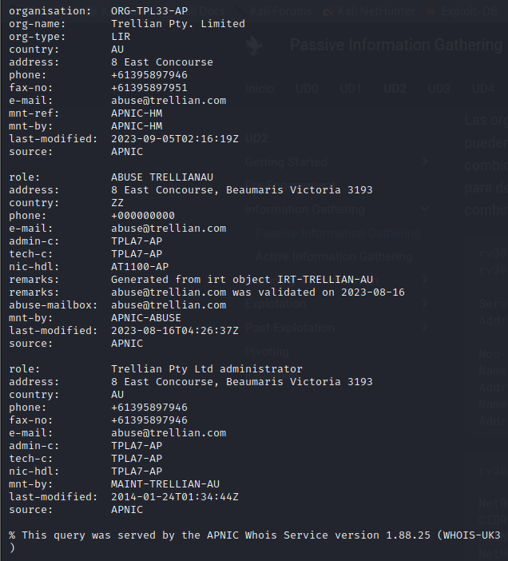

## DNSRecon

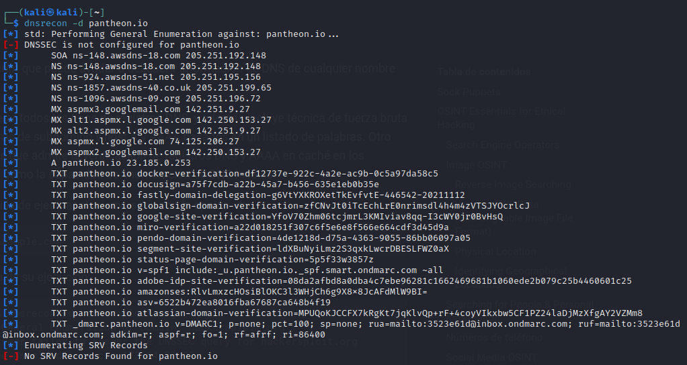

## Host

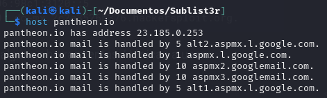