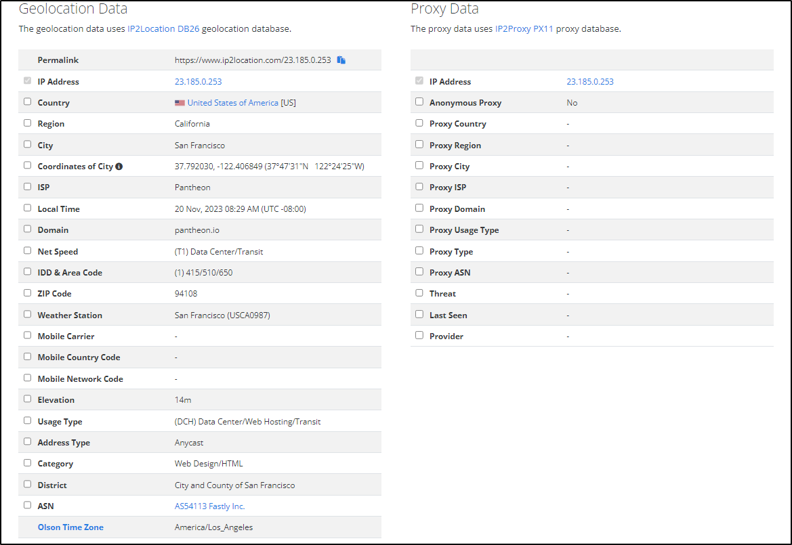
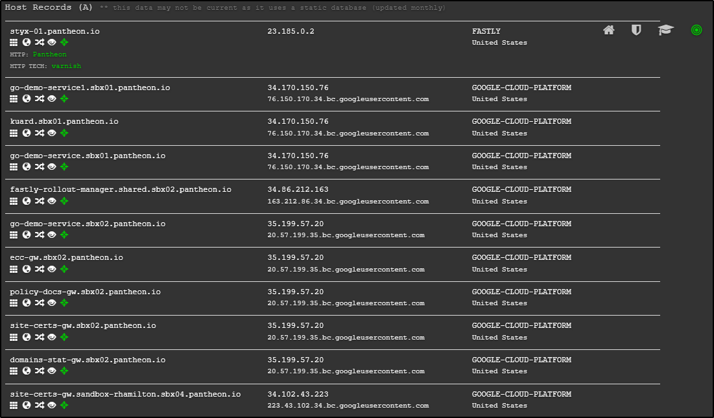
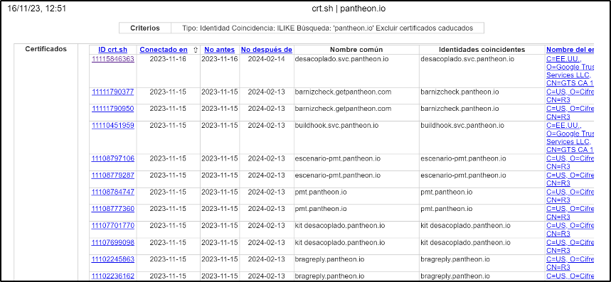

# Investigación pasiva a la empresa Pantheon


**Autores:** Grupo 3

**Integrantes:**

- Raúl Ladrón de Guevara García

- Juan Manuel Cumbrera López

- Christian Romero Oliva

- Sergio Guerrero Merlo

## Introducción

Por hacer......

## Información recopilada

### Empresa Pantheon

La empresa Pantheon se dedica a crear, alojar y administrar páginas web a través de las plataformas WordPress, Drupal y el framework de javascript NextJS. A través de su cuenta de Linkedin hemos descubierto la ubicación de su sede principal la cual es "717 California St. San Francisco, California 94108, US", que cuenta con una plantilla de 1000 empleados y que fue fundada en 2010. También hemos descubierto los dominios anteriores a pantheon.io, ambos dominios estaban a nombre de David Timothy Strauss:

- pantheonsite.io
- pantheon.io

Link Linkedin: https://www.linkedin.com/company/getpantheon/

A través de las herramientas **whois.domaintools.com , whois y who.is** hemos podido descubrir la dirección IP pública del dominio de la empresa que es 23.185.0.253. 

Una vez encontrada esta dirección IP pública hemos utilizado la herramienta **IP2LOCATION** para encontrar más información sobre esta dirección. Como podemos ver en la siguiente imagen hemos podido encontrar el ISP y el ASN de la empresa:



### Servidores DNS

Una vez recolectada toda la información básica sobre la empresa, hemos utilizado las herramientas dig, nslookup, DNSRECON, TheHarvester y DNSDumpster para recolectar toda la información posible sobre los servidores DNS del dominio pantheon.io. La información encontrada la hemos dividido por registros con sus respectivas direcciones IP:

- Servidores DNS:

```
ns-148.awsdns-18.com -> 205.251.192.148

ns-924.awsdns-51.net -> 205.251.195.156

ns-1096.awsdns-09.org -> 205.251.196.72

ns-1857.awsdns-40.co.uk -> 205.251.199.65

ns-148.awsdns-18.com -> 205.251.192.148
```

- Registros de correo:

```
aspmx2.googlemail.com -> 142.250.153.26

aspmx3.googlemail.com -> 142.251.9.27

alt1.aspmx.l.google.com -> 142.250.153.27

alt2.aspmx.l.google.com -> 142.251.9.27

aspmx.l.google.com -> 64.233.166.27
```

- Registros TXT:

```
TXT pantheon.io amazonses:RlvLmxzcHOsiBlOKC3l3WHjCh6g9X8x8JcAFdMlW9BI=

TXT pantheon.io asv=6522b472ea8016fba67687ca648b4f19

TXT pantheon.io atlassian-domain-verification=MPUQoKJCCFX7kRgKt7jqKlvQp+rF+4coyVIkxbw5CF1PZ24laDjMzXfgAY2VZMm8

TXT pantheon.io docker-verification=df12737e-922c-4a2e-ac9b-0c5a97da58c5

TXT pantheon.io docusign=a75f7cdb-a22b-45a7-b456-635e1eb0b35e

TXT pantheon.io fastly-domain-delegation-g6VtYXKROXetTkEvfvtE-446542-20211112

TXT pantheon.io globalsign-domain-verification=zfCNvJt0iTcEchLrE0nrimsdl4h4m4zVTSJYOcrlcJ

TXT pantheon.io google-site-verification=YfoV70Zhm06tcjmrL3KMIviav8qq-I3cWY0jr0BvHsQ

TXT pantheon.io miro-verification=a22d018251f307c6f5e6e8f566e664cdf3d45d9a

TXT pantheon.io pendo-domain-verification=4de1218d-d75a-4363-9055-86bb06097a05

TXT pantheon.io segment-site-verification=ldXBuNyiLmz2S3qxkLwcrDBESLFWZ0aX

TXT pantheon.io status-page-domain-verification=5p5f33w3857z

TXT pantheon.io v=spf1 include:_u.pantheon.io._spf.smart.ondmarc.com ~all

TXT pantheon.io adobe-idp-site-verification=08da2afbd8a0dba4c7ebe96281c1662469681b1060ede2b079c25b4460601c25

TXT _dmarc.pantheon.io v=DMARC1; p=none; pct=100; sp=none; rua=mailto:3523e61d@inbox.ondmarc.com; ruf=mailto:3523e61d@inbox.ondmarc.com; adkim=r; aspf=r; fo=1; rf=afrf; ri=86400
```

- Registros A (Direcciones IP de los dominios):

Como la cantidad de registros obtenidos es demasiado grande hemos decidido poner una captura de una parte de los registros. Si se quieren consultar todos los registros estan en el fichero: https://github.com/IES-Rafael-Alberti/G3-HACKING-ETICO/blob/main/proyecto_3/Investigaciones_pasivas/Investigaci%C3%B3n_pasiva_Ra%C3%BAl/Datos/SUBDOMINIOS/pantheon.io-202311171820.xlsx



### Subdominios

Con la ayuda de las herramienta sublist3r hemos podido detectar un total de 147 subdominios, especificamente utilizando el comando "```python sublist3r.py -v -d pantheon.io -t 3```" los cuales son:

```
www.pantheon.io
answers.pantheon.io
api.pantheon.io
api-sandbox.pantheon.io
billing-history-webhook-receiver.pantheon.io
bragreply.pantheon.io
brandtheon.pantheon.io
chat.pantheon.io
community.pantheon.io
www.community.pantheon.io
decoupled.pantheon.io
prod-router.decoupled.pantheon.io
sandbox-router.decoupled.pantheon.io
dev-canary.pantheon.io
dev-nmtc.pantheon.io
dev-ns-tech.pantheon.io
discover.pantheon.io
discuss.pantheon.io
fe1.edge.pantheon.io
fe2.edge.pantheon.io
5649391675244544.fe2.edge.pantheon.io
fe3.edge.pantheon.io
5639445604728832.fe3.edge.pantheon.io
fe4.edge.pantheon.io
5659313586569216.fe4.edge.pantheon.io
policy-docs-api-sandbox.edrt.pantheon.io
enterwebopssummit.pantheon.io
goto.pantheon.io
grafana-ingress.pantheon.io
helpdesk.pantheon.io
insecure-terminus.pantheon.io
guide.itsupport.pantheon.io
joe-test-le.pantheon.io
ing-test.sandbox-antonpetryk.sandbox-02.us-east4.sandbox.k8s.pantheon.io
ingress-hermes-test.sandbox-antonpetryk.sandbox-02.us-east4.sandbox.k8s.pantheon.io
ingress-test.sandbox-antonpetryk.sandbox-02.us-east4.sandbox.k8s.pantheon.io
ingress2-test.sandbox-antonpetryk.sandbox-02.us-east4.sandbox.k8s.pantheon.io
ingress3-test.sandbox-antonpetryk.sandbox-02.us-east4.sandbox.k8s.pantheon.io
ingress4-test.sandbox-antonpetryk.sandbox-02.us-east4.sandbox.k8s.pantheon.io
ingress5-test.sandbox-antonpetryk.sandbox-02.us-east4.sandbox.k8s.pantheon.io
vcr.joecorall.sandbox-03.us-west1.sandbox.k8s.pantheon.io
policy-docs-mtls-test.sandbox-oleksiimiroshnyk.sandbox-04.us-west2.sandbox.k8s.pantheon.io
policy-docs-test.sandbox-oleksiimiroshnyk.sandbox-04.us-west2.sandbox.k8s.pantheon.io
learn.pantheon.io
learning.pantheon.io
legal.pantheon.io
linuxsecaudit.pantheon.io
live-clomedia.pantheon.io
live-prcmacro.pantheon.io
router.sfo.office.pantheon.io
partners.pantheon.io
pmc.pantheon.io
pmt-staging.pantheon.io
bugfix-devpmt-808.pmt-staging.pantheon.io
check-dev-deployment.pmt-staging.pantheon.io
devpmt-621-add-site-label.pmt-staging.pantheon.io
devpmt-654-service-plan-levels.pmt-staging.pantheon.io
devpmt-655-migration-stops.pmt-staging.pantheon.io
devpmt-656-failed-add-user.pmt-staging.pantheon.io
devpmt-656-migration-failed.pmt-staging.pantheon.io
devpmt-659-update-testuser-creds.pmt-staging.pantheon.io
devpmt-661-deployment-to-prod-cluster.pmt-staging.pantheon.io
devpmt-661-deployment-to-prod-cluster2.pmt-staging.pantheon.io
devpmt-669-investigate-fails.pmt-staging.pantheon.io
devpmt-675-update-terminus-version-on-pm.pmt-staging.pantheon.io
devpmt-681-additional-ui-tests.pmt-staging.pantheon.io
devpmt-689-github-actions.pmt-staging.pantheon.io
devpmt-689-github-actions-2.pmt-staging.pantheon.io
devpmt-778-update-terminus-version.pmt-staging.pantheon.io
feat-dev-pmt-800-material-ui.pmt-staging.pantheon.io
feat-devpmt-664-repeat-prev-migration.pmt-staging.pantheon.io
feat-devpmt-806-update-github-actions.pmt-staging.pantheon.io
feat-pmts-18-skip-settings-files.pmt-staging.pantheon.io
feature-debug-tests.pmt-staging.pantheon.io
feature-deployment-history.pmt-staging.pantheon.io
feature-devpmt-447.pmt-staging.pantheon.io
feature-devpmt-623.pmt-staging.pantheon.io
feature-devpmt-654-service-plan-levels.pmt-staging.pantheon.io
feature-devpmt-662.pmt-staging.pantheon.io
feature-devpmt-674.pmt-staging.pantheon.io
feature-devpmt-679-react-unit.pmt-staging.pantheon.io
feature-drupal7-bugfix.pmt-staging.pantheon.io
feature-e2e-tests.pmt-staging.pantheon.io
feature-pmtdev-637-bitbucket-pipelines.pmt-staging.pantheon.io
feature-retry-failed-tasks.pmt-staging.pantheon.io
feature-user-seed.pmt-staging.pantheon.io
feature-users-seeder.pmt-staging.pantheon.io
fix-bulk-operations-layout.pmt-staging.pantheon.io
fix-deployments.pmt-staging.pantheon.io
fix-devpmt-618-undefined-offset.pmt-staging.pantheon.io
fix-devpmt-639-select-destroy.pmt-staging.pantheon.io
fix-devpmt-678-new-migration-checkboxes.pmt-staging.pantheon.io
fix-devpmt-690.pmt-staging.pantheon.io
fix-devpmt-691-account-organizations.pmt-staging.pantheon.io
fix-devpmt-692-repeat-each-migration.pmt-staging.pantheon.io
fix-e2e-test-run.pmt-staging.pantheon.io
integrate-vrt2.pmt-staging.pantheon.io
master.pmt-staging.pantheon.io
staging.pmt-staging.pantheon.io
vpn-support-feature.pmt-staging.pantheon.io
vrt-staging.pmt-staging.pantheon.io
vrt-test.pmt-staging.pantheon.io
wraith-staging.pmt-staging.pantheon.io
sales.pantheon.io
api-gateway.sandbox-antonpetryk.sbx02.pantheon.io
kuard.sandbox-antonpetryk.sbx02.pantheon.io
secure-terminus.pantheon.io
slackin.pantheon.io
social.pantheon.io
sso-stage.pantheon.io
sso-test.pantheon.io
status.pantheon.io
styleguide-unfpa-global.pantheon.io
styx-fe1-australia-southeast1.pantheon.io
styx-fe2-australia-southeast1.pantheon.io
styx-fe3-australia-southeast1.pantheon.io
styx-fe4-australia-southeast1.pantheon.io
buildhook.svc.pantheon.io
decoupled.svc.pantheon.io
decoupled-notification.svc.pantheon.io
decoupled-subscription.svc.pantheon.io
payment-service-webhook-receiver.svc.pantheon.io
prod-decoupled.svc.pantheon.io
api-gateway.prod-decoupled.svc.pantheon.io
github-auth.prod-decoupled.svc.pantheon.io
github-listener.prod-decoupled.svc.pantheon.io
subscription-proxy.prod-decoupled.svc.pantheon.io
webhook-listener.prod-decoupled.svc.pantheon.io
dev-decoupled.sandbox.svc.pantheon.io
api-gateway.dev-decoupled.sandbox.svc.pantheon.io
github-auth.dev-decoupled.sandbox.svc.pantheon.io
github-listener.dev-decoupled.sandbox.svc.pantheon.io
subscription-proxy.dev-decoupled.sandbox.svc.pantheon.io
webhook-listener.dev-decoupled.sandbox.svc.pantheon.io
integration-decoupled.sandbox.svc.pantheon.io
zuora-payment-service-webhook-receiver.sandbox.svc.pantheon.io
sandbox-decoupled.svc.pantheon.io
sandbox-vcs.svc.pantheon.io
auth.sandbox-vcs.svc.pantheon.io
vcs.svc.pantheon.io
auth.vcs.svc.pantheon.io
vcs-auth.svc.pantheon.io
webhook.svc.pantheon.io
zuora-payment-service-webhook-receiver.svc.pantheon.io
test-canary.pantheon.io
test-vinyl-institute.pantheon.io
varnishcheck.pantheon.io
```

Con la herramienta **amass** hemos completado la información obtenida sobre los dominios, pero al ser tan grande el fichero hemos decido poner un enlace a él: https://github.com/IES-Rafael-Alberti/G3-HACKING-ETICO/blob/main/proyecto_3/Investigaciones_pasivas/Investigaci%C3%B3n_pasiva%20Juan%20Manuel/results.xlsx

### Robots y Sitemap

Para recolectar esta información no se ha utilizado ninguna herramienta en concreto simplemente se ha extraido la información del navegador:

- El archivo **robots.txt** indica a los rastreadores de los buscadores a qué URLs de tu sitio pueden acceder.

```
User-agent: *
# CSS, JS, Images
Allow: /core/*.css$
Allow: /core/*.css?
Allow: /core/*.js$
Allow: /core/*.js?
Allow: /core/*.gif
Allow: /core/*.jpg
Allow: /core/*.jpeg
Allow: /core/*.png
Allow: /core/*.svg
Allow: /profiles/*.css$
Allow: /profiles/*.css?
Allow: /profiles/*.js$
Allow: /profiles/*.js?
Allow: /profiles/*.gif
Allow: /profiles/*.jpg
Allow: /profiles/*.jpeg
Allow: /profiles/*.png
Allow: /profiles/*.svg
# Directories
Disallow: /core/
Disallow: /profiles/
# Files
Disallow: /README.txt
Disallow: /web.config
# Paths (clean URLs)
Disallow: /admin/
Disallow: /comment/reply/
Disallow: /filter/tips
Disallow: /node/add/
Disallow: /search/
Disallow: /user/register
Disallow: /user/password
Disallow: /user/login
Disallow: /user/logout
Disallow: /media/oembed
Disallow: /*/media/oembed
# Paths (no clean URLs)
Disallow: /index.php/admin/
Disallow: /index.php/comment/reply/
Disallow: /index.php/filter/tips
Disallow: /index.php/node/add/
Disallow: /index.php/search/
Disallow: /index.php/user/password
Disallow: /index.php/user/register
Disallow: /index.php/user/login
Disallow: /index.php/user/logout
Disallow: /index.php/media/oembed
Disallow: /index.php/*/media/oembed
```

- **Sitemap.xml** es el archivo o una url que contiene todas y cada una de las páginas de una web.


Es demasiado grande para incluirlo, el fichero esta en https://github.com/IES-Rafael-Alberti/G3-HACKING-ETICO/blob/main/proyecto_3/Investigaciones_pasivas/Investigaci%C3%B3n_pasiva_Ra%C3%BAl/Datos/sitemap.pdf

### Certificados

Con la ayuda de la herramienta **crt.sh** hemos adquirido una gran cantidad de certificados los cuales hemos exportado a un fichero pdf (https://github.com/IES-Rafael-Alberti/G3-HACKING-ETICO/blob/main/proyecto_3/Investigaciones_pasivas/Investigaci%C3%B3n_pasiva_Ra%C3%BAl/Datos/CERTIFICADOS/crt.sh%20_%20pantheon.io.pdf) ya su tamaño es demasiado grande:



## Tecnologías que usa el dominio

Para descubrir las tecnologías que usa la empresa hemos utilizado las herramientas **Wappalizer** y **Whatweb**. Las tecnologías que hemos descubierto son las siguientes:

- **Gestor de Contenido:** Drupal 9 Analítica: VWO

- **Seguridad:** HSTS reCAPTCHA

- **Tipografía:** Google Font API

- **Miscelánea:** Webpack Open Graph Module Federation

- **Servidor Web:** Nginx 1.17.8

- **Herramienta de Cache:** Varnish 1.1

- **Lenguaje de programación:** PHP

- **CDN:** Fastly

- **Base de Datos:** MariaDB 
  
- **Tag Manager:** Google Tag Manager

- **Librerías JavaScript:** jQuery UI 1.13.2 jQuery 3.6.3

- **PaaS:** Pantheon Proxy reverso: Nginx 1.17.8

- **Cookie compliance:** OneTrust

- **A/B testing:** VWO

- **RUM:** New Relic

- **Performance:** Priority Hints

## Información sobre los empleados de la empresa

Toda la información de los empleados ha sido recolectada haciendo búquedas con dorks, con linkedin, hunter.io y truecaller:

### Información CEO/co-fundador

**Nombre:** Zachary Rosen </br>
**Localización:** San Francisco, California, Estados Unidos

- **Web personal:** https://about.me/zack
- **Twiter:** https://twitter.com/zack

**Educación:** University of Illinois Urbana-Champaign

**E-Mail Empresarial:** zack@pantheon.io

---

### Información CTO/Co-fundador

**Nombre:** David Timothy Strauss </br>
**Localización:** San Francisco, California, Estados Unidos

- Linkedin account: https://www.linkedin.com/in/davidstrauss
- Cuenta de twitter: https://twitter.com/davidstrauss

**Educación:** The University of Texas Austin

**E-Mail Empresarial:** david@pantheon.io

**E-Mail personal:** david@davidstrauss.net

**Número de teléfono:** +1 512 577 5827

---

### Información Co-fundador y director de estrategia

**Nombre:** Josh Koenig </br>
**Localización:** San Francisco, California, Estados Unidos

- Linkedin account: https://www.linkedin.com/in/joshkoenig
- Blog: https://www.outlandishjosh.com/
- Twitter: https://twitter.com/outlandishjosh

**Educación:** New York University

**E-Mail Empresarial:** josh@pantheon.io

**Blog personal:** https://www.outlandishjosh.com/

---

### Senior Director, Ventas Estrategia y operaciones

**Nombre:** John Romano </br>
**Localización:** San Francisco, California, Estados Unidos

- Linkedin account: https://www.linkedin.com/in/john-romano18/

**Educación:** Northeastern University

**E-Mail Empresarial:** john.romano@pantheon.io

---

### Directora de marketing de Pantheon

**Nombre:** Christy Marble </br>
**Localización:** Seattle, Washington, Estados Unidos

- Linkedin account: https://www.linkedin.com/in/christymarble/

**E-Mail Empresarial:** christy.marble@pantheon.io

---

### Senior IT Manager

**Nombre:** Steven Juanes </br>
**Localización:** San Francisco, California, Estados Unidos

- Linkedin account: https://www.linkedin.com/in/steven-juanes-jr/

**Educación:** San Jose State University

**E-Mail Empresarial:** steven@pantheon.io

--- 

### Senior CRM Administrator

**Nombre:** Hien Ferber </br>
**Localización:** San Francisco, California, Estados Unidos

- Linkedin account: https://www.linkedin.com/in/hien-ferber/

**Educación:** RMIT University

**E-Mail Empresarial:** hien.ferber@pantheon.io

---

### Product Leader & GM

**Nombre:** Meredith Brown </br>
**Localización:** San Francisco, California, Estados Unidos

- Linkedin account: https://www.linkedin.com/in/brownmeredith/
- Twitter account: https://twitter.com/meredithbrownsf

**Educación:** University of Pennsylvania

---

### CXO of hyper growth, PE-backed tech and data companies

**Nombre:** John Gardiner </br>
**Localización:** San Francisco, California, Estados Unidos

- Linkedin account: https://www.linkedin.com/in/johngardiner3/
- Twitter account: https://twitter.com/JohnGardiner1

**Educación:** The University of Chicago Booth School of Business

---

### Director, Field & Partner Marketing at Pantheon Platform

**Nombre:** Atoosa Campbell </br>
**Localización:** San Francisco, California, Estados Unidos

- Linkedin account: https://www.linkedin.com/in/atoosa/

**Educación:** San Francisco State University

---

### Workplace Experience Manager at Pantheon & Independent Fine Artist

**Nombre:** Amanda Klimek </br>
**Localización:** San Francisco, California, Estados Unidos

- Linkedin account: https://www.linkedin.com/in/amanda-klimek-2769b71b/overlay/contact-info/
- Web personal: amandaklimek.com

**Educación:** San Francisco Art Institute

---

### Enterprise Account Executive at Pantheon Platform

**Nombre:** Sara Drohan </br>
**Localización:** San Francisco, California, Estados Unidos

- Email empresarial: sara.drohan@pantheon.io


---

### Greg Anderson

**Nombre:** Greg Anderson </br>
**Localización:** San Francisco, California, Estados Unidos

- Email empresarial: greg@pantheon.io

---

### Brian Perry

**Nombre:** Brian Perry </br>
**Localización:** San Francisco, California, Estados Unidos

- Email empresarial: brian.perry@pantheon.io

---

### Más correos eléctronicos de la empresa:

- news@pantheon.io

- diversityinclusion@pantheon.io

- press@pantheon.io

- info@pantheon.io