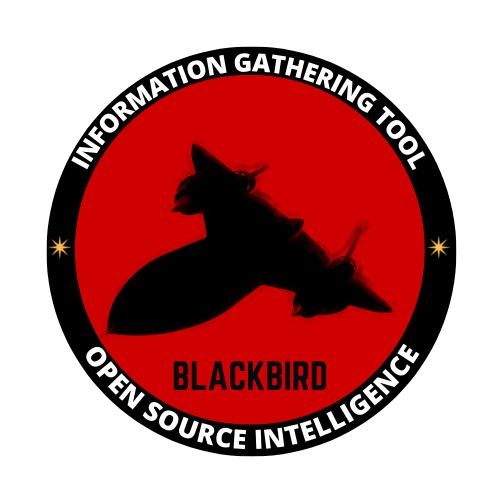

# Blackbird


**Autor:** Guerrero Merlo, Sergio

## Índice

1. [Introducción](#introducción)
2. [Para que sirve](#para-que-sirve)
3. [Intalación](#instalación)
4. [Funcionamiento](#funcionamiento)
5. [Conclusión](#conclusión)
6. [Bibliografía](#bibliografía)

## Introducción

Se ha investigado numerosas herramientas OSINT de tipo navegador web o aplicación, pero la mayoría de estas herramientas pedían un registro previo a su página web o un pago para poder ver los resultados u obtener capacidades menos limitadas.

Nos hemos decidido utilizar esta herramienta ya que no solo no tiene el problema comentado anteriomente sino que, es una herramienta gratuita e instalable.

## Para que sirve

Blackbird es una herramienta OSINT que sirve para buscar cuentas por nombres de usuario en más de 500 sitios web. Cada vez que se genera una busqueda, utiliza User-Agent aleatorio de una lista de más de 1000 para evitar bloqueos.

Esta herramienta nos permite además la posibilidad de obtener metadatos siempre cuando sea posible como por ejemplo, nombre, biogradía, ubicación y foto de perfil.

Blackbird envía solicitudes HTTP asíncronas lo que permite mayor velocidad en estas peticiones.

## Instalación

Esta herramienta se debe instalar clonado primero el repositorio de github donde se encuentra la herramienta. Se recomienda hacer apt update y apt upgrade antes de instalar la herramienta.

```git clone https://github.com/p1ngul1n0/blackbird```

Una vez que se ha clonado el repositorio nos movemos al mismo desde la terminal de Kali Linux.

```cd blackbird```

Al clonar el repositorio, tendremos un fichero txt que nos instalará la herramienta con pip.

```pip install -r requeriments.txt```

## Funcionamiento

A día de hoy hay tres formas de utilizar esta herramienta. La primera de todas es utilizando la terminal de por ejemplo Kali Linux. 

Si queremos ver la lista de sitios que son compatibles con la herramienta.

```python blackbird.py --list-sites```

Por ejemplo con esta herramienta podemos utilizar el siguiente comando para buscar un nombre de usuario.

```python blackbird.py -u NombreUsuario```

Con esta línea de comando nos genera un fichero con el nombre del usuario y la extensión .json. Para leer este tipo de ficheros por terminal podemos usar el siguiente comando.

```Python blackbird.py -f NombreUsuario.json```

Esto nos mostrará solo las cuentas de usuario que ha encontrado pero no siempre estas cuentas que no ha encontrado no significa que no existan, por lo tanto podemos utilizar el siguiente comando para ver todos los resultados.

```python blackbird.py -u crash --show-all```

También podemos exportar el resultado a un fichero con extensión .csv de la siguiente manera.

```python blackbird.py -u crash --csv```

La segunda forma de utilizar esta herramienta es levantando nuestro propio servidor web, esta herramienta nos permite levantarlo en local. A este servidor web nos podremos conectar por navegador utilizando la dirección http://127.0.0.1:9797.

```python blackbird.py --web```

Al utilizar esta segunda posibilidad, nos seguirá guardando en la carpeta results del repositorio que hemos clonado, los ficheros con el nombre del usuario y acabado en .json.

Además, esta interfaz gráfica en web nos permite exportarlo en un fichero pdf.

La tercera y más reciente es utilizando la página web que el propio desarrollador de la misma ha creado. La diferencia entre esta página web y levantar nuestro propio servidor web en local, es que los nombres de usuario creados, no guardan el fichero con su nombre y de extensión .json en nuestra máquina. 

En general esta es la única diferencia ya que es la misma interfaz gráfica y al igual que en nuestra versión en local como se ha mencionado anteriormente, nos permite exportarlo a un fichero pdf.

## Conclusión

Como hemos podido ver, esta herramienta es bastante útil. Por ejemplo, si conocemos el nombre de usuario de la persona a la que estamos haciendo OSINT nos da la posibilidad de encontrar posibles cuentas en distintas páginas webs que pueden ser de la misma persona.

Esto nos permite ahorrar tiempo buscando posibles cuentas de usuario ya que nos da directamente los enlaces y los metadatos a esas cuentas de usuario sin tener que estar horas buscando todas estas cuentas de usuario en internet.

## Bibliografía

- [https://github.com/p1ngul1n0/blackbird](https://github.com/p1ngul1n0/blackbird)
- [https://derechodelared.com/blackbird-cuentas-nombre-usuario/](https://derechodelared.com/blackbird-cuentas-nombre-usuario/)


